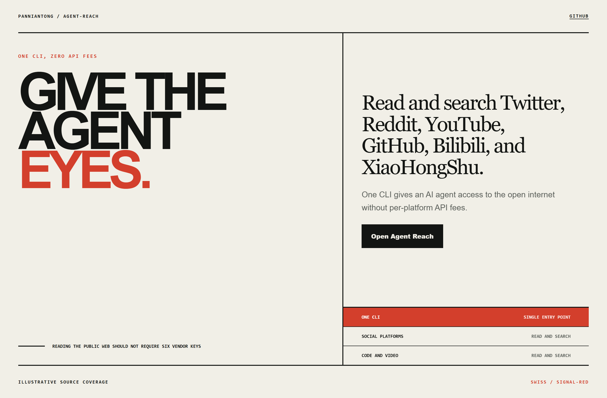
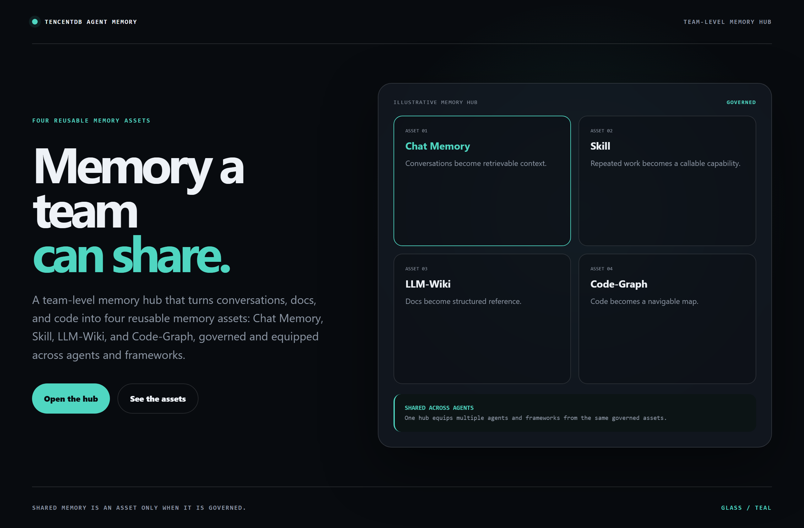
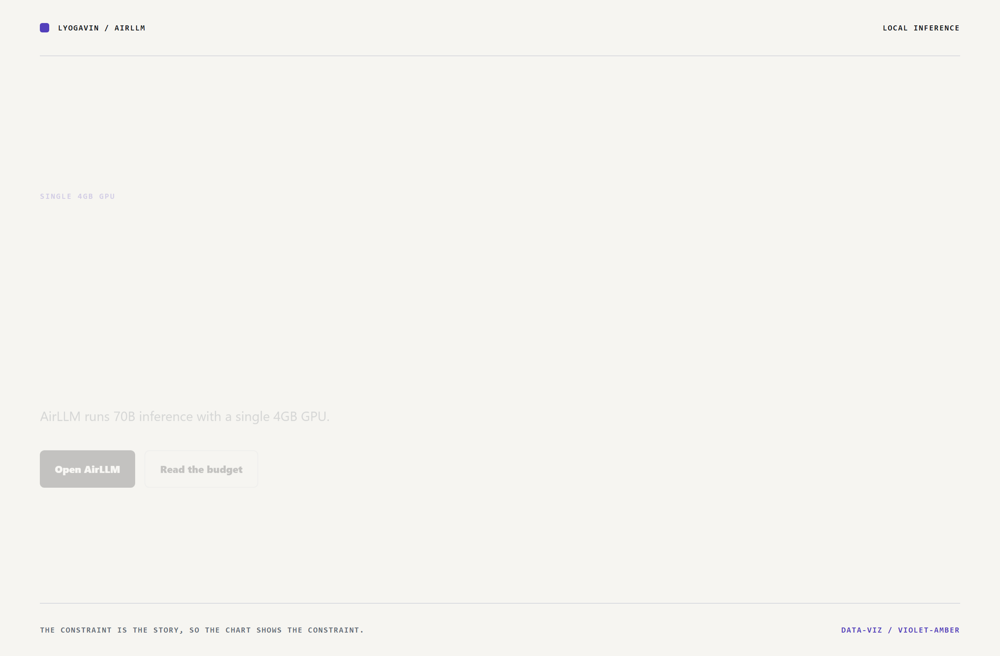

# Design Rep — Sunday, August 2

> 3 mocks — swiss, glass, data-viz

[Catalog](../../CATALOG.md) · [Home](../../README.md)

## [Panniantong/Agent-Reach](https://github.com/Panniantong/Agent-Reach)

- **Style:** swiss / signal-red
- **Idea tested:** put the access claim in the largest type and let a source rail carry breadth
- **Verdict:** landed: promise stated once, proven underneath
- [live .html](./01-agent-reach.html) · [repo on GitHub](https://github.com/Panniantong/Agent-Reach)

## [TencentCloud/TencentDB-Agent-Memory](https://github.com/TencentCloud/TencentDB-Agent-Memory)

- **Style:** glass / teal
- **Idea tested:** name all four memory assets on one frosted panel as owned inventory
- **Verdict:** landed: assets stay concrete and governance replaces adjectives
- [live .html](./02-tencentdb-agent-memory.html) · [repo on GitHub](https://github.com/TencentCloud/TencentDB-Agent-Memory)

## [lyogavin/airllm](https://github.com/lyogavin/airllm)

- **Style:** data-viz / violet-amber
- **Idea tested:** chart the stated 4GB budget against 70B parameters with layer residency
- **Verdict:** landed: the constraint is the argument with nothing invented
- [live .html](./03-airllm.html) · [repo on GitHub](https://github.com/lyogavin/airllm)

