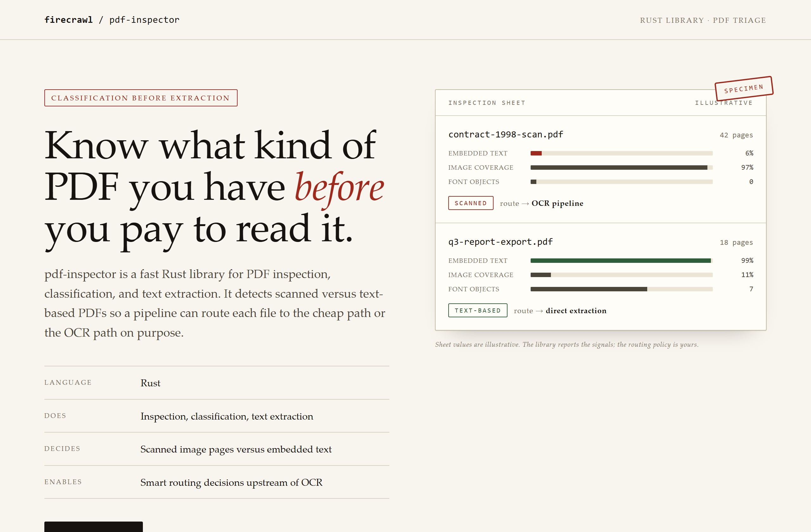
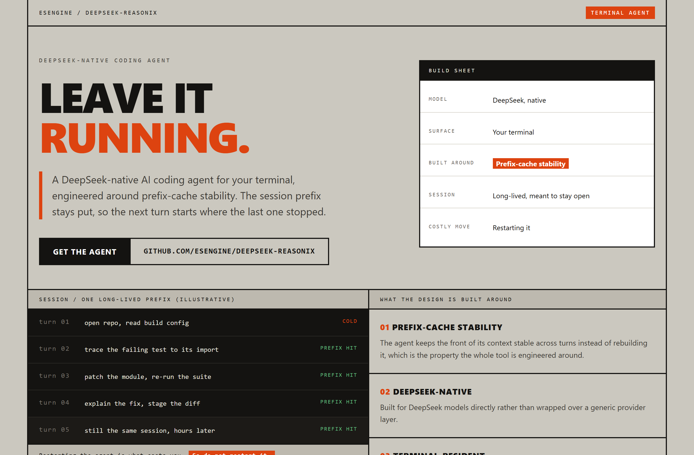
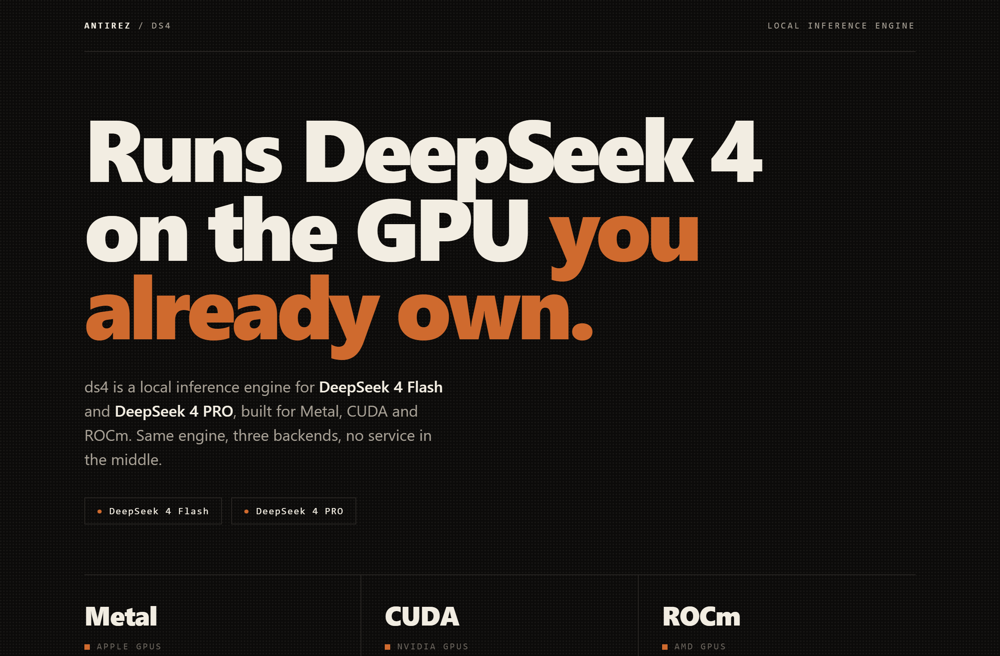

# Design Rep — Monday, August 3

> 3 mocks — specimen, brutalist, poster

[Catalog](../../CATALOG.md) · [Home](../../README.md)

## [firecrawl/pdf-inspector](https://github.com/firecrawl/pdf-inspector)

- **Style:** specimen / stamp-red
- **Idea tested:** make the classifier verdict the hero and route each file explicitly
- **Verdict:** landed: the decision is legible before any speed claim
- [live .html](./01-pdf-inspector.html) · [repo on GitHub](https://github.com/firecrawl/pdf-inspector)

## [esengine/DeepSeek-Reasonix](https://github.com/esengine/DeepSeek-Reasonix)

- **Style:** brutalist / harsh-orange
- **Idea tested:** turn leave it running into an architectural claim with one long-lived session slab
- **Verdict:** landed: exposed structure matches a tool built on a stable prefix
- [live .html](./02-deepseek-reasonix.html) · [repo on GitHub](https://github.com/esengine/DeepSeek-Reasonix)

## [antirez/ds4](https://github.com/antirez/ds4)

- **Style:** poster / oxide
- **Idea tested:** spend the whole page on one sentence with three backends as the only proof
- **Verdict:** landed: restraint reads as confidence when the claim stays small
- [live .html](./03-ds4.html) · [repo on GitHub](https://github.com/antirez/ds4)

