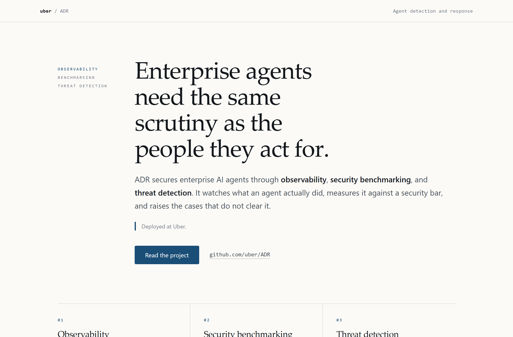
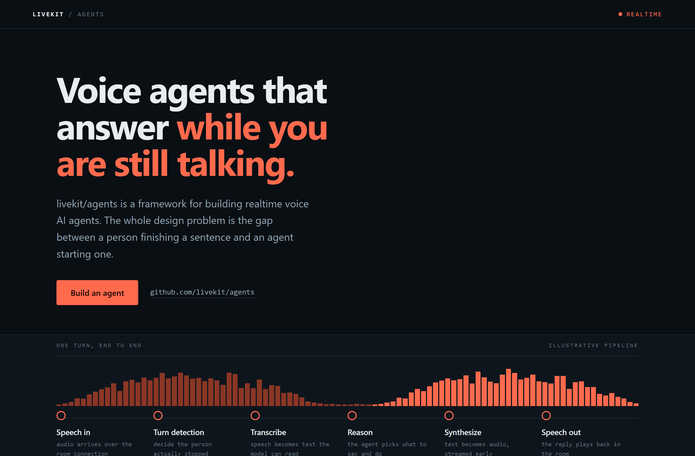
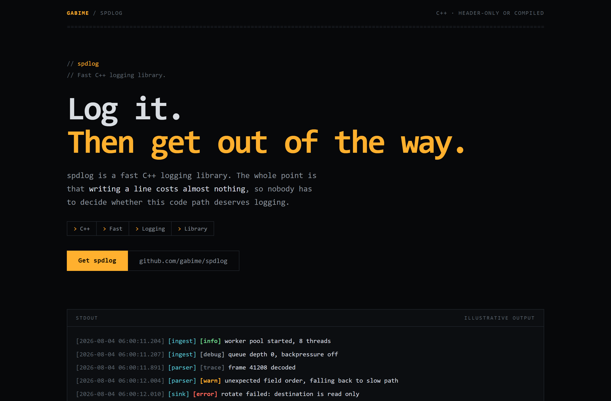

# Design Rep — Tuesday, August 4

> 3 mocks — editorial, waveform, mono-zine

[Catalog](../../CATALOG.md) · [Home](../../README.md)

## [uber/ADR](https://github.com/uber/ADR)

- **Style:** editorial / ink-blue
- **Idea tested:** give an agent security tool the calm of an essay with three disciplines at equal weight
- **Verdict:** landed: restraint suits a claim about scrutiny
- [live .html](./01-adr.html) · [repo on GitHub](https://github.com/uber/ADR)

## [livekit/agents](https://github.com/livekit/agents)

- **Style:** waveform / signal-coral
- **Idea tested:** draw realtime as a waveform gap between two turns instead of claiming it
- **Verdict:** landed: the product becomes visible with no benchmark figure
- [live .html](./02-livekit-agents.html) · [repo on GitHub](https://github.com/livekit/agents)

## [gabime/spdlog](https://github.com/gabime/spdlog)

- **Style:** mono-zine / amber
- **Idea tested:** make the library's own output the largest block on the page
- **Verdict:** landed: a logging library sells itself by showing the lines it writes
- [live .html](./03-spdlog.html) · [repo on GitHub](https://github.com/gabime/spdlog)

