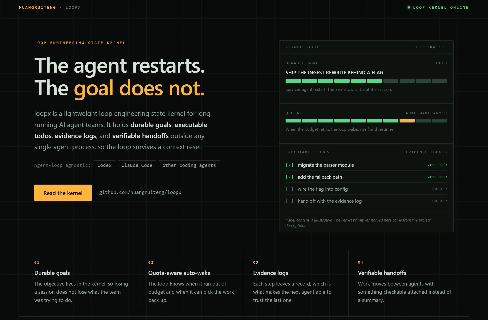
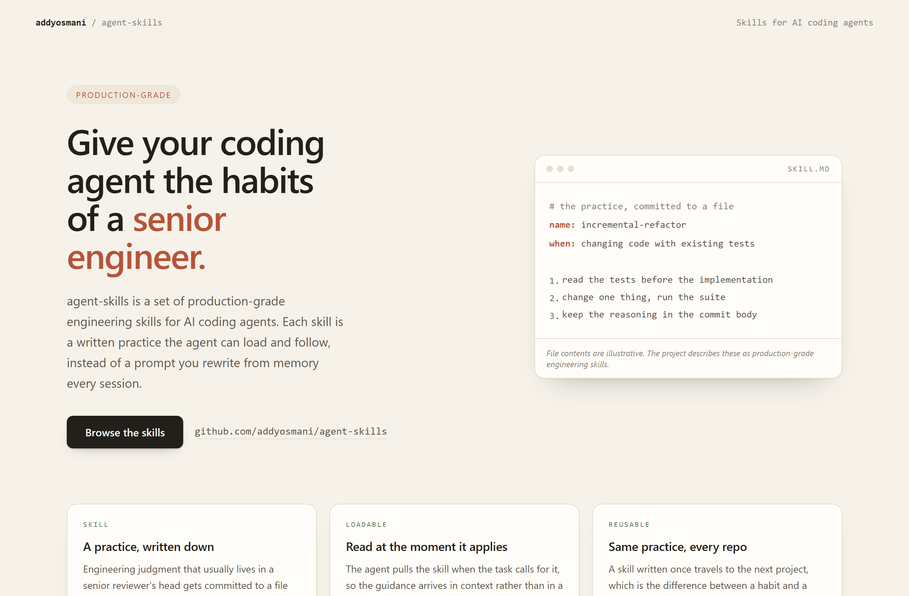
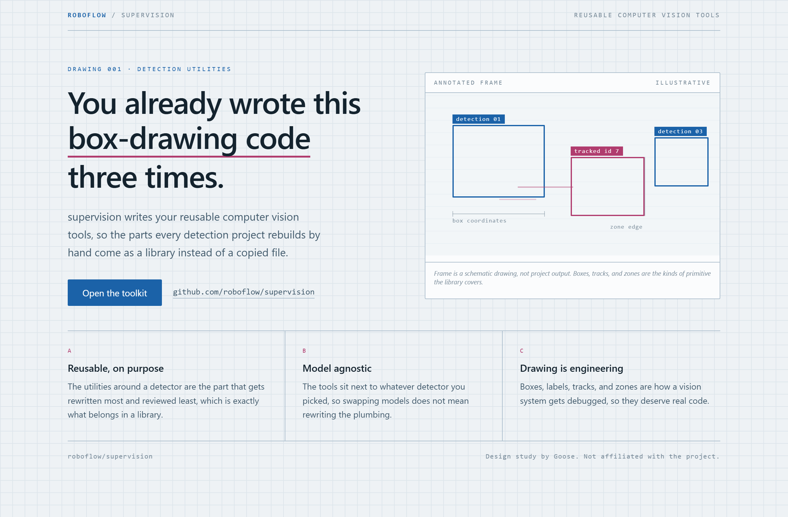

# Design Rep — Wednesday, August 5

> 3 mocks — hud, warm-minimal, blueprint

[Catalog](../../CATALOG.md) · [Home](../../README.md)

## [huangruiteng/loopx](https://github.com/huangruiteng/loopx)

- **Style:** hud / signal-amber
- **Idea tested:** show kernel state as an instrument cluster with a held goal and an armed quota gauge
- **Verdict:** landed: a state kernel is believable when you can see the state
- [live .html](./01-loopx.html) · [repo on GitHub](https://github.com/huangruiteng/loopx)

## [addyosmani/agent-skills](https://github.com/addyosmani/agent-skills)

- **Style:** warm-minimal / terracotta
- **Idea tested:** put a SKILL.md card beside the claim so the abstraction has a file
- **Verdict:** landed: warmth keeps a rigor claim from reading as scolding
- [live .html](./02-agent-skills.html) · [repo on GitHub](https://github.com/addyosmani/agent-skills)

## [roboflow/supervision](https://github.com/roboflow/supervision)

- **Style:** blueprint / ink-blue
- **Idea tested:** draw detection output as a drafting sheet with dimension lines instead of a demo screenshot
- **Verdict:** landed: a schematic names the primitives better than a real frame
- [live .html](./03-supervision.html) · [repo on GitHub](https://github.com/roboflow/supervision)

