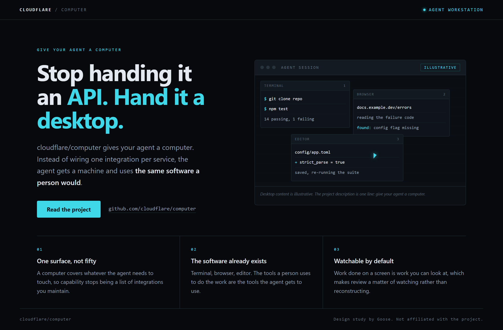
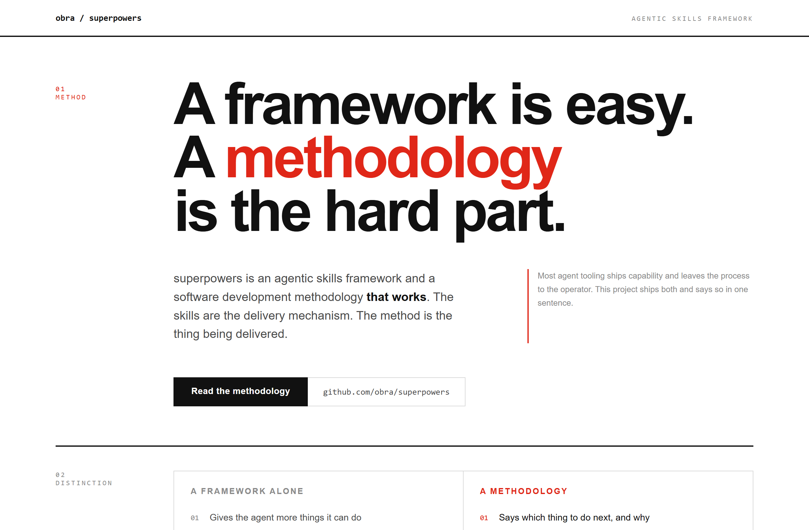
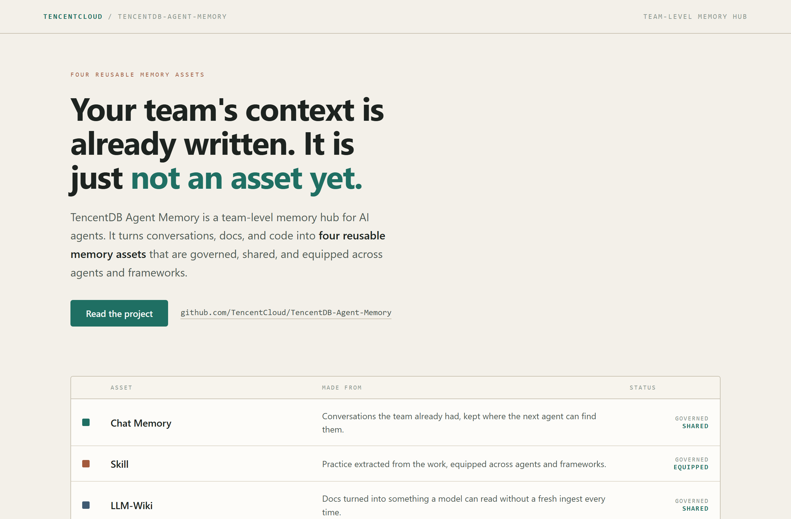

# Design Rep — Thursday, August 6

> 3 mocks — terminal-dark, swiss, ledger

[Catalog](../../CATALOG.md) · [Home](../../README.md)

## [cloudflare/computer](https://github.com/cloudflare/computer)

- **Style:** terminal-dark / electric-cyan
- **Idea tested:** take the five-word description literally and draw the desktop mid-task
- **Verdict:** landed: drawing the artifact keeps a one-line README honest
- [live .html](./01-computer.html) · [repo on GitHub](https://github.com/cloudflare/computer)

## [obra/superpowers](https://github.com/obra/superpowers)

- **Style:** swiss / signal-red
- **Idea tested:** put the weight on methodology and set a framework alone against it
- **Verdict:** landed: the grid gives the comparison somewhere to sit
- [live .html](./02-superpowers.html) · [repo on GitHub](https://github.com/obra/superpowers)

## [TencentCloud/TencentDB-Agent-Memory](https://github.com/TencentCloud/TencentDB-Agent-Memory)

- **Style:** ledger / linen-teal
- **Idea tested:** treat the four memory assets as a ruled inventory with governed status
- **Verdict:** landed: a ledger implies accountability where a card grid does not
- [live .html](./03-tencentdb-agent-memory.html) · [repo on GitHub](https://github.com/TencentCloud/TencentDB-Agent-Memory)

