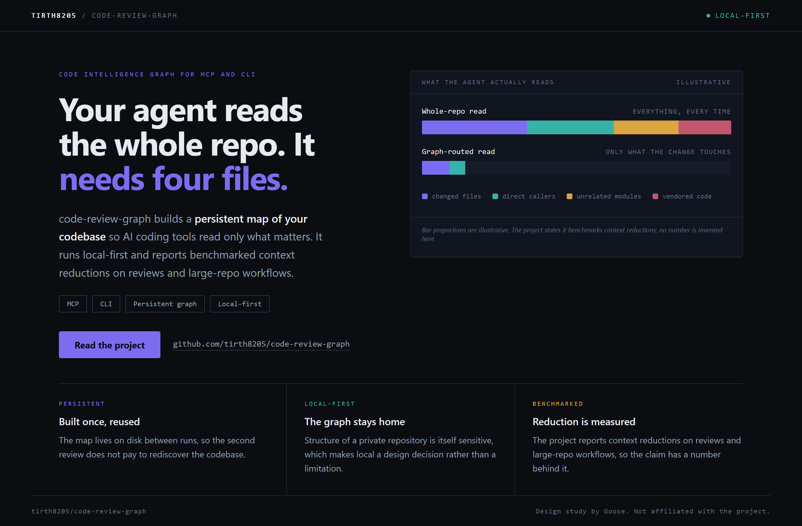
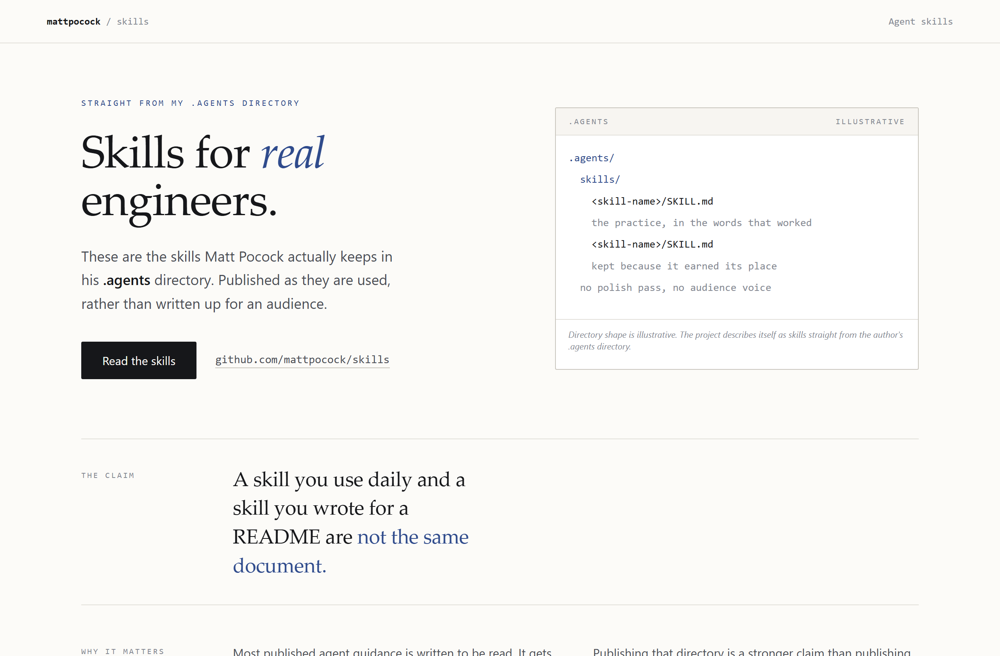
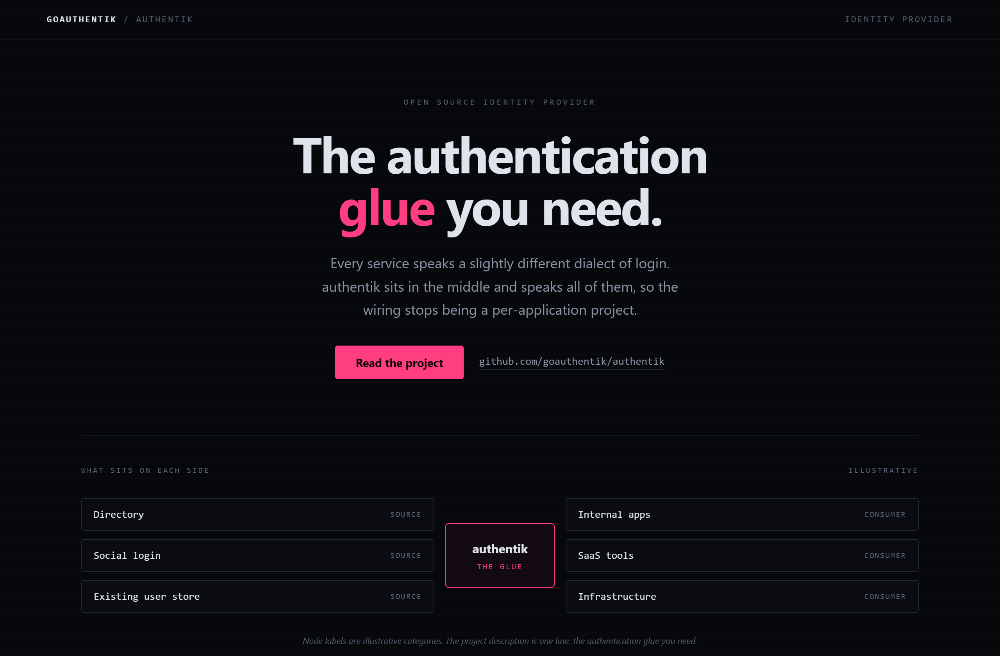

# Design Rep — Friday, August 7

> 3 mocks — data-viz, editorial, neon-noir

[Catalog](../../CATALOG.md) · [Home](../../README.md)

## [tirth8205/code-review-graph](https://github.com/tirth8205/code-review-graph)

- **Style:** data-viz / violet-teal
- **Idea tested:** show the context reduction as two stacked bars with no invented percentage
- **Verdict:** landed: the gap carries the argument and the chart stays credible
- [live .html](./01-code-review-graph.html) · [repo on GitHub](https://github.com/tirth8205/code-review-graph)

## [mattpocock/skills](https://github.com/mattpocock/skills)

- **Style:** editorial / ink-blue
- **Idea tested:** make provenance the headline and put the .agents directory beside the claim
- **Verdict:** landed: showing the directory proves the claim instead of restating it
- [live .html](./02-skills.html) · [repo on GitHub](https://github.com/mattpocock/skills)

## [goauthentik/authentik](https://github.com/goauthentik/authentik)

- **Style:** neon-noir / magenta
- **Idea tested:** draw the word glue with sources left, consumers right, one lit hub in the middle
- **Verdict:** landed: one neon element keeps the style from turning decorative
- [live .html](./03-authentik.html) · [repo on GitHub](https://github.com/goauthentik/authentik)

