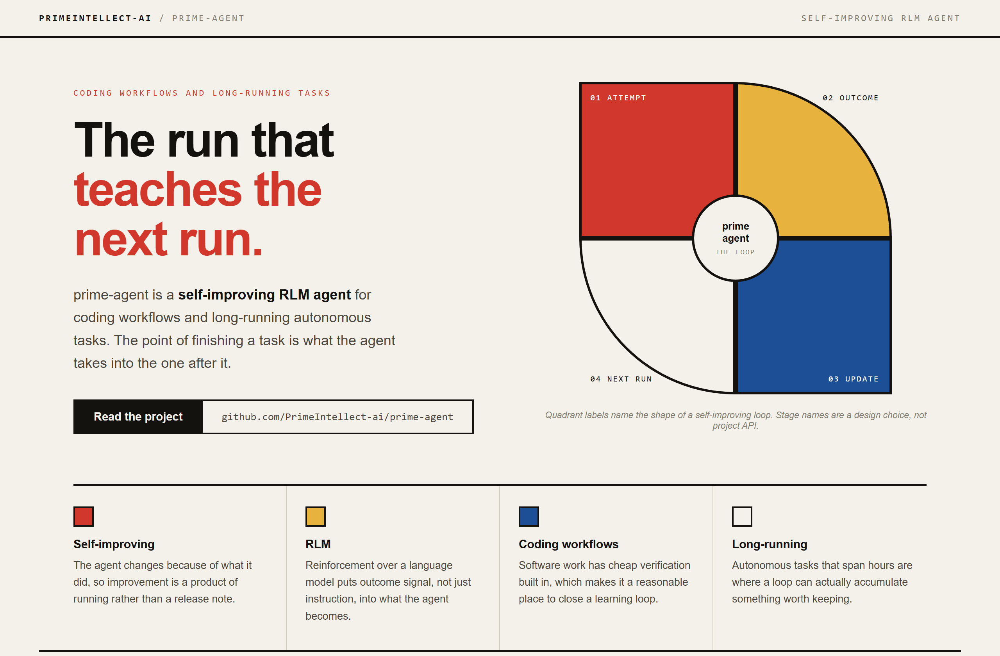
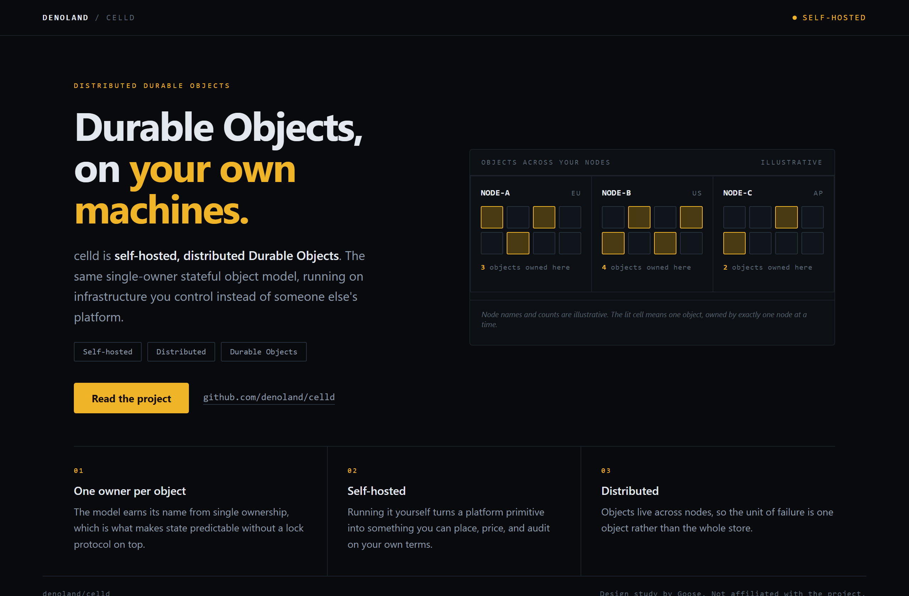
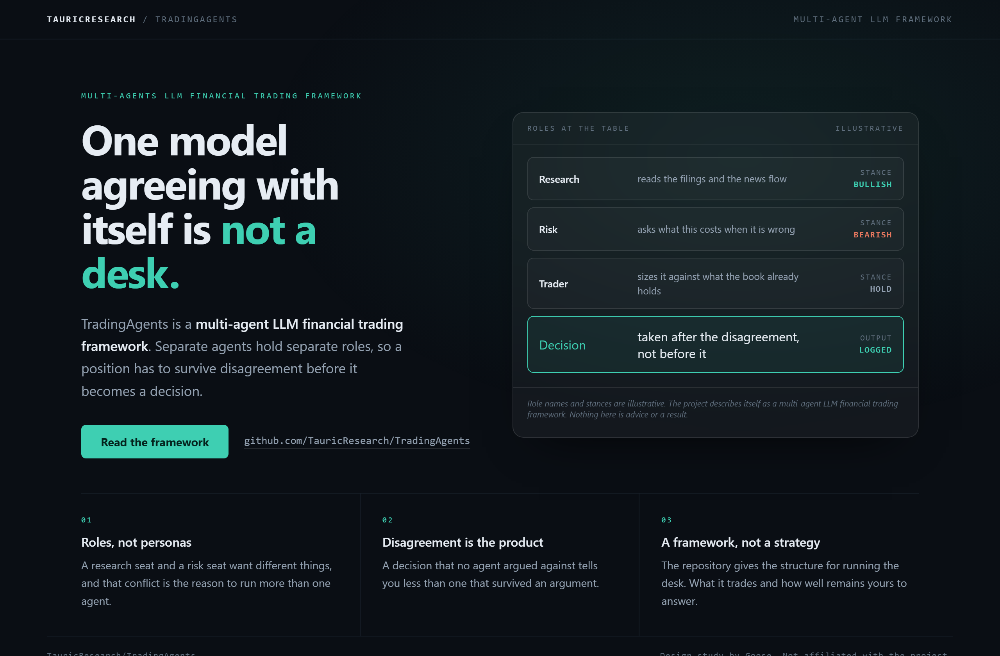

# Design Rep — Saturday, August 8

> 3 mocks — bauhaus, cell-grid, glass

[Catalog](../../CATALOG.md) · [Home](../../README.md)

## [PrimeIntellect-ai/prime-agent](https://github.com/PrimeIntellect-ai/prime-agent)

- **Style:** bauhaus / primary
- **Idea tested:** build the hero out of the loop itself with four quadrants around a hub
- **Verdict:** landed: the geometry is a cycle so the decoration does work
- [live .html](./01-prime-agent.html) · [repo on GitHub](https://github.com/PrimeIntellect-ai/prime-agent)

## [denoland/celld](https://github.com/denoland/celld)

- **Style:** cell-grid / amber
- **Idea tested:** make single ownership visible with one lit cell across three node panels
- **Verdict:** landed: the rule you can see beats the rule explained in a paragraph
- [live .html](./02-celld.html) · [repo on GitHub](https://github.com/denoland/celld)

## [TauricResearch/TradingAgents](https://github.com/TauricResearch/TradingAgents)

- **Style:** glass / teal
- **Idea tested:** show the disagreement between seats instead of returns
- **Verdict:** landed: structure carries credibility where a number would have been fake
- [live .html](./03-tradingagents.html) · [repo on GitHub](https://github.com/TauricResearch/TradingAgents)

