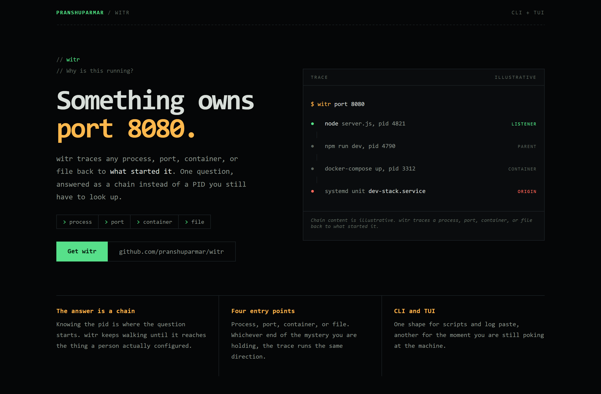
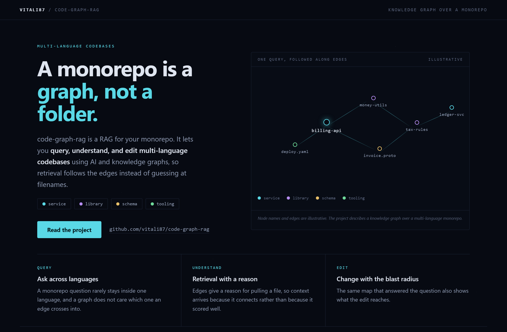
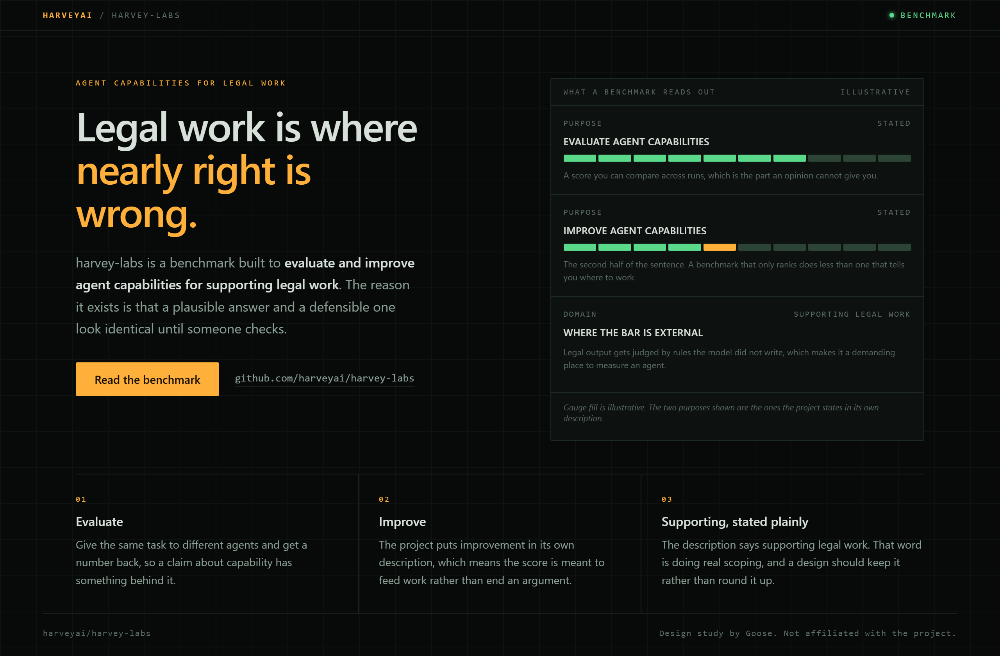

# Design Rep — Sunday, August 9

> 3 mocks — mono-zine, constellation, hud

[Catalog](../../CATALOG.md) · [Home](../../README.md)

## [pranshuparmar/witr](https://github.com/pranshuparmar/witr)

- **Style:** mono-zine / phosphor-green
- **Idea tested:** ask the tool's own question in the hero and run the trace beside it
- **Verdict:** landed: one question answered beats any feature list
- [live .html](./01-witr.html) · [repo on GitHub](https://github.com/pranshuparmar/witr)

## [vitali87/code-graph-rag](https://github.com/vitali87/code-graph-rag)

- **Style:** constellation / cyan
- **Idea tested:** make the retrieval unit visible with one lit node and four typed edges
- **Verdict:** landed: retrieval by connection becomes a picture instead of a claim
- [live .html](./02-code-graph-rag.html) · [repo on GitHub](https://github.com/vitali87/code-graph-rag)

## [harveyai/harvey-labs](https://github.com/harveyai/harvey-labs)

- **Style:** hud / signal-amber
- **Idea tested:** read evaluate and improve back as two gauges and keep the word supporting
- **Verdict:** landed: quantitative layout with no invented score
- [live .html](./03-harvey-labs.html) · [repo on GitHub](https://github.com/harveyai/harvey-labs)

