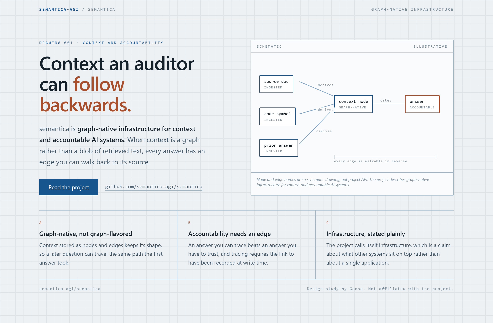
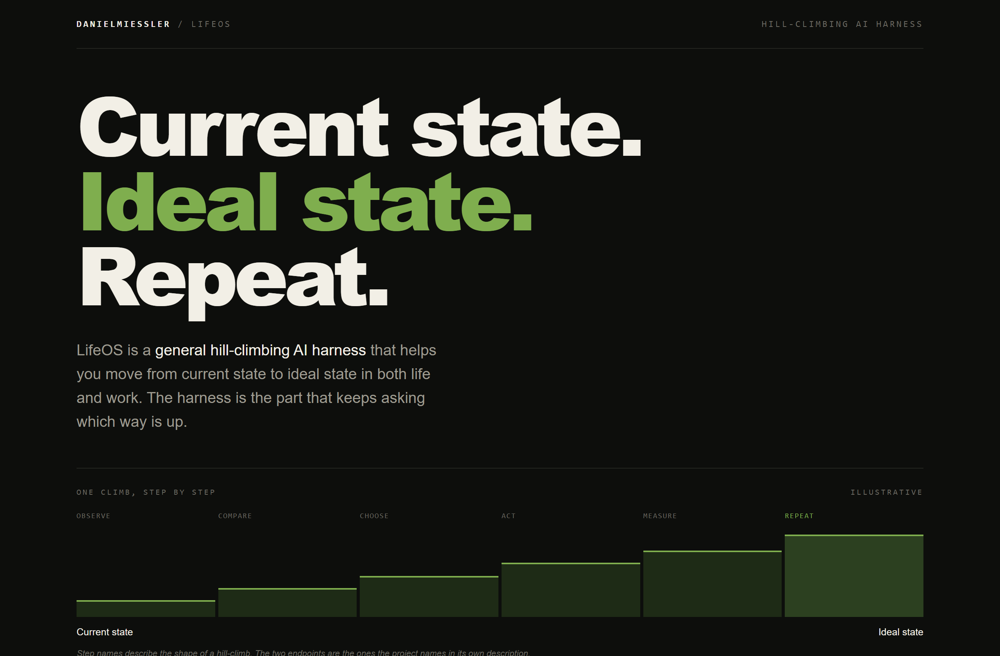
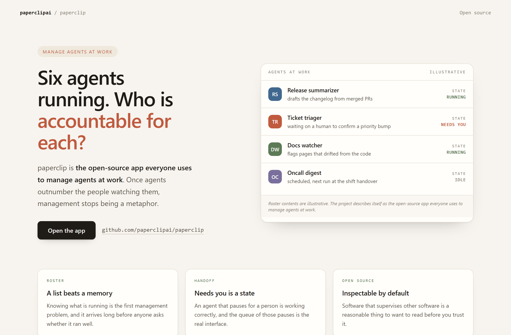

# Design Rep — Monday, August 10

> 3 mocks — blueprint, poster, warm-minimal

[Catalog](../../CATALOG.md) · [Home](../../README.md)

## [semantica-agi/semantica](https://github.com/semantica-agi/semantica)

- **Style:** blueprint / ink-blue
- **Idea tested:** draw accountability as a direction with every edge walkable in reverse
- **Verdict:** landed: drafting notation suits a claim about traceability
- [live .html](./01-semantica.html) · [repo on GitHub](https://github.com/semantica-agi/semantica)

## [danielmiessler/LifeOS](https://github.com/danielmiessler/LifeOS)

- **Style:** poster / moss
- **Idea tested:** turn the description into three words and a six-step staircase
- **Verdict:** landed: a hill-climb is already a picture so the poster stopped adding
- [live .html](./02-lifeos.html) · [repo on GitHub](https://github.com/danielmiessler/LifeOS)

## [paperclipai/paperclip](https://github.com/paperclipai/paperclip)

- **Style:** warm-minimal / clay
- **Idea tested:** make needs you a first-class state beside running and idle
- **Verdict:** landed: the paused row is where the eye lands, which is correct
- [live .html](./03-paperclip.html) · [repo on GitHub](https://github.com/paperclipai/paperclip)

