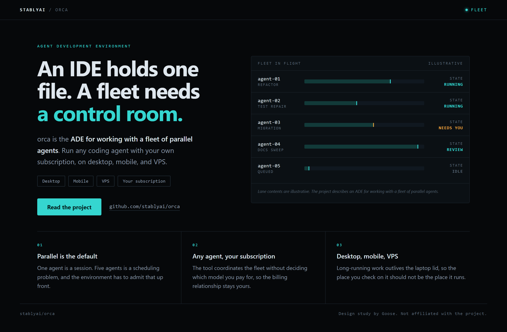
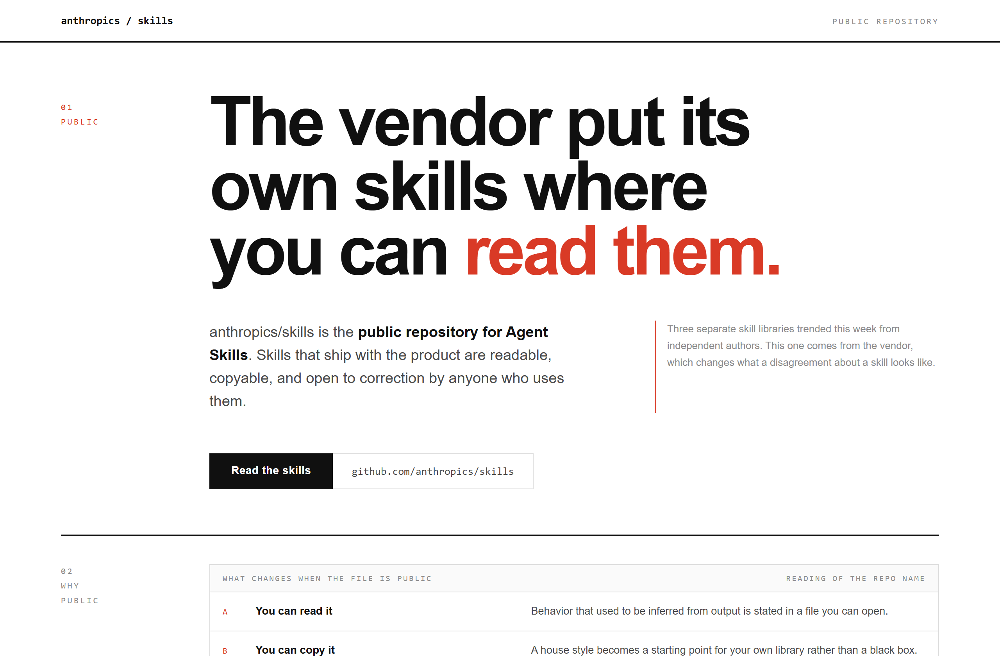
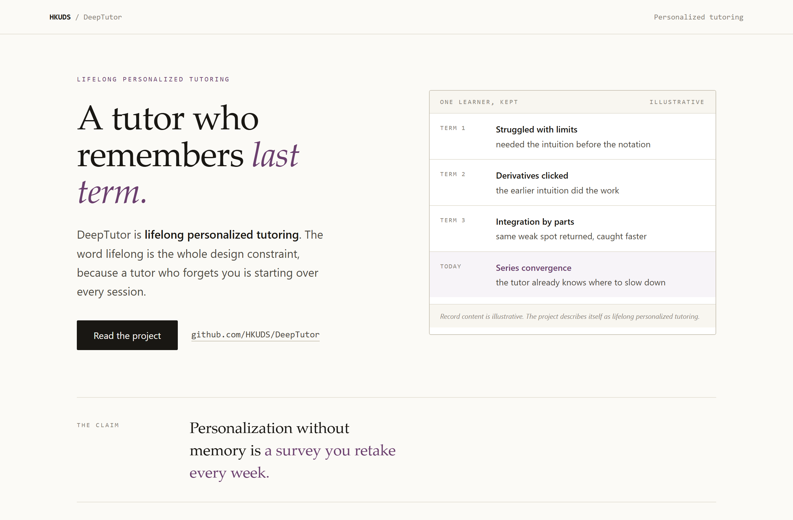

# Design Rep — Tuesday, August 11

> 3 mocks — terminal-dark, swiss, editorial

[Catalog](../../CATALOG.md) · [Home](../../README.md)

## [stablyai/orca](https://github.com/stablyai/orca)

- **Style:** terminal-dark / cyan
- **Idea tested:** argue the category name with five lanes at different depths and one blocked
- **Verdict:** landed: parallel reads as a scheduling problem not a feature word
- [live .html](./01-orca.html) · [repo on GitHub](https://github.com/stablyai/orca)

## [anthropics/skills](https://github.com/anthropics/skills)

- **Style:** swiss / signal-red
- **Idea tested:** take the word public seriously and show what changes when the file is readable
- **Verdict:** landed: the grid holds an argument without inventing product claims
- [live .html](./02-skills.html) · [repo on GitHub](https://github.com/anthropics/skills)

## [HKUDS/DeepTutor](https://github.com/HKUDS/DeepTutor)

- **Style:** editorial / plum
- **Idea tested:** make lifelong load-bearing with one learner across four dated terms
- **Verdict:** landed: a repeated mistake is only a pattern if the first was recorded
- [live .html](./03-deeptutor.html) · [repo on GitHub](https://github.com/HKUDS/DeepTutor)

