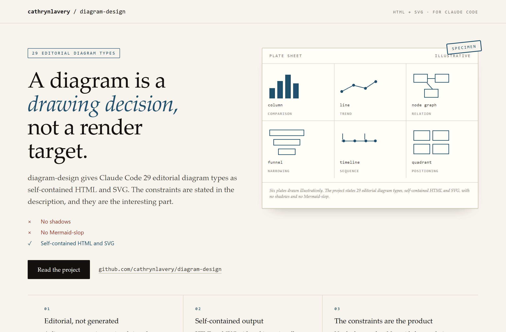
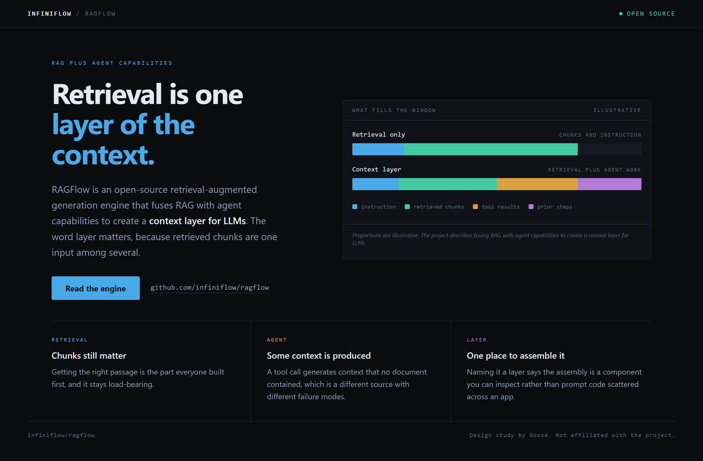
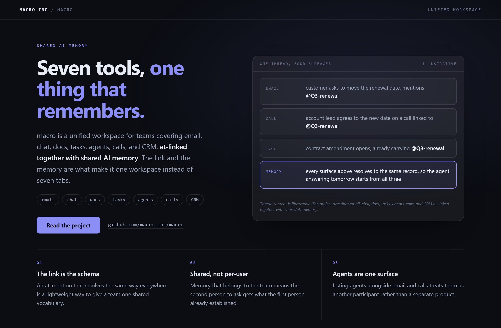

# Design Rep — Wednesday, August 12

> 3 mocks — specimen, data-viz, glass

[Catalog](../../CATALOG.md) · [Home](../../README.md)

## [cathrynlavery/diagram-design](https://github.com/cathrynlavery/diagram-design)

- **Style:** specimen / stamp-red
- **Idea tested:** anti-goals as the product, a specimen sheet of rejected vs accepted renderings
- **Verdict:** landed
- [live .html](./01-diagram-design.html) · [repo on GitHub](https://github.com/cathrynlavery/diagram-design)

## [infiniflow/ragflow](https://github.com/infiniflow/ragflow)

- **Style:** data-viz / multi
- **Idea tested:** build the page around the word layer, two bars for what fills the context window
- **Verdict:** landed
- [live .html](./02-ragflow.html) · [repo on GitHub](https://github.com/infiniflow/ragflow)

## [macro-inc/macro](https://github.com/macro-inc/macro)

- **Style:** glass / iris
- **Idea tested:** show the at-mention doing work across four surfaces
- **Verdict:** landed
- [live .html](./03-macro.html) · [repo on GitHub](https://github.com/macro-inc/macro)

