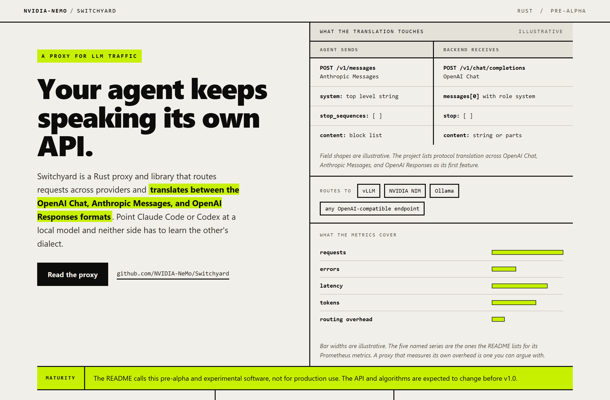
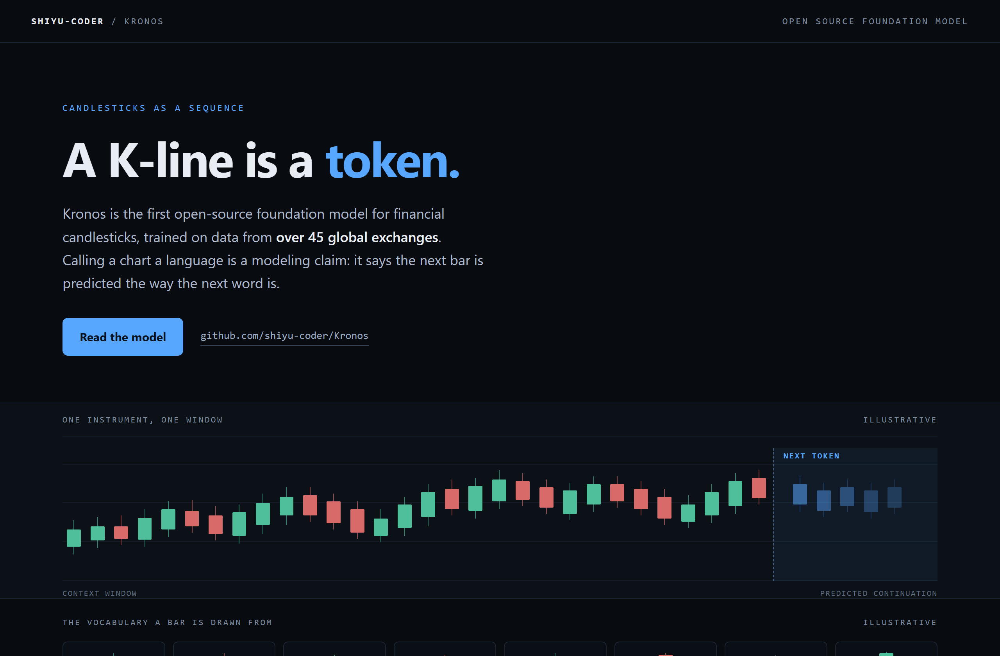
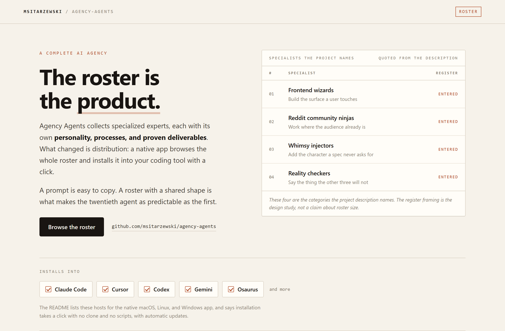

# Design Rep — Thursday, August 13

> 3 mocks — brutalist, waveform, ledger

[Catalog](../../CATALOG.md) · [Home](../../README.md)

## [NVIDIA-NeMo/Switchyard](https://github.com/NVIDIA-NeMo/Switchyard)

- **Style:** brutalist / acid-lime
- **Idea tested:** put the translation on the wire with paired request shapes and an exposed maturity band
- **Verdict:** landed
- [live .html](./01-switchyard.html) · [repo on GitHub](https://github.com/NVIDIA-NeMo/Switchyard)

## [shiyu-coder/Kronos](https://github.com/shiyu-coder/Kronos)

- **Style:** waveform / tide-blue
- **Idea tested:** take the word language literally, a bar sequence plus the vocabulary it is drawn from
- **Verdict:** landed
- [live .html](./02-kronos.html) · [repo on GitHub](https://github.com/shiyu-coder/Kronos)

## [msitarzewski/agency-agents](https://github.com/msitarzewski/agency-agents)

- **Style:** ledger / ink-rust
- **Idea tested:** treat the roster as the artifact, a quoted register plus the install targets
- **Verdict:** landed
- [live .html](./03-agency-agents.html) · [repo on GitHub](https://github.com/msitarzewski/agency-agents)

