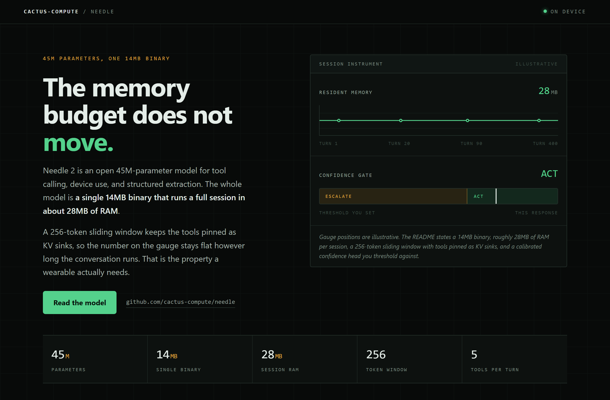
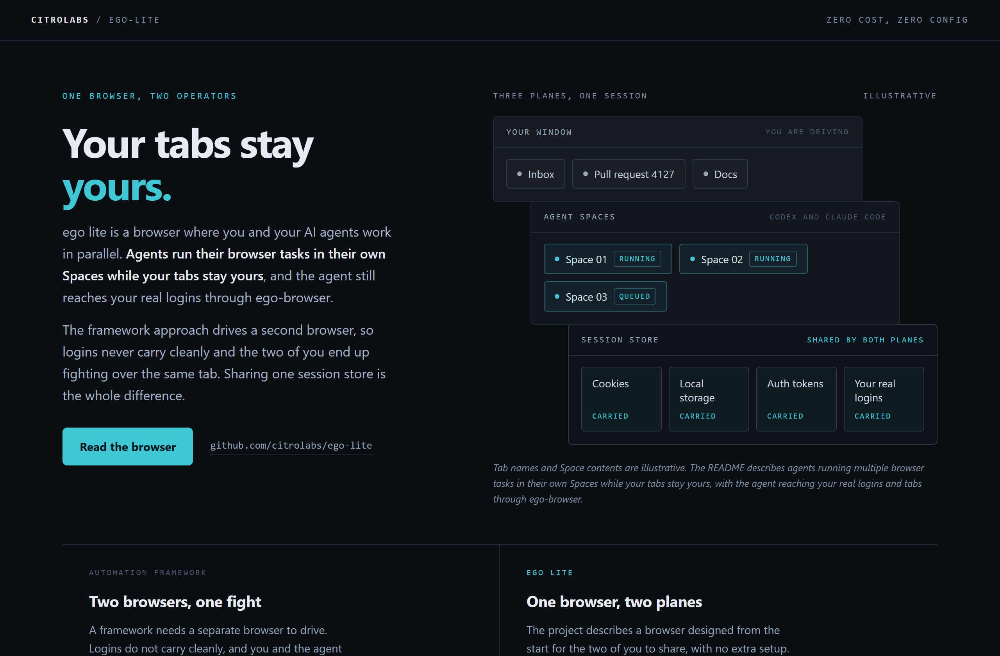
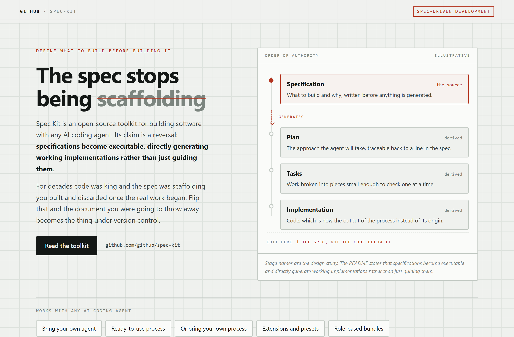

# Design Rep — Friday, August 14

> 3 mocks — hud, strata, blueprint

[Catalog](../../CATALOG.md) · [Home](../../README.md)

## [cactus-compute/needle](https://github.com/cactus-compute/needle)

- **Style:** hud / instrument-green
- **Idea tested:** make the flat line the hero, a memory readout that does not move across 400 turns
- **Verdict:** landed
- [live .html](./01-needle.html) · [repo on GitHub](https://github.com/cactus-compute/needle)

## [citrolabs/ego-lite](https://github.com/citrolabs/ego-lite)

- **Style:** strata / slate-cyan
- **Idea tested:** draw the ownership boundary as three offset planes over one shared session store
- **Verdict:** landed
- [live .html](./02-ego-lite.html) · [repo on GitHub](https://github.com/citrolabs/ego-lite)

## [github/spec-kit](https://github.com/github/spec-kit)

- **Style:** blueprint / drafting-red
- **Idea tested:** strike the old word out and keep it visible, one source card and three derived
- **Verdict:** landed
- [live .html](./03-spec-kit.html) · [repo on GitHub](https://github.com/github/spec-kit)

