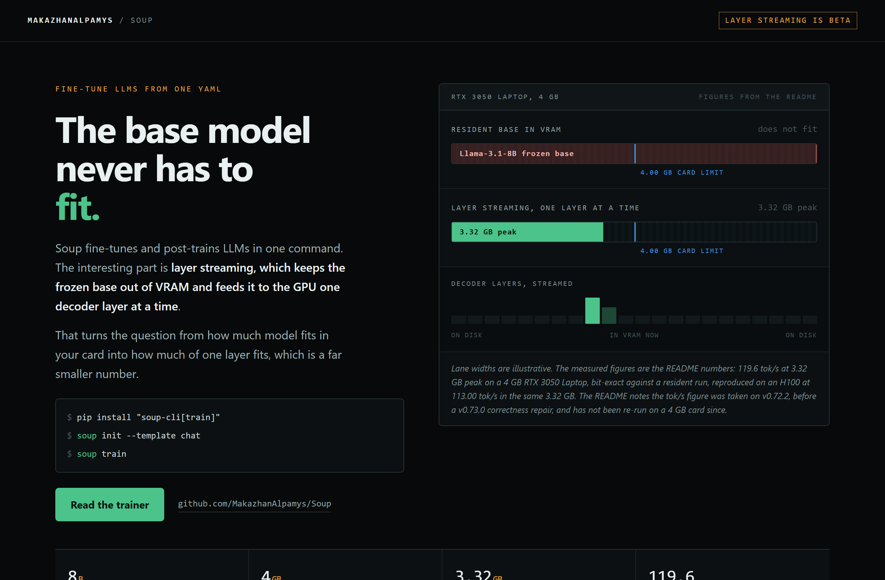
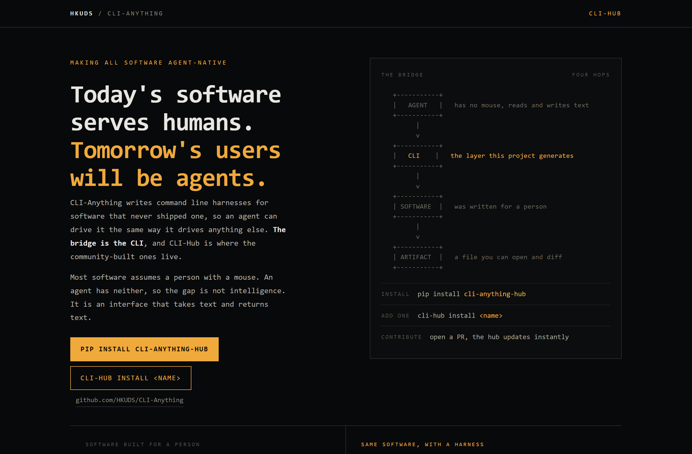
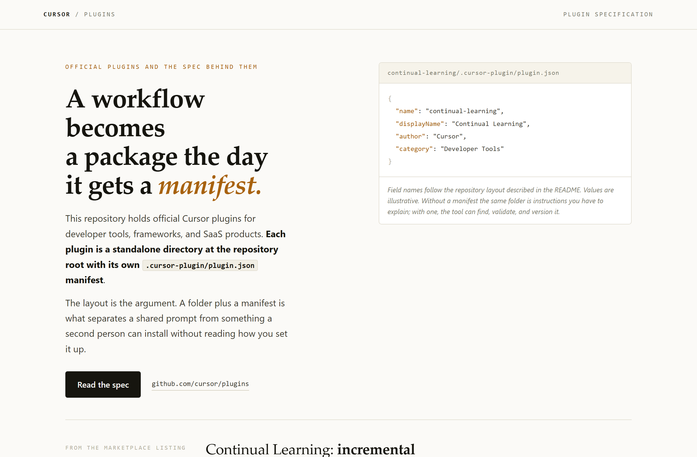

# Design Rep — Saturday, August 15

> 3 mocks — data-viz, mono-zine, editorial

[Catalog](../../CATALOG.md) · [Home](../../README.md)

## [MakazhanAlpamys/Soup](https://github.com/MakazhanAlpamys/Soup)

- **Style:** data-viz / vram-green
- **Idea tested:** draw the constraint then the thing that beats it, one card limit across two VRAM tracks
- **Verdict:** landed
- [live .html](./01-soup.html) · [repo on GitHub](https://github.com/MakazhanAlpamys/Soup)

## [HKUDS/CLI-Anything](https://github.com/HKUDS/CLI-Anything)

- **Style:** mono-zine / amber
- **Idea tested:** show the failure before the fix, a stalled GUI run beside four working commands
- **Verdict:** landed
- [live .html](./02-cli-anything.html) · [repo on GitHub](https://github.com/HKUDS/CLI-Anything)

## [cursor/plugins](https://github.com/cursor/plugins)

- **Style:** editorial / ochre
- **Idea tested:** build the page on the repository layout, manifest card beside the headline
- **Verdict:** landed
- [live .html](./03-cursor-plugins.html) · [repo on GitHub](https://github.com/cursor/plugins)

