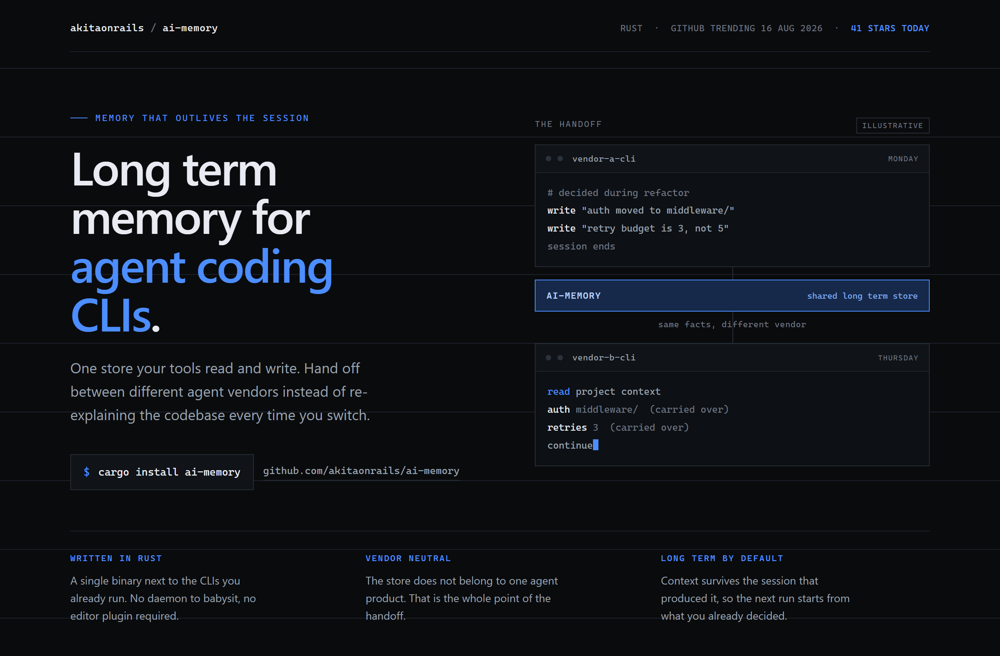
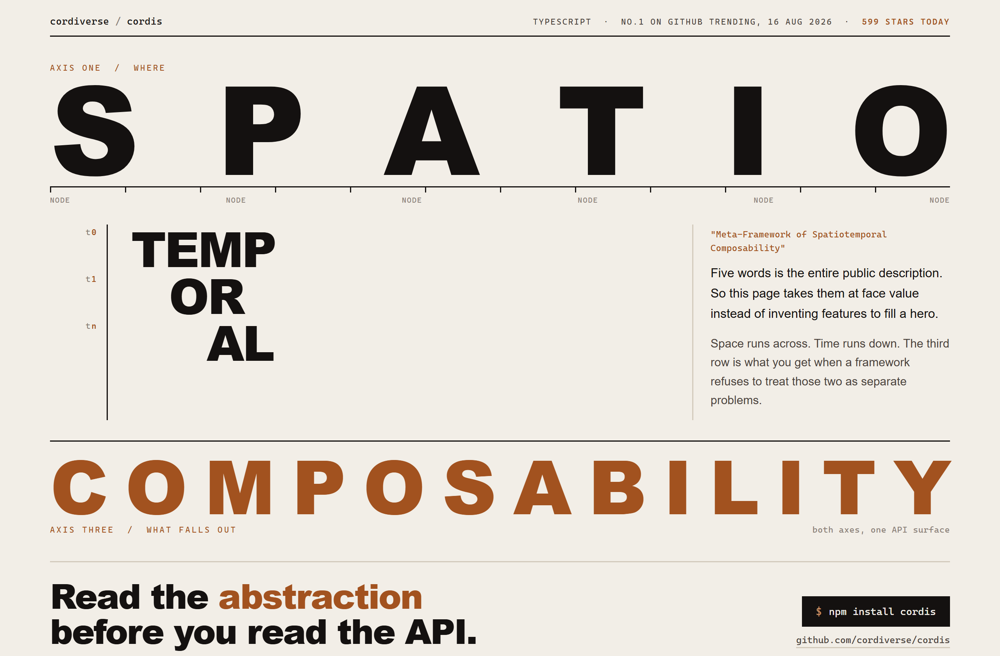
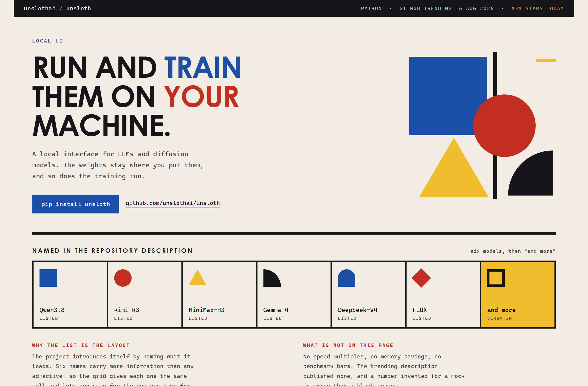

# Design Rep — Sunday, August 16

> 3 mocks — terminal-dark, poster, bauhaus

[Catalog](../../CATALOG.md) · [Home](../../README.md)

## [akitaonrails/ai-memory](https://github.com/akitaonrails/ai-memory)

- **Style:** terminal-dark / cobalt
- **Idea tested:** make the handoff the hero, one shared store between two dated vendor CLI panes
- **Verdict:** landed
- [live .html](./01-ai-memory.html) · [repo on GitHub](https://github.com/akitaonrails/ai-memory)

## [cordiverse/cordis](https://github.com/cordiverse/cordis)

- **Style:** poster / copper
- **Idea tested:** split a five-word abstraction onto two axes and let the third word land full width
- **Verdict:** landed
- [live .html](./02-cordis.html) · [repo on GitHub](https://github.com/cordiverse/cordis)

## [unslothai/unsloth](https://github.com/unslothai/unsloth)

- **Style:** bauhaus / primary-blue
- **Idea tested:** treat the six named models as the layout and quote "and more" as the seventh tile
- **Verdict:** landed
- [live .html](./03-unsloth.html) · [repo on GitHub](https://github.com/unslothai/unsloth)

