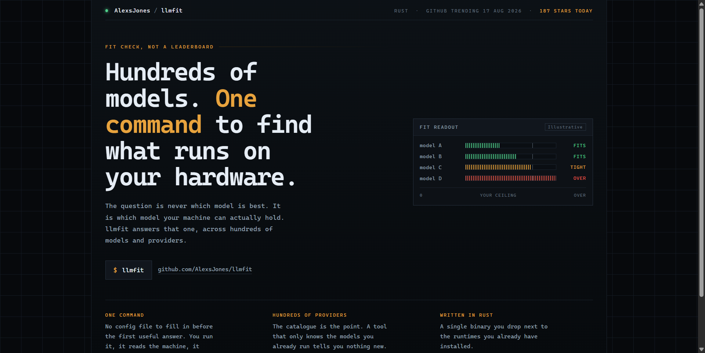
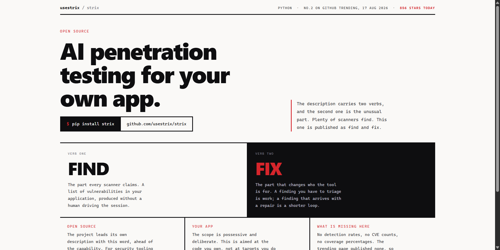
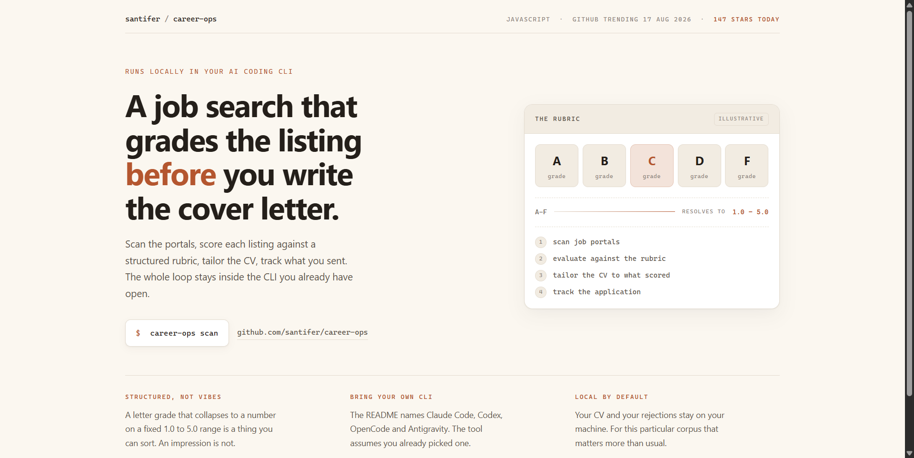

# Design Rep — Monday, August 17

> 3 mocks — hud, brutalist, warm-minimal

[Catalog](../../CATALOG.md) · [Home](../../README.md)

## [AlexsJones/llmfit](https://github.com/AlexsJones/llmfit)

- **Style:** hud / instrument-amber
- **Idea tested:** put the user hardware ceiling in the panel and let four anonymous bars fall either side of it
- **Verdict:** landed
- [live .html](./01-llmfit.html) · [repo on GitHub](https://github.com/AlexsJones/llmfit)

## [usestrix/strix](https://github.com/usestrix/strix)

- **Style:** brutalist / acid-red
- **Idea tested:** split the description on its own conjunction, FIND on paper and FIX inverted
- **Verdict:** landed
- [live .html](./02-strix.html) · [repo on GitHub](https://github.com/usestrix/strix)

## [santifer/career-ops](https://github.com/santifer/career-ops)

- **Style:** warm-minimal / clay
- **Idea tested:** make the scoring scale the product shot, A-F tiles resolving into the 1.0-5.0 number
- **Verdict:** landed
- [live .html](./03-career-ops.html) · [repo on GitHub](https://github.com/santifer/career-ops)

