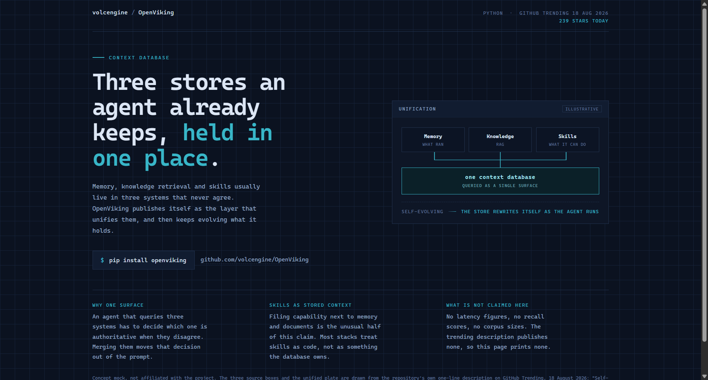
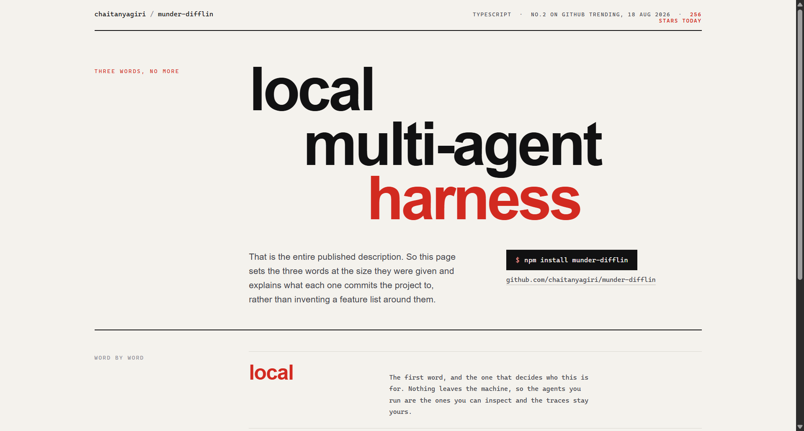
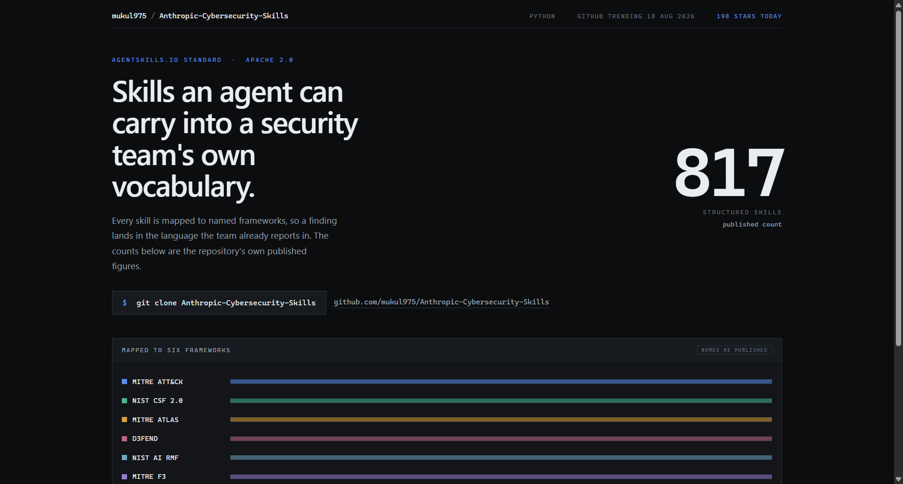

# Design Rep — Tuesday, August 18

> 3 mocks — blueprint, swiss, data-viz

[Catalog](../../CATALOG.md) · [Home](../../README.md)

## [volcengine/OpenViking](https://github.com/volcengine/OpenViking)

- **Style:** blueprint / drafting-cyan
- **Idea tested:** draw the word unify, three source boxes converging by leader line into one plate
- **Verdict:** landed
- [live .html](./01-openviking.html) · [repo on GitHub](https://github.com/volcengine/OpenViking)

## [chaitanyagiri/munder-difflin](https://github.com/chaitanyagiri/munder-difflin)

- **Style:** swiss / signal-red
- **Idea tested:** set a three-word description as the hero staircase and annotate each word
- **Verdict:** landed
- [live .html](./02-munder-difflin.html) · [repo on GitHub](https://github.com/chaitanyagiri/munder-difflin)

## [mukul975/Anthropic-Cybersecurity-Skills](https://github.com/mukul975/Anthropic-Cybersecurity-Skills)

- **Style:** data-viz / six-lane
- **Idea tested:** draw six lanes at equal width because the split is not published
- **Verdict:** landed
- [live .html](./03-cybersecurity-skills.html) · [repo on GitHub](https://github.com/mukul975/Anthropic-Cybersecurity-Skills)

