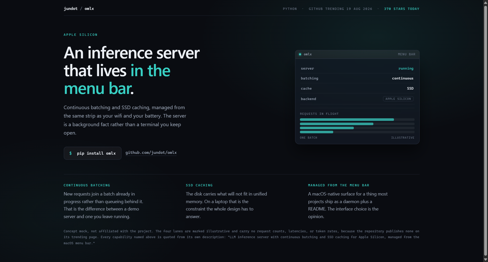
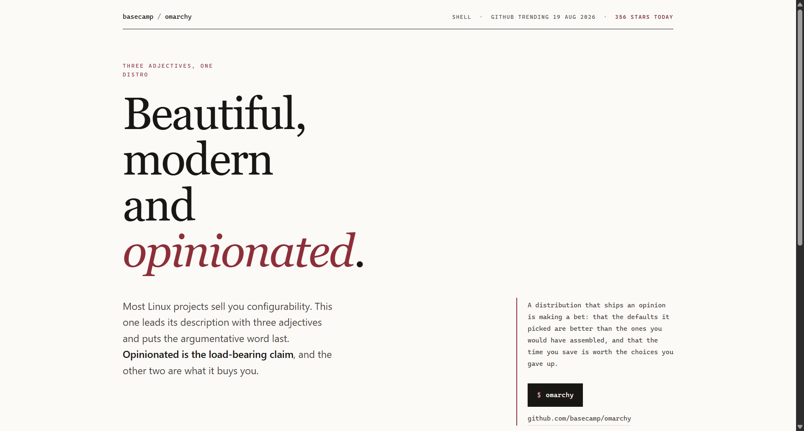
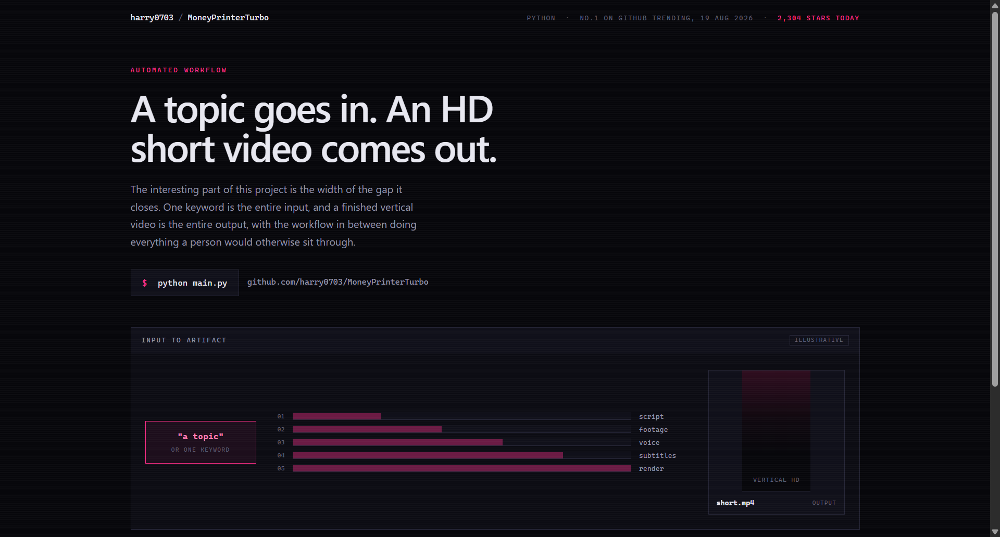

# Design Rep — Wednesday, August 19

> 3 mocks — glass, editorial, neon-noir

[Catalog](../../CATALOG.md) · [Home](../../README.md)

## [jundot/omlx](https://github.com/jundot/omlx)

- **Style:** glass / frost-teal
- **Idea tested:** let the interface choice be the hero, one frosted menu bar dropdown as the whole product shot
- **Verdict:** landed
- [live .html](./01-omlx.html) · [repo on GitHub](https://github.com/jundot/omlx)

## [basecamp/omarchy](https://github.com/basecamp/omarchy)

- **Style:** editorial / wine
- **Idea tested:** treat three adjectives as a three-column argument with the risky one set apart
- **Verdict:** landed
- [live .html](./02-omarchy.html) · [repo on GitHub](https://github.com/basecamp/omarchy)

## [harry0703/MoneyPrinterTurbo](https://github.com/harry0703/MoneyPrinterTurbo)

- **Style:** neon-noir / magenta
- **Idea tested:** draw the width of the gap, one seed box widening across five stages into a 9:16 artifact
- **Verdict:** landed
- [live .html](./03-moneyprinterturbo.html) · [repo on GitHub](https://github.com/harry0703/MoneyPrinterTurbo)

