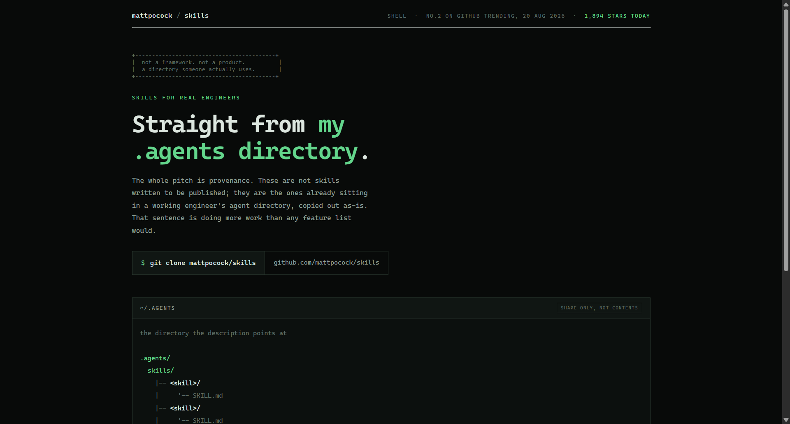
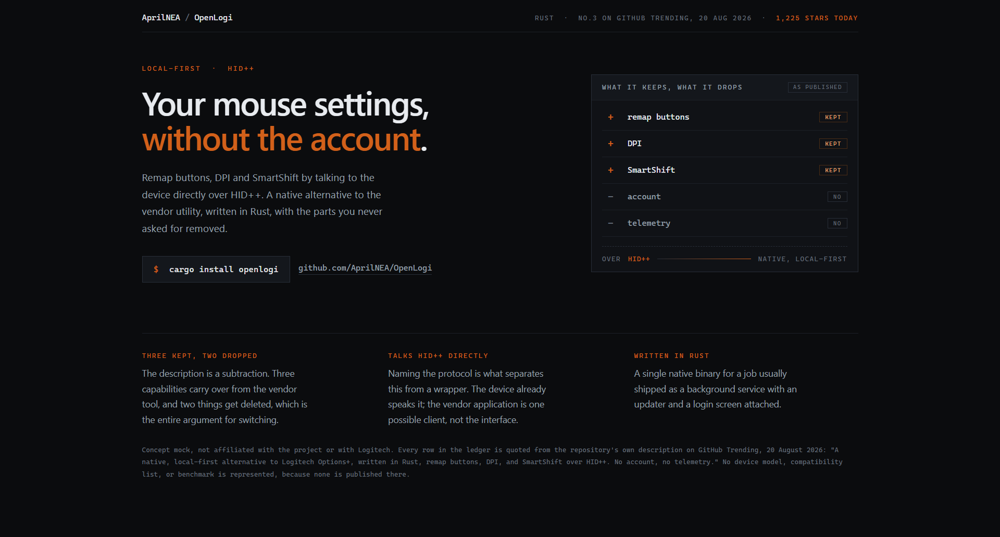
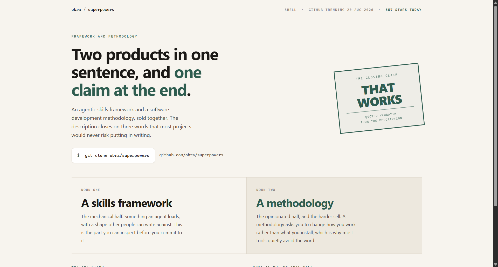

# Design Rep — Thursday, August 20

> 3 mocks — mono-zine, terminal-dark, specimen

[Catalog](../../CATALOG.md) · [Home](../../README.md)

## [mattpocock/skills](https://github.com/mattpocock/skills)

- **Style:** mono-zine / phosphor-green
- **Idea tested:** make provenance the product shot, draw the .agents directory instead of a feature list
- **Verdict:** landed
- [live .html](./01-skills.html) · [repo on GitHub](https://github.com/mattpocock/skills)

## [AprilNEA/OpenLogi](https://github.com/AprilNEA/OpenLogi)

- **Style:** terminal-dark / rust-orange
- **Idea tested:** render the description as arithmetic, three plus rows over two minus rows
- **Verdict:** landed
- [live .html](./02-openlogi.html) · [repo on GitHub](https://github.com/AprilNEA/OpenLogi)

## [obra/superpowers](https://github.com/obra/superpowers)

- **Style:** specimen / stamp-green
- **Idea tested:** isolate the three words the project risked and stamp them as evidence
- **Verdict:** landed
- [live .html](./03-superpowers.html) · [repo on GitHub](https://github.com/obra/superpowers)

