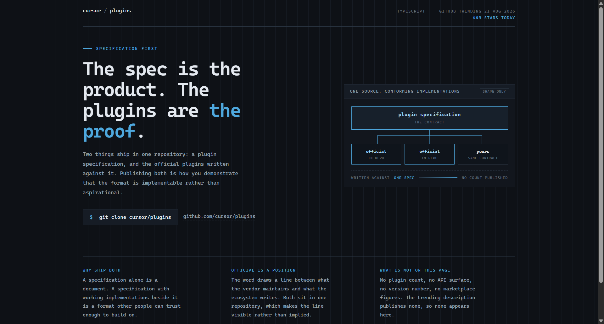
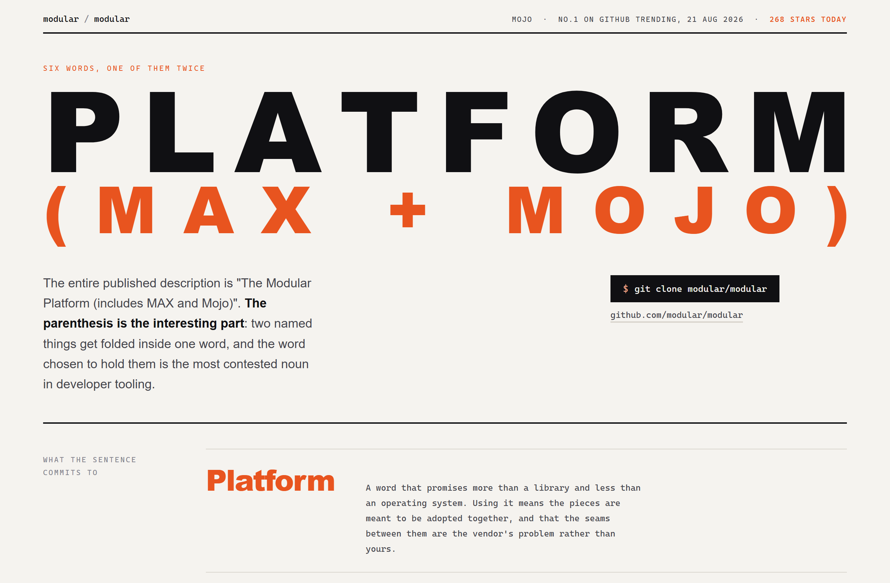
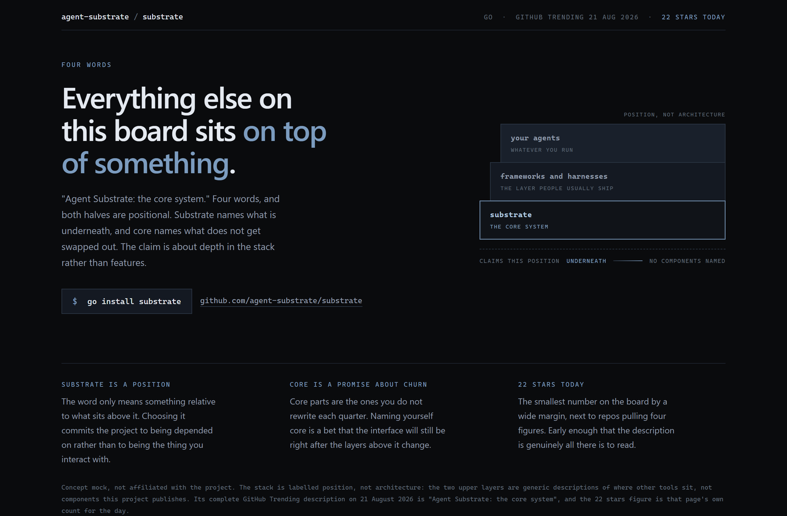

# Design Rep — Friday, August 21

> 3 mocks — blueprint, poster, strata

[Catalog](../../CATALOG.md) · [Home](../../README.md)

## [cursor/plugins](https://github.com/cursor/plugins)

- **Style:** blueprint / spec-blue
- **Idea tested:** draw the relationship, one spec box fanning by leader line into three conforming implementations
- **Verdict:** landed
- [live .html](./01-cursor-plugins.html) · [repo on GitHub](https://github.com/cursor/plugins)

## [modular/modular](https://github.com/modular/modular)

- **Style:** poster / flame
- **Idea tested:** set the parenthesis as the second line of the headline, one word holding two
- **Verdict:** landed
- [live .html](./02-modular.html) · [repo on GitHub](https://github.com/modular/modular)

## [agent-substrate/substrate](https://github.com/agent-substrate/substrate)

- **Style:** strata / slate-blue
- **Idea tested:** draw a claim about position not capability, three offset planes with the lowest lit
- **Verdict:** landed
- [live .html](./03-substrate.html) · [repo on GitHub](https://github.com/agent-substrate/substrate)

