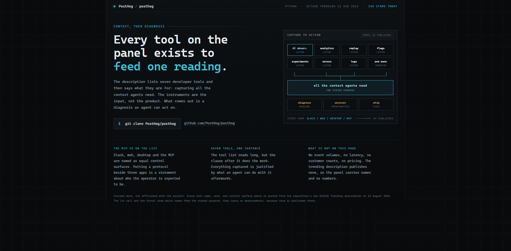
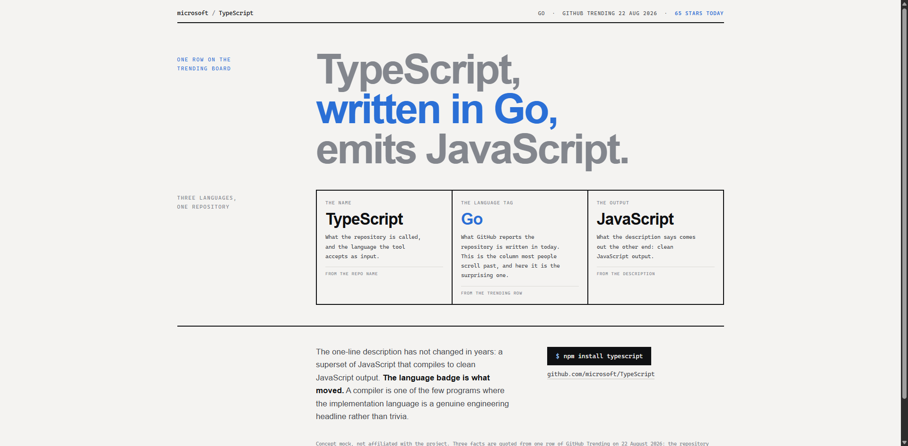
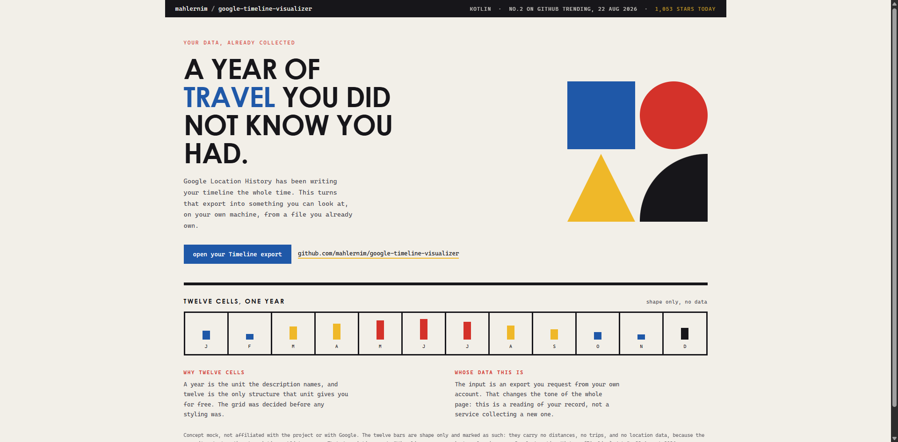

# Design Rep — Saturday, August 22

> 3 mocks — hud, swiss, bauhaus

[Catalog](../../CATALOG.md) · [Home](../../README.md)

## [PostHog/posthog](https://github.com/PostHog/posthog)

- **Style:** hud / instrument-cyan
- **Idea tested:** treat a seven-item feature list as the input side of a funnel into one stated purpose
- **Verdict:** landed
- [live .html](./01-posthog.html) · [repo on GitHub](https://github.com/PostHog/posthog)

## [microsoft/TypeScript](https://github.com/microsoft/TypeScript)

- **Style:** swiss / signal-blue
- **Idea tested:** build the page on the language badge, the metadata column everyone scrolls past
- **Verdict:** landed
- [live .html](./02-typescript.html) · [repo on GitHub](https://github.com/microsoft/TypeScript)

## [mahlernim/google-timeline-visualizer](https://github.com/mahlernim/google-timeline-visualizer)

- **Style:** bauhaus / primary-red
- **Idea tested:** let the noun pick the grid, a year gives you twelve cells for free
- **Verdict:** landed
- [live .html](./03-timeline.html) · [repo on GitHub](https://github.com/mahlernim/google-timeline-visualizer)

