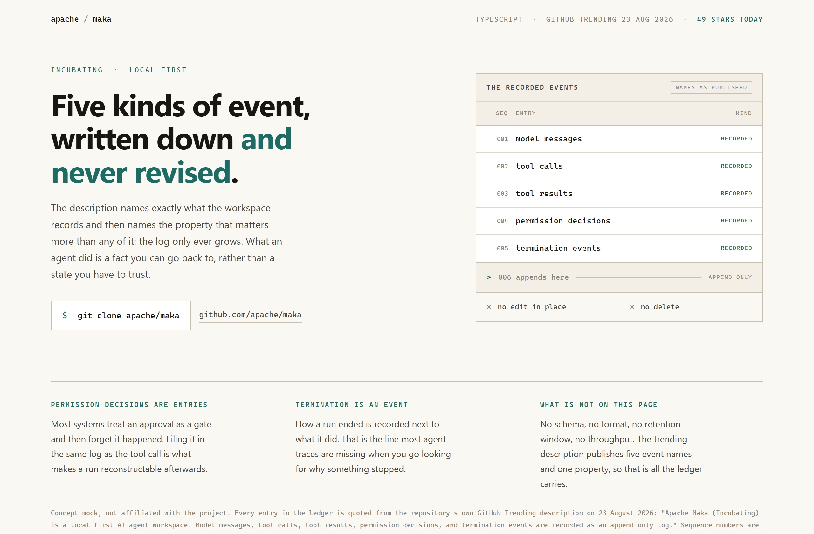
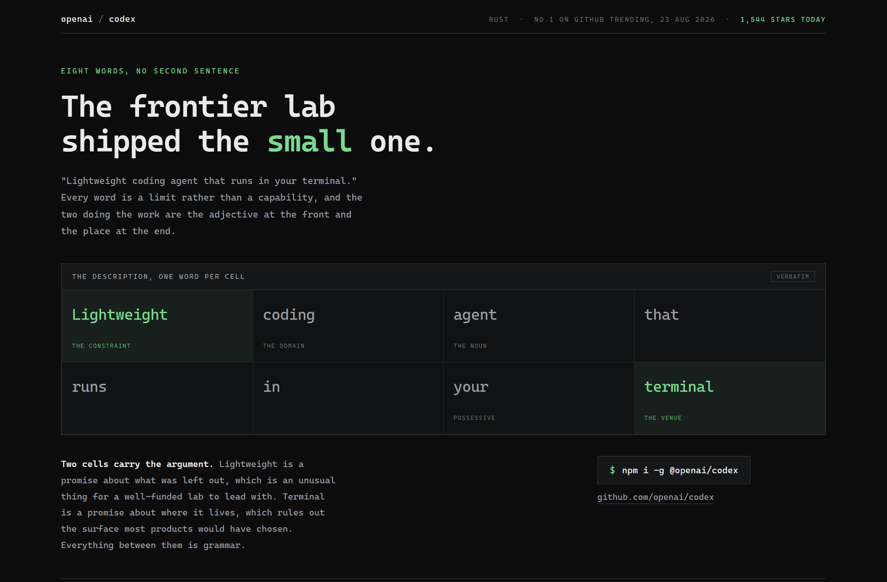
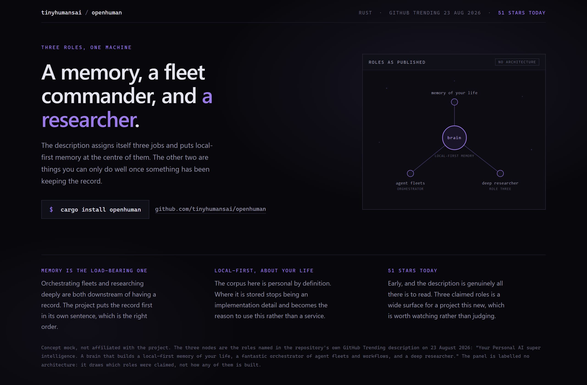

# Design Rep — Sunday, August 23

> 3 mocks — ledger, cell-grid, constellation

[Catalog](../../CATALOG.md) · [Home](../../README.md)

## [apache/maka](https://github.com/apache/maka)

- **Style:** ledger / ink-teal
- **Idea tested:** draw the data structure, five numbered rows and an append rail that forbids edit and delete
- **Verdict:** landed
- [live .html](./01-maka.html) · [repo on GitHub](https://github.com/apache/maka)

## [openai/codex](https://github.com/openai/codex)

- **Style:** cell-grid / lime
- **Idea tested:** one word per cell, light only the two that carry the claim
- **Verdict:** landed
- [live .html](./02-codex.html) · [repo on GitHub](https://github.com/openai/codex)

## [tinyhumansai/openhuman](https://github.com/tinyhumansai/openhuman)

- **Style:** constellation / violet
- **Idea tested:** put the load-bearing role at the hub and hang the other two off it
- **Verdict:** landed
- [live .html](./03-openhuman.html) · [repo on GitHub](https://github.com/tinyhumansai/openhuman)

