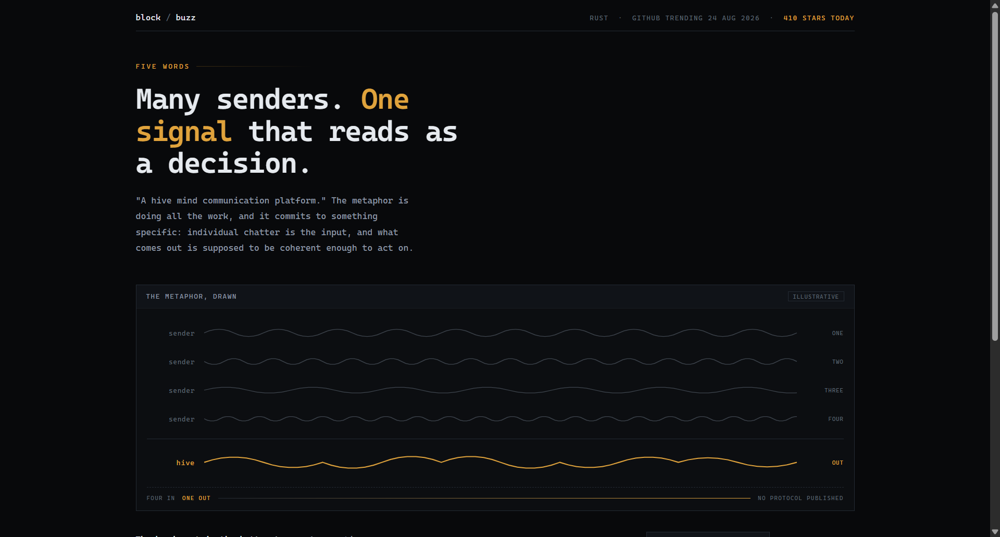
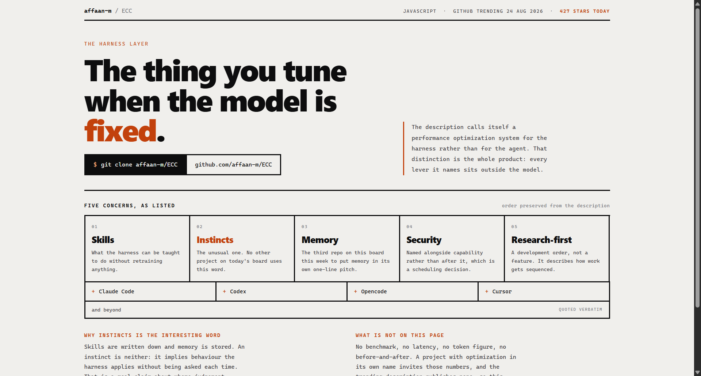
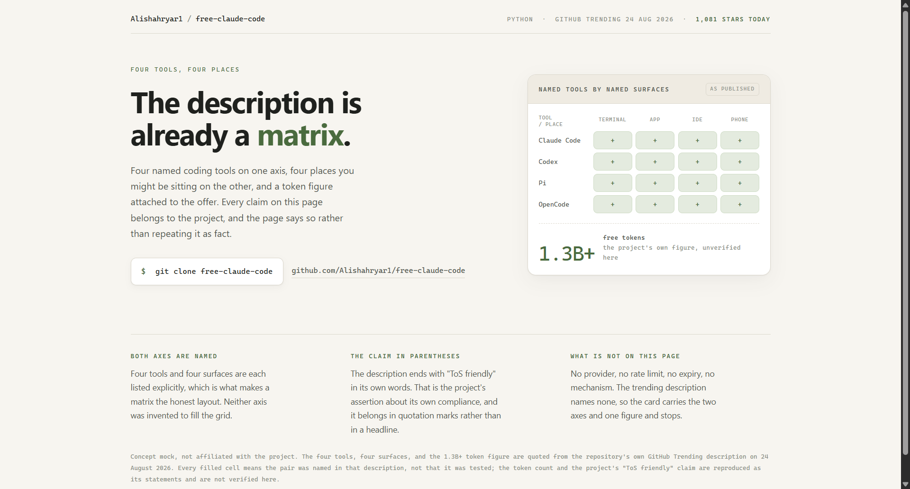

# Design Rep — Monday, August 24

> 3 mocks — waveform, brutalist, warm-minimal

[Catalog](../../CATALOG.md) · [Home](../../README.md)

## [block/buzz](https://github.com/block/buzz)

- **Style:** waveform / signal-amber
- **Idea tested:** draw the metaphor, four sender traces resolving into one carrier
- **Verdict:** landed
- [live .html](./01-buzz.html) · [repo on GitHub](https://github.com/block/buzz)

## [affaan-m/ECC](https://github.com/affaan-m/ECC)

- **Style:** brutalist / burnt-orange
- **Idea tested:** keep the published list order and mark the one word no other repo uses
- **Verdict:** landed
- [live .html](./02-ecc.html) · [repo on GitHub](https://github.com/affaan-m/ECC)

## [Alishahryar1/free-claude-code](https://github.com/Alishahryar1/free-claude-code)

- **Style:** warm-minimal / moss
- **Idea tested:** when both axes are published the matrix is the layout, attribute every figure
- **Verdict:** landed
- [live .html](./03-free-claude-code.html) · [repo on GitHub](https://github.com/Alishahryar1/free-claude-code)

