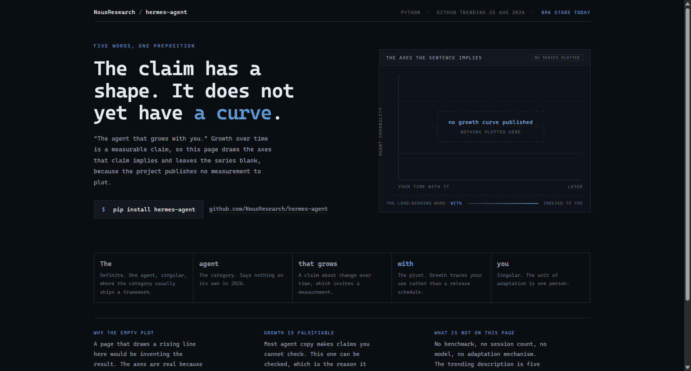
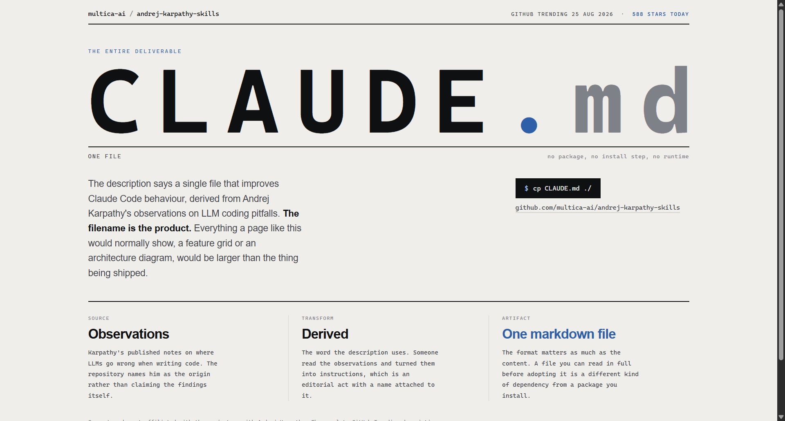
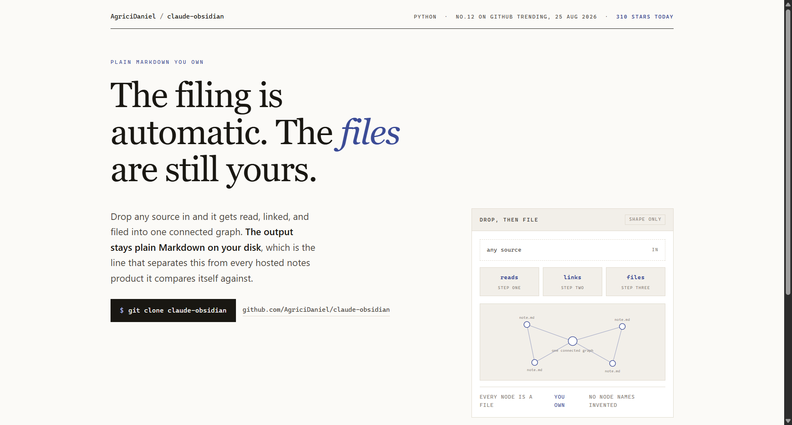

# Design Rep — Tuesday, August 25

> 3 mocks — data-viz, poster, editorial

[Catalog](../../CATALOG.md) · [Home](../../README.md)

## [NousResearch/hermes-agent](https://github.com/NousResearch/hermes-agent)

- **Style:** data-viz / axis-blue
- **Idea tested:** draw the axes the claim implies and leave the series empty
- **Verdict:** landed
- [live .html](./01-hermes-agent.html) · [repo on GitHub](https://github.com/NousResearch/hermes-agent)

## [multica-ai/andrej-karpathy-skills](https://github.com/multica-ai/andrej-karpathy-skills)

- **Style:** poster / slate
- **Idea tested:** set the filename as the entire hero when the deliverable is one file
- **Verdict:** landed
- [live .html](./02-karpathy-skills.html) · [repo on GitHub](https://github.com/multica-ai/andrej-karpathy-skills)

## [AgriciDaniel/claude-obsidian](https://github.com/AgriciDaniel/claude-obsidian)

- **Style:** editorial / indigo
- **Idea tested:** ownership clause in the headline, mechanism in the panel, every node a note.md
- **Verdict:** landed
- [live .html](./03-claude-obsidian.html) · [repo on GitHub](https://github.com/AgriciDaniel/claude-obsidian)

