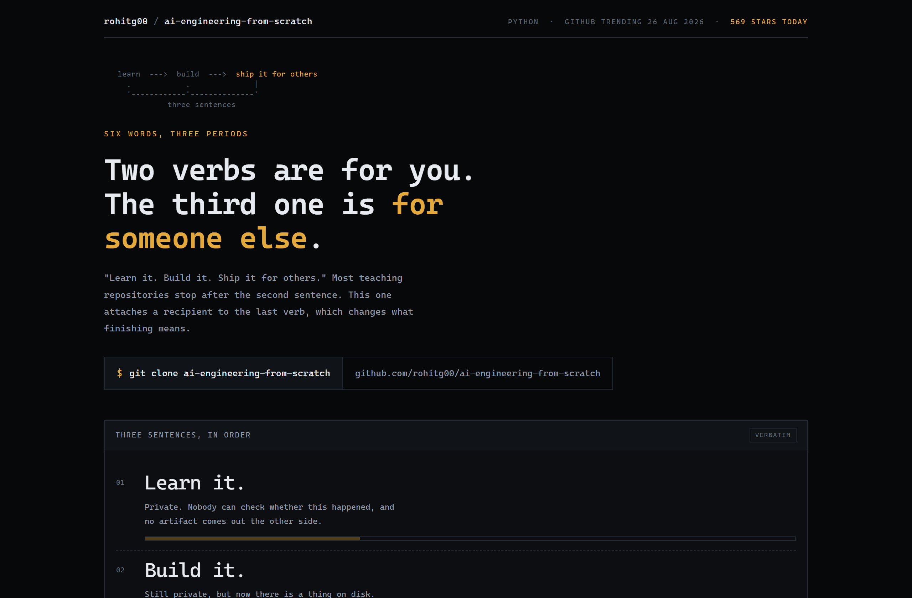
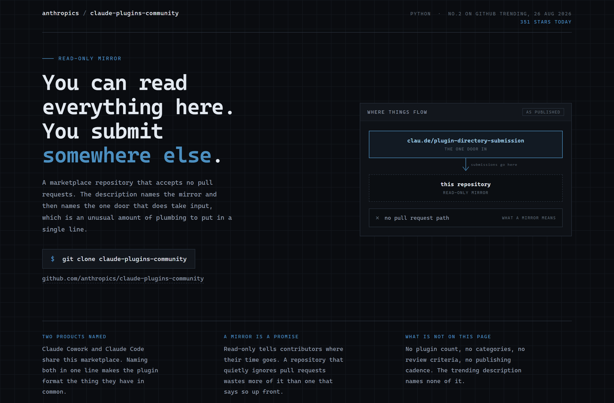
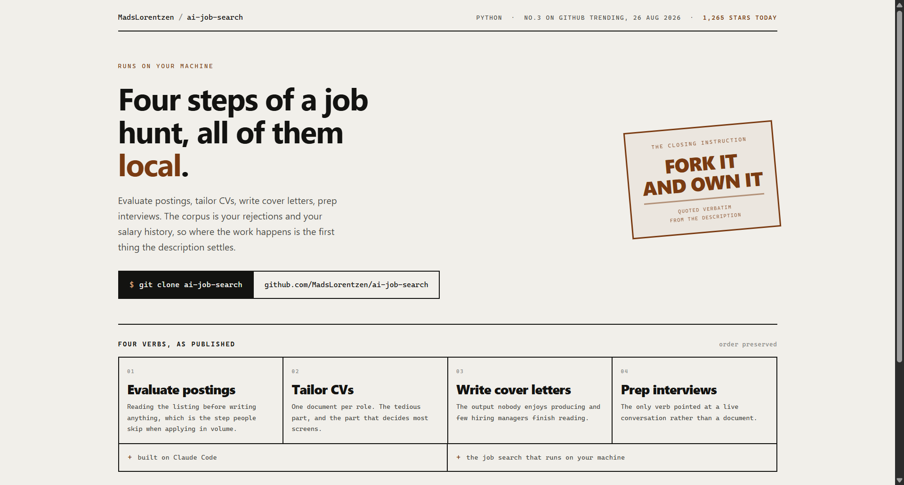

# Design Rep — Wednesday, August 26

> 3 mocks — mono-zine, blueprint, specimen

[Catalog](../../CATALOG.md) · [Home](../../README.md)

## [rohitg00/ai-engineering-from-scratch](https://github.com/rohitg00/ai-engineering-from-scratch)

- **Style:** mono-zine / amber
- **Idea tested:** count the parties in each sentence and light the only one with a witness
- **Verdict:** landed
- [live .html](./01-ai-engineering.html) · [repo on GitHub](https://github.com/rohitg00/ai-engineering-from-scratch)

## [anthropics/claude-plugins-community](https://github.com/anthropics/claude-plugins-community)

- **Style:** blueprint / mirror-blue
- **Idea tested:** draw the direction of travel when a repository refuses input
- **Verdict:** landed
- [live .html](./02-claude-plugins.html) · [repo on GitHub](https://github.com/anthropics/claude-plugins-community)

## [MadsLorentzen/ai-job-search](https://github.com/MadsLorentzen/ai-job-search)

- **Style:** specimen / stamp-rust
- **Idea tested:** stamp the instruction the project closes on, four published verbs beneath
- **Verdict:** landed
- [live .html](./03-ai-job-search.html) · [repo on GitHub](https://github.com/MadsLorentzen/ai-job-search)

