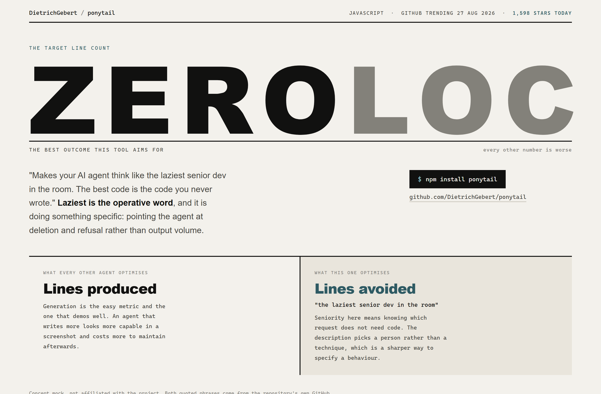
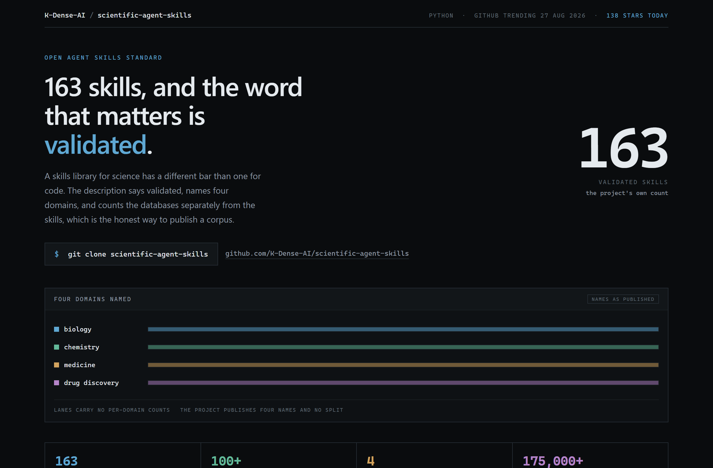
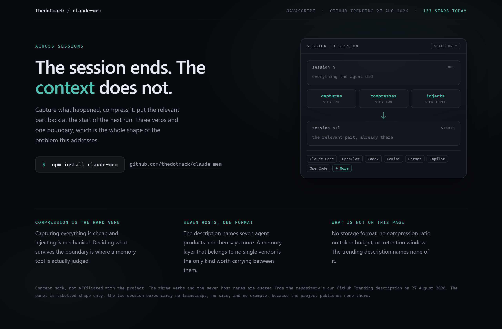

# Design Rep — Thursday, August 27

> 3 mocks — swiss, data-viz, glass

[Catalog](../../CATALOG.md) · [Home](../../README.md)

## [DietrichGebert/ponytail](https://github.com/DietrichGebert/ponytail)

- **Style:** swiss / slate-teal
- **Idea tested:** set the target number as the hero when the target is zero
- **Verdict:** landed
- [live .html](./01-ponytail.html) · [repo on GitHub](https://github.com/DietrichGebert/ponytail)

## [K-Dense-AI/scientific-agent-skills](https://github.com/K-Dense-AI/scientific-agent-skills)

- **Style:** data-viz / four-lane
- **Idea tested:** pick the adjective over the number for the headline, attribute every count
- **Verdict:** landed
- [live .html](./02-scientific-skills.html) · [repo on GitHub](https://github.com/K-Dense-AI/scientific-agent-skills)

## [thedotmack/claude-mem](https://github.com/thedotmack/claude-mem)

- **Style:** glass / frost-teal
- **Idea tested:** draw the boundary the product exists to cross, three verbs between two sessions
- **Verdict:** landed
- [live .html](./03-claude-mem.html) · [repo on GitHub](https://github.com/thedotmack/claude-mem)

