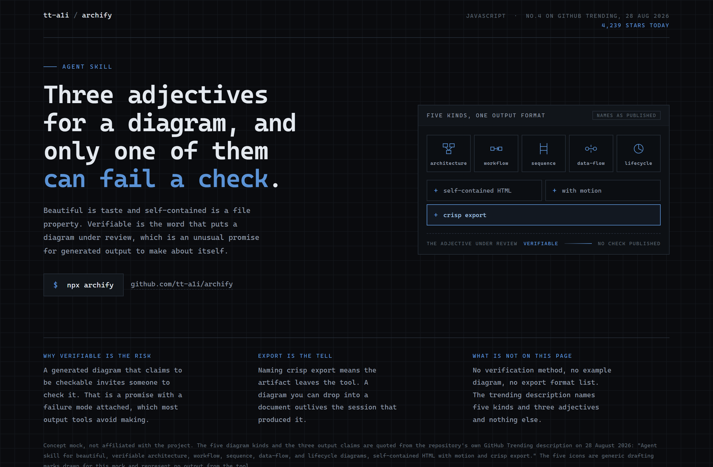
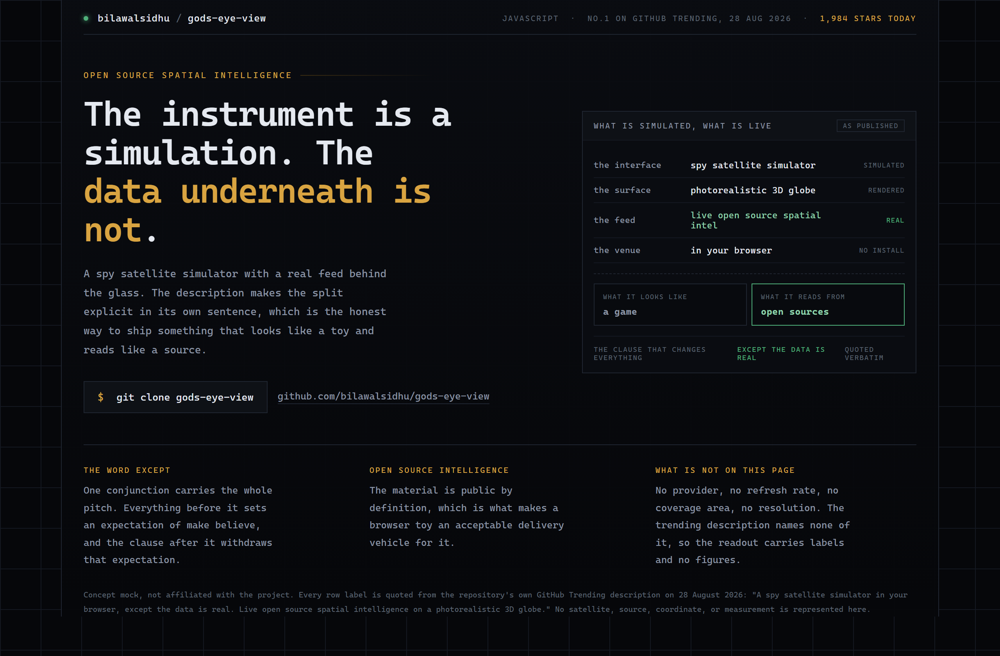
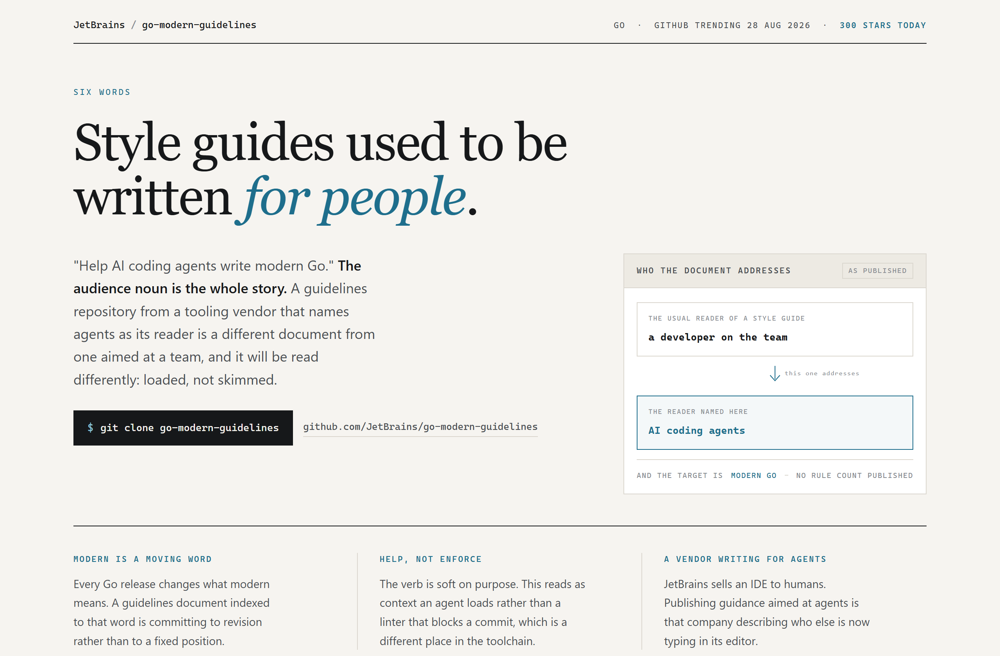

# Design Rep — Friday, August 28

> 3 mocks — blueprint, hud, editorial

[Catalog](../../CATALOG.md) · [Home](../../README.md)

## [tt-a1i/archify](https://github.com/tt-a1i/archify)

- **Style:** blueprint / draft-blue
- **Idea tested:** grade the three adjectives by which one can fail a check
- **Verdict:** landed
- [live .html](./01-archify.html) · [repo on GitHub](https://github.com/tt-a1i/archify)

## [bilawalsidhu/gods-eye-view](https://github.com/bilawalsidhu/gods-eye-view)

- **Style:** hud / instrument-amber
- **Idea tested:** split the readout by simulated and live, colour exactly one row
- **Verdict:** landed
- [live .html](./02-gods-eye-view.html) · [repo on GitHub](https://github.com/bilawalsidhu/gods-eye-view)

## [JetBrains/go-modern-guidelines](https://github.com/JetBrains/go-modern-guidelines)

- **Style:** editorial / cyan
- **Idea tested:** make the audience noun the headline and stack it against the usual reader
- **Verdict:** landed
- [live .html](./03-go-guidelines.html) · [repo on GitHub](https://github.com/JetBrains/go-modern-guidelines)

