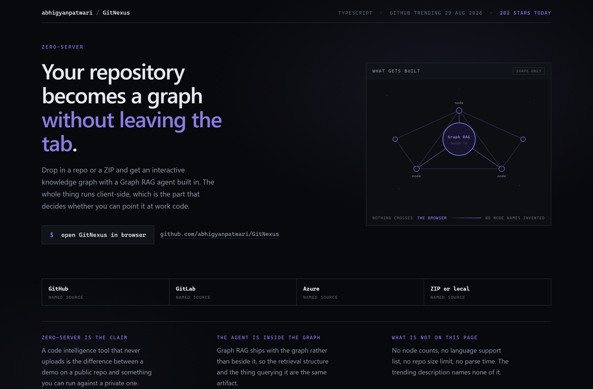
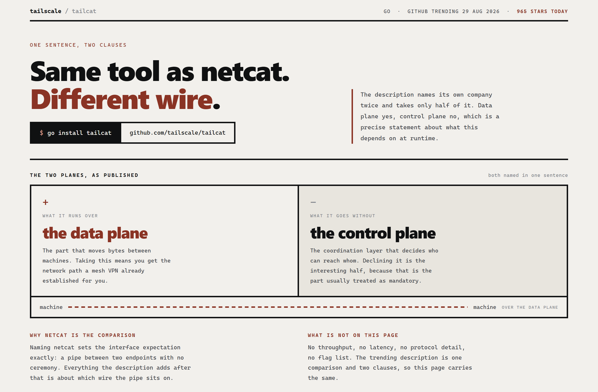
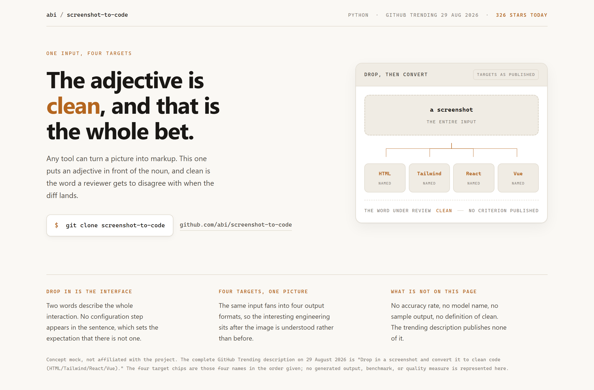

# Design Rep — Saturday, August 29

> 3 mocks — constellation, brutalist, warm-minimal

[Catalog](../../CATALOG.md) · [Home](../../README.md)

## [abhigyanpatwari/GitNexus](https://github.com/abhigyanpatwari/GitNexus)

- **Style:** constellation / violet
- **Idea tested:** draw the artifact but label it shape only with generic nodes
- **Verdict:** works, hub circle needed r=35 to hold its label
- [live .html](./01-gitnexus.html) · [repo on GitHub](https://github.com/abhigyanpatwari/GitNexus)

## [tailscale/tailcat](https://github.com/tailscale/tailcat)

- **Style:** brutalist / wire-rust
- **Idea tested:** plus panel and minus panel mirroring the sentence structure
- **Verdict:** strongest of the three, fourteen words fill a screen honestly
- [live .html](./02-tailcat.html) · [repo on GitHub](https://github.com/tailscale/tailcat)

## [abi/screenshot-to-code](https://github.com/abi/screenshot-to-code)

- **Style:** warm-minimal / amber
- **Idea tested:** put the contested adjective on a review line
- **Verdict:** works, fan lines a hair off chip centers
- [live .html](./03-screenshot-to-code.html) · [repo on GitHub](https://github.com/abi/screenshot-to-code)

