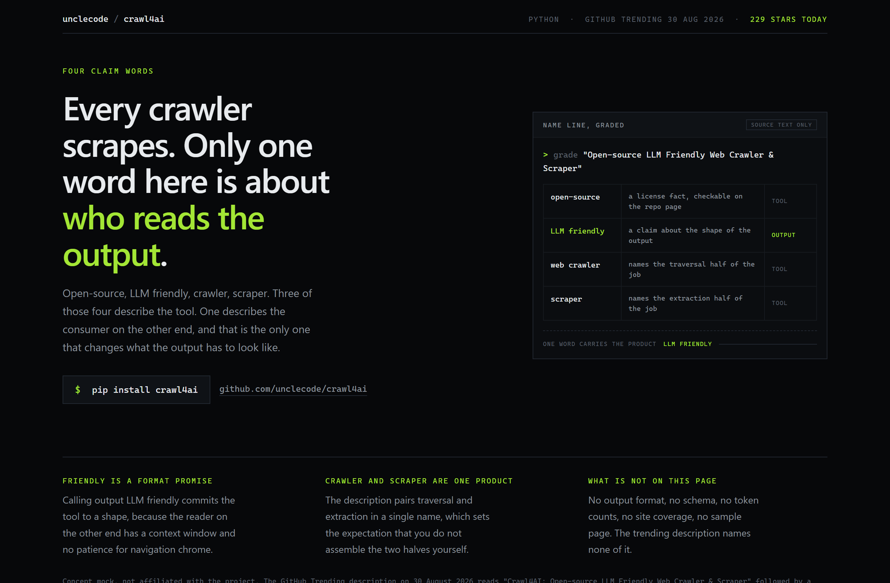
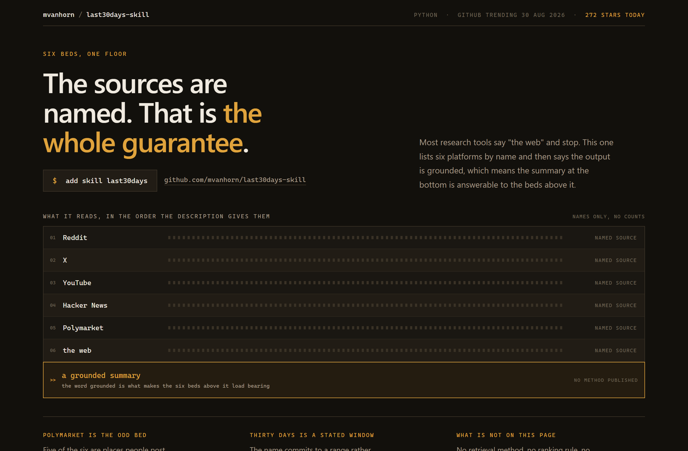
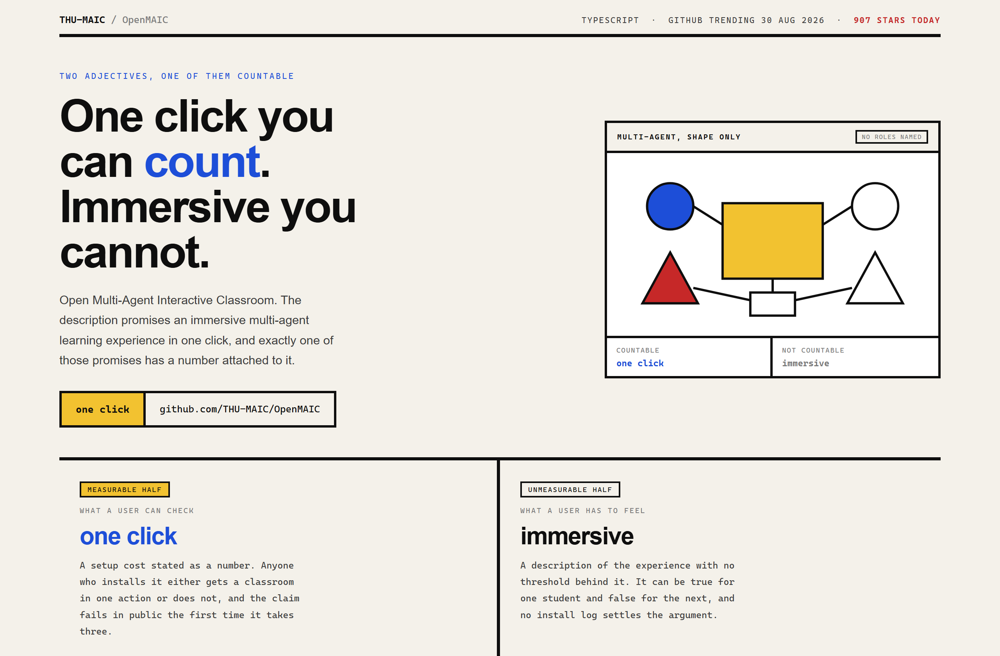

# Design Rep — Sunday, August 30

> 3 mocks — terminal-dark, strata, bauhaus

[Catalog](../../CATALOG.md) · [Home](../../README.md)

## [unclecode/crawl4ai](https://github.com/unclecode/crawl4ai)

- **Style:** terminal-dark / signal-lime
- **Idea tested:** grade the four claim words and mark which one describes the output
- **Verdict:** works, one word carries the product
- [live .html](./01-crawl4ai.html) · [repo on GitHub](https://github.com/unclecode/crawl4ai)

## [mvanhorn/last30days-skill](https://github.com/mvanhorn/last30days-skill)

- **Style:** strata / signal-amber
- **Idea tested:** stack the named sources as beds with the grounded summary as the floor
- **Verdict:** works after moving the sediment rule into the wide column
- [live .html](./02-last30days-skill.html) · [repo on GitHub](https://github.com/mvanhorn/last30days-skill)

## [THU-MAIC/OpenMAIC](https://github.com/THU-MAIC/OpenMAIC)

- **Style:** bauhaus / primary-yellow
- **Idea tested:** split the two-adjective promise by which half a user can check
- **Verdict:** strongest of the three
- [live .html](./03-openmaic.html) · [repo on GitHub](https://github.com/THU-MAIC/OpenMAIC)

