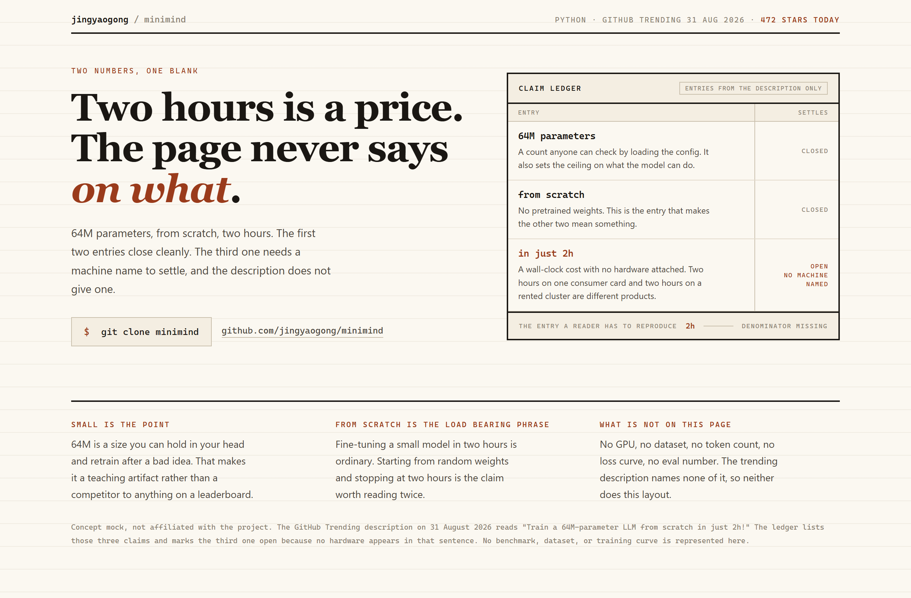
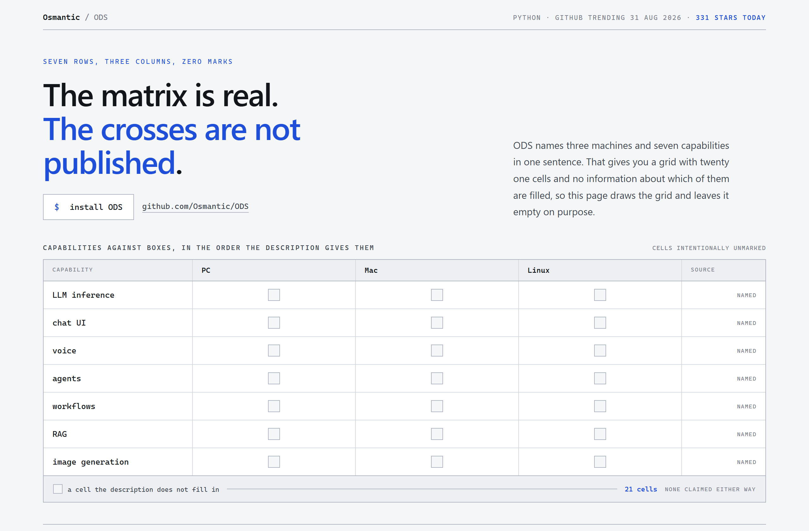
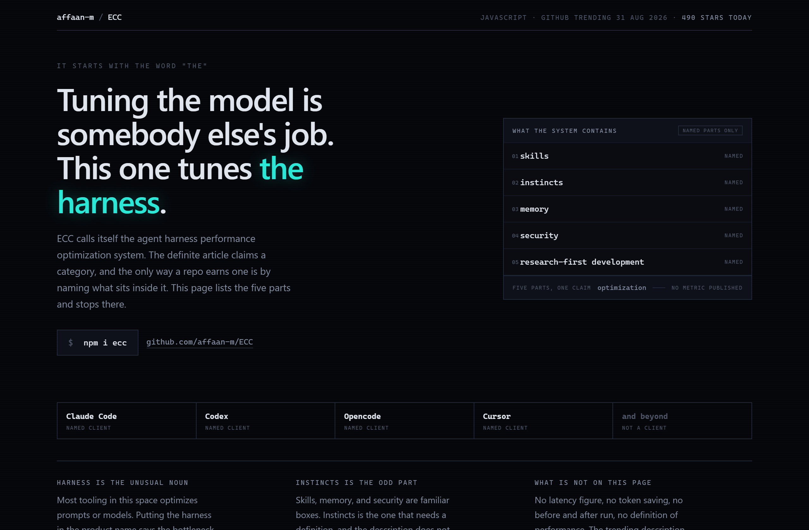

# Design Rep — Monday, August 31

> 3 mocks — ledger, cell-grid, neon-noir

[Catalog](../../CATALOG.md) · [Home](../../README.md)

## [jingyaogong/minimind](https://github.com/jingyaogong/minimind)

- **Style:** ledger / ink-rust
- **Idea tested:** book the three claims as entries and mark the one that cannot close
- **Verdict:** works, the open row carries the argument
- [live .html](./01-minimind.html) · [repo on GitHub](https://github.com/jingyaogong/minimind)

## [Osmantic/ODS](https://github.com/Osmantic/ODS)

- **Style:** cell-grid / cobalt
- **Idea tested:** draw the 21-cell support matrix and ship it unmarked
- **Verdict:** works, an empty grid beats 21 invented facts
- [live .html](./02-ods.html) · [repo on GitHub](https://github.com/Osmantic/ODS)

## [affaan-m/ECC](https://github.com/affaan-m/ECC)

- **Style:** neon-noir / acid-cyan
- **Idea tested:** put the definite article on trial and list what the category contains
- **Verdict:** strongest of the three
- [live .html](./03-ecc.html) · [repo on GitHub](https://github.com/affaan-m/ECC)

