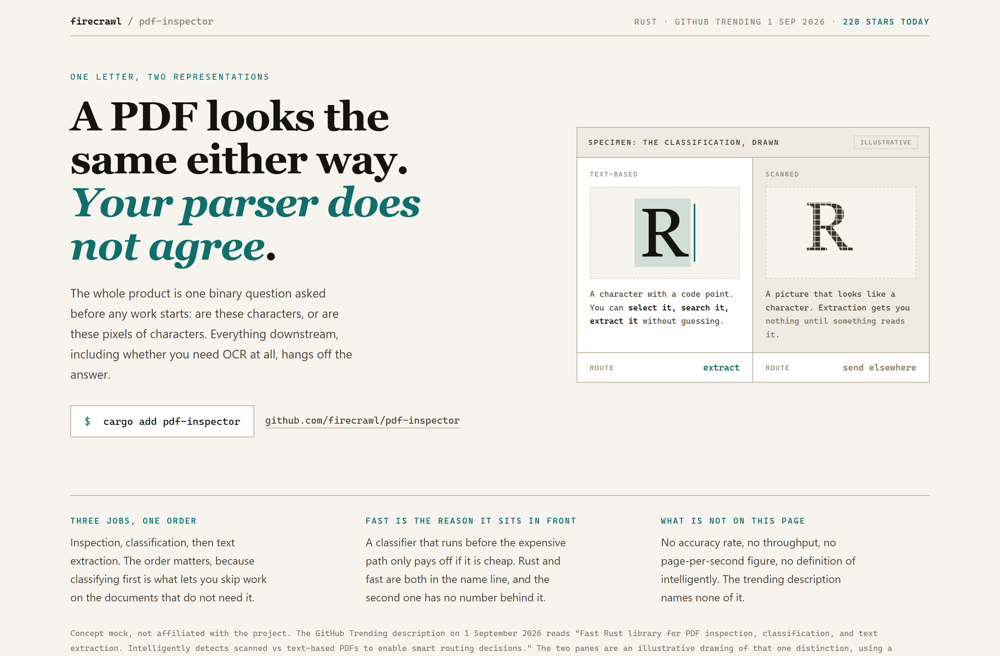
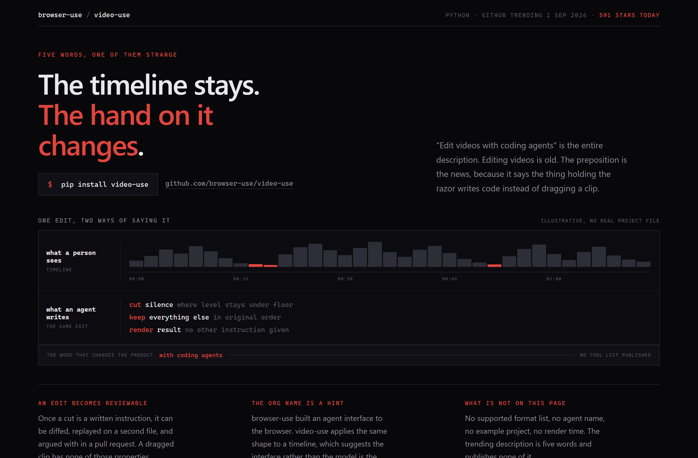
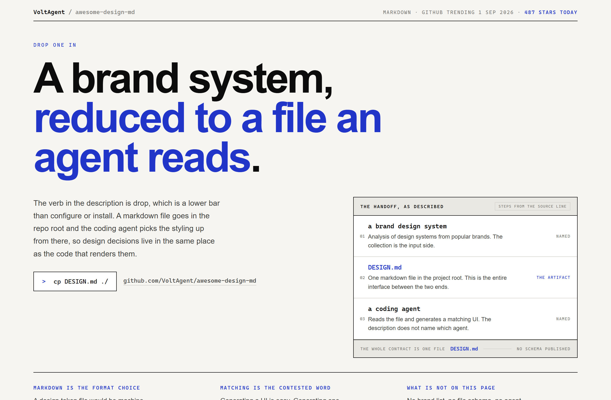

# Design Rep — Tuesday, September 1

> 3 mocks — specimen, waveform, poster

[Catalog](../../CATALOG.md) · [Home](../../README.md)

## [firecrawl/pdf-inspector](https://github.com/firecrawl/pdf-inspector)

- **Style:** specimen / ink-teal
- **Idea tested:** use a type specimen to draw the character-versus-pixel distinction
- **Verdict:** cleanest idea of the week, genre and subject are the same thing
- [live .html](./01-pdf-inspector.html) · [repo on GitHub](https://github.com/firecrawl/pdf-inspector)

## [browser-use/video-use](https://github.com/browser-use/video-use)

- **Style:** waveform / cut-red
- **Idea tested:** show one edit twice, as a timeline and as instruction lines
- **Verdict:** works, red marks map to the cuts below
- [live .html](./02-video-use.html) · [repo on GitHub](https://github.com/browser-use/video-use)

## [VoltAgent/awesome-design-md](https://github.com/VoltAgent/awesome-design-md)

- **Style:** poster / ultramarine
- **Idea tested:** give the headline two thirds of the fold and the mechanism one small panel
- **Verdict:** works after top-aligning the columns and dropping 116px to 92px
- [live .html](./03-awesome-design-md.html) · [repo on GitHub](https://github.com/VoltAgent/awesome-design-md)

