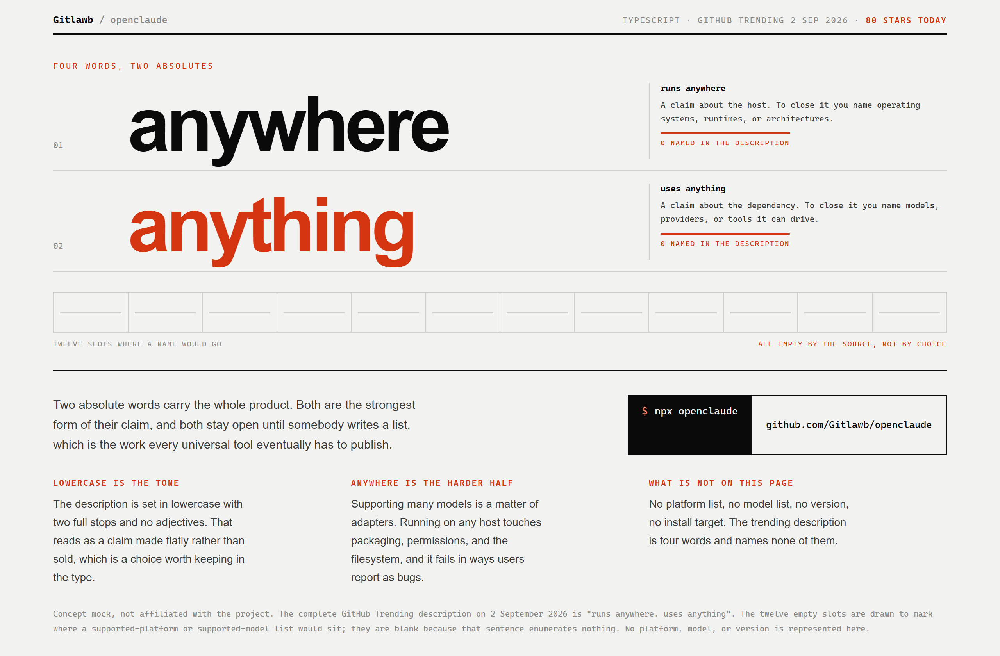
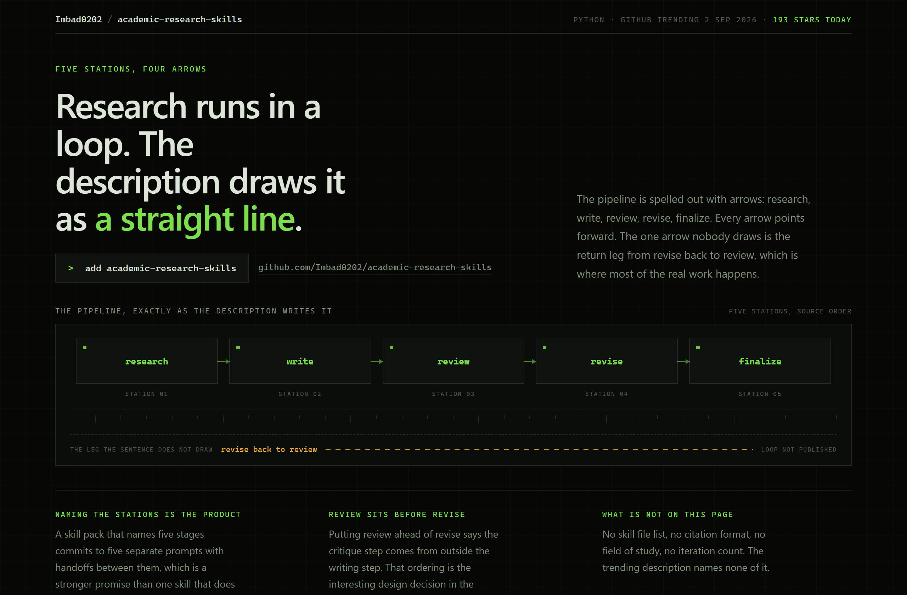
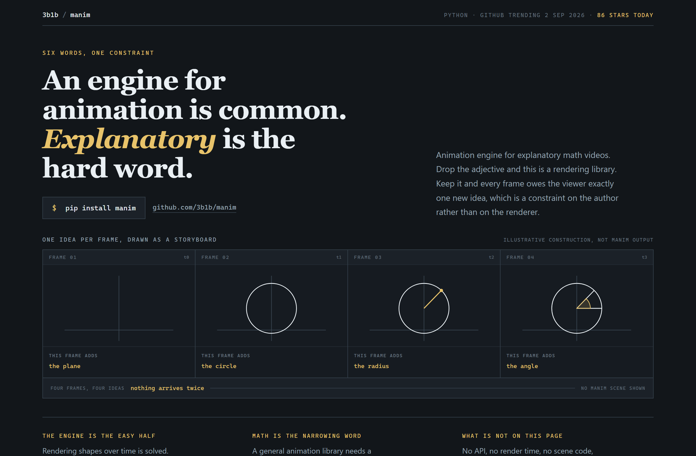

# Design Rep — Wednesday, September 2

> 3 mocks — swiss, hud, storyboard

[Catalog](../../CATALOG.md) · [Home](../../README.md)

## [Gitlawb/openclaude](https://github.com/Gitlawb/openclaude)

- **Style:** swiss / vermilion
- **Idea tested:** set the two absolute words at 104px and let 10px captions carry the counter-argument
- **Verdict:** works, restraint by contrast
- [live .html](./01-openclaude.html) · [repo on GitHub](https://github.com/Gitlawb/openclaude)

## [Imbad0202/academic-research-skills](https://github.com/Imbad0202/academic-research-skills)

- **Style:** hud / instrument-green
- **Idea tested:** draw the pipeline as written, then draw the missing return leg in a second colour
- **Verdict:** strongest of the three, absence marked honestly
- [live .html](./02-academic-research-skills.html) · [repo on GitHub](https://github.com/Imbad0202/academic-research-skills)

## [3b1b/manim](https://github.com/3b1b/manim)

- **Style:** storyboard / chalk-gold
- **Idea tested:** pick the genre whose unit matches the product unit, one idea per frame
- **Verdict:** works, new family and second win for genre-by-unit
- [live .html](./03-manim.html) · [repo on GitHub](https://github.com/3b1b/manim)

