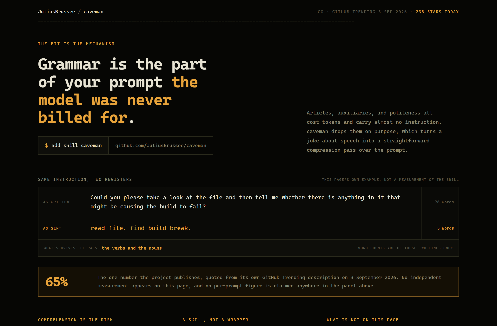
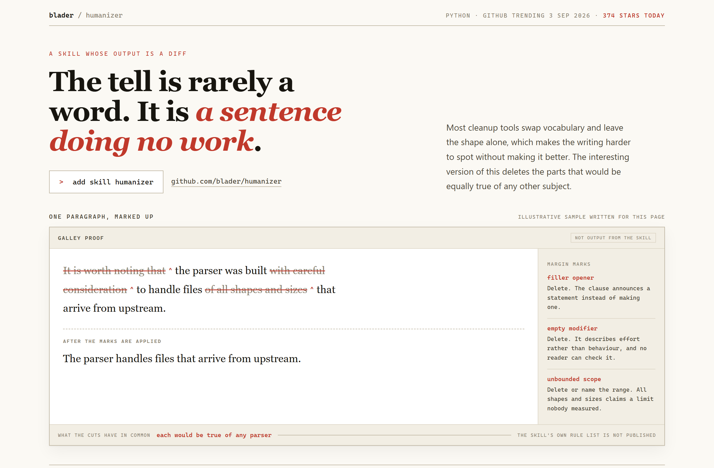
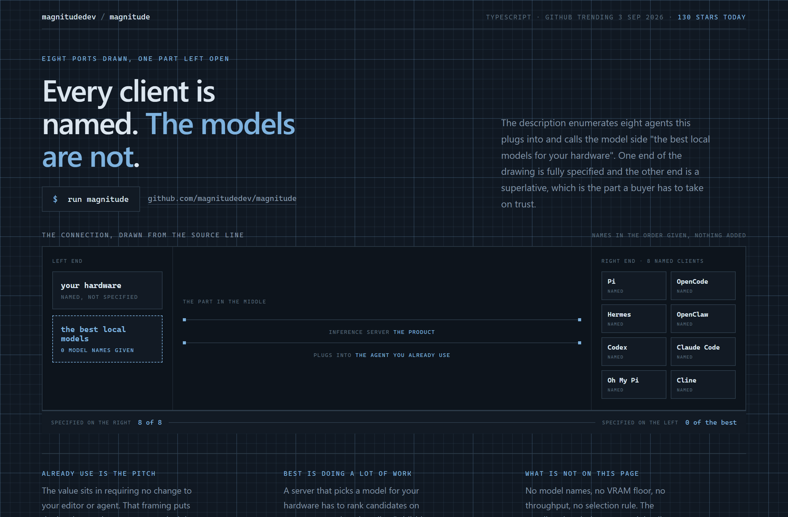

# Design Rep — Thursday, September 3

> 3 mocks — mono-zine, redline, blueprint

[Catalog](../../CATALOG.md) · [Home](../../README.md)

## [JuliusBrussee/caveman](https://github.com/JuliusBrussee/caveman)

- **Style:** mono-zine / ochre
- **Idea tested:** demonstrate with the page's own two lines and print counts the reader can check
- **Verdict:** works, live demo kept separate from the published 65 percent
- [live .html](./01-caveman.html) · [repo on GitHub](https://github.com/JuliusBrussee/caveman)

## [blader/humanizer](https://github.com/blader/humanizer)

- **Style:** redline / proof-red
- **Idea tested:** the unit is a revision, so the genre is a galley proof with margin marks
- **Verdict:** strongest of the three, new family, third win for genre-by-unit
- [live .html](./02-humanizer.html) · [repo on GitHub](https://github.com/blader/humanizer)

## [magnitudedev/magnitude](https://github.com/magnitudedev/magnitude)

- **Style:** blueprint / graphite-ink
- **Idea tested:** draw both ends and let the asymmetry between 8 named and 0 named be the headline
- **Verdict:** works, the dashed part does the whole job
- [live .html](./03-magnitude.html) · [repo on GitHub](https://github.com/magnitudedev/magnitude)

