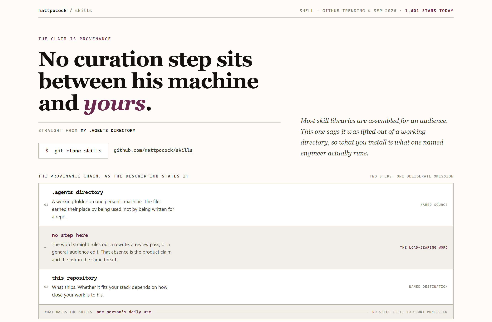
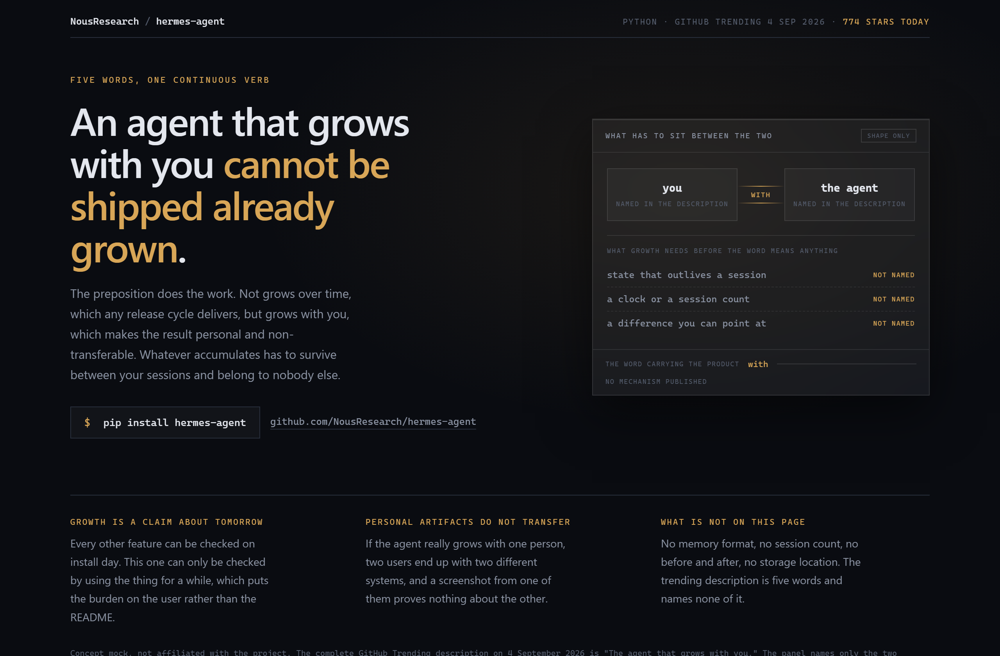
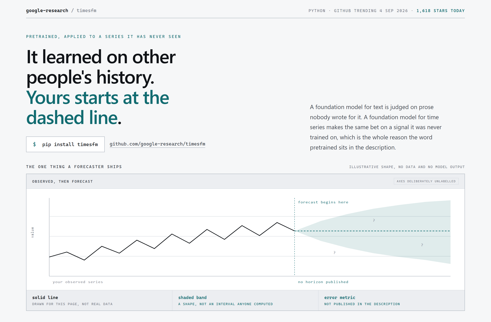

# Design Rep — Friday, September 4

> 3 mocks — editorial, glass, data-viz

[Catalog](../../CATALOG.md) · [Home](../../README.md)

## [mattpocock/skills](https://github.com/mattpocock/skills)

- **Style:** editorial / ink-plum
- **Idea tested:** treat the description as a byline and draw the missing curation step as its own tinted row
- **Verdict:** works, the absent row reads better than a sentence about it
- [live .html](./01-skills.html) · [repo on GitHub](https://github.com/mattpocock/skills)

## [NousResearch/hermes-agent](https://github.com/NousResearch/hermes-agent)

- **Style:** glass / frost-amber
- **Idea tested:** one frosted panel holds the shared state between the two named parties
- **Verdict:** works, first subject that justifies the glass family
- [live .html](./02-hermes-agent.html) · [repo on GitHub](https://github.com/NousResearch/hermes-agent)

## [google-research/timesfm](https://github.com/google-research/timesfm)

- **Style:** data-viz / forecast-teal
- **Idea tested:** draw the whole forecast chart and strip every number off both axes
- **Verdict:** works, unlabelled and still legible
- [live .html](./03-timesfm.html) · [repo on GitHub](https://github.com/google-research/timesfm)

