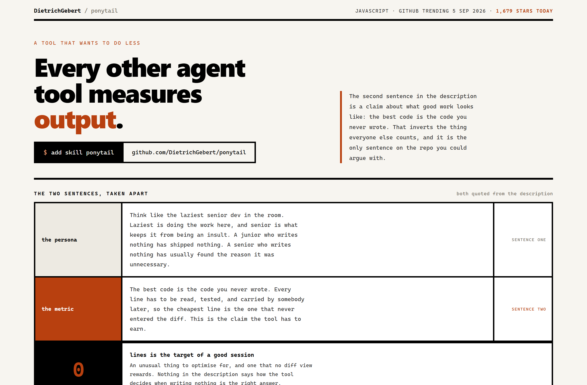
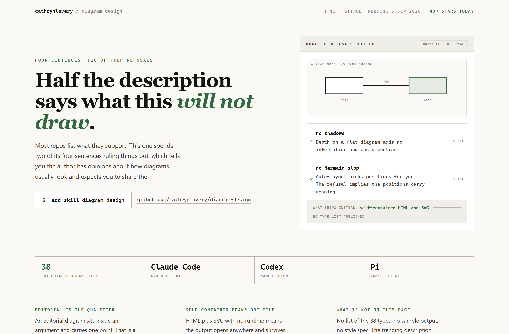
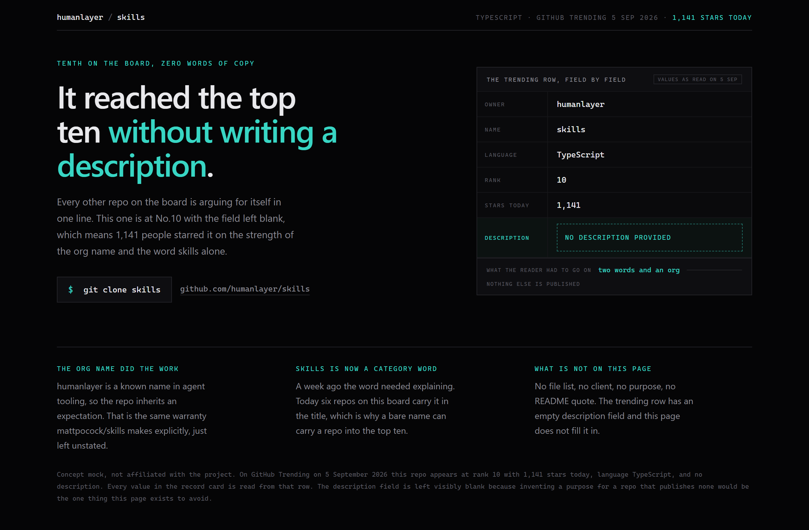

# Design Rep — Saturday, September 5

> 3 mocks — brutalist, specimen, terminal-dark

[Catalog](../../CATALOG.md) · [Home](../../README.md)

## [DietrichGebert/ponytail](https://github.com/DietrichGebert/ponytail)

- **Style:** brutalist / acid-orange
- **Idea tested:** label each sentence by function, then add the zero the description implies
- **Verdict:** works, brutalist is the right register for a tool that refuses
- [live .html](./01-ponytail.html) · [repo on GitHub](https://github.com/DietrichGebert/ponytail)

## [cathrynlavery/diagram-design](https://github.com/cathrynlavery/diagram-design)

- **Style:** specimen / press-green
- **Idea tested:** when half the description is refusals, draw the positive form of both
- **Verdict:** works, two nodes was enough
- [live .html](./02-diagram-design.html) · [repo on GitHub](https://github.com/cathrynlavery/diagram-design)

## [humanlayer/skills](https://github.com/humanlayer/skills)

- **Style:** terminal-dark / signal-cyan
- **Idea tested:** no description at all, so make the trending row the subject and leave the field blank
- **Verdict:** strongest of the three, furthest push of the draw-the-absence rule
- [live .html](./03-humanlayer-skills.html) · [repo on GitHub](https://github.com/humanlayer/skills)

