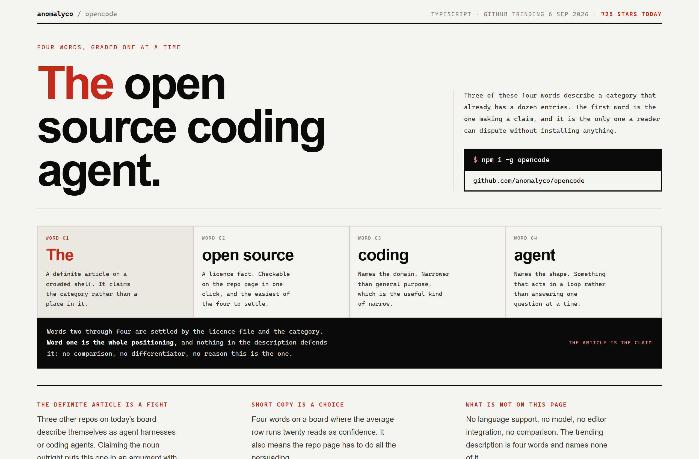
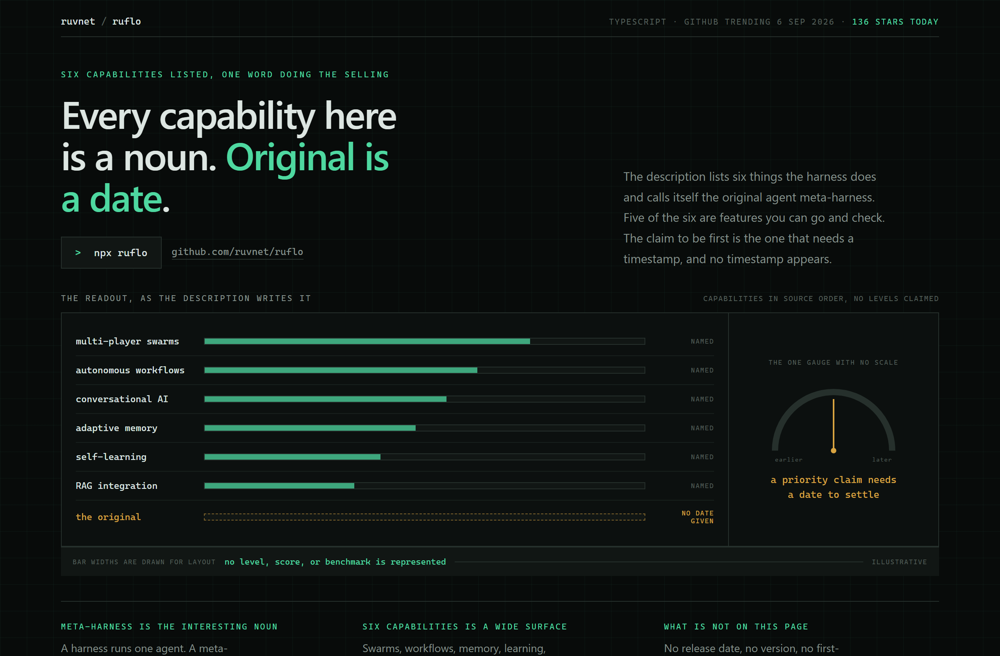
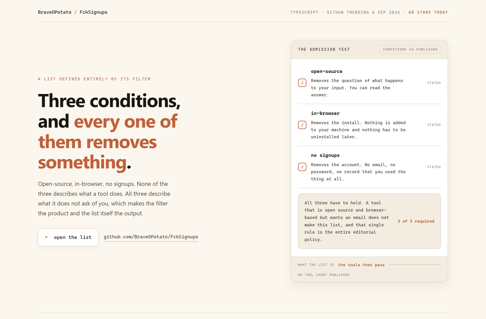

# Design Rep — Sunday, September 6

> 3 mocks — swiss, hud, warm-minimal

[Catalog](../../CATALOG.md) · [Home](../../README.md)

## [anomalyco/opencode](https://github.com/anomalyco/opencode)

- **Style:** swiss / signal-red
- **Idea tested:** grade four words and colour only the contested one, the definite article
- **Verdict:** works after moving the accent off coding agent onto The
- [live .html](./01-opencode.html) · [repo on GitHub](https://github.com/anomalyco/opencode)

## [ruvnet/ruflo](https://github.com/ruvnet/ruflo)

- **Style:** hud / instrument-mint
- **Idea tested:** six solid bars for named capabilities, one dashed empty bar for the priority claim
- **Verdict:** works, a gauge with no scale is the honest form
- [live .html](./02-ruflo.html) · [repo on GitHub](https://github.com/ruvnet/ruflo)

## [BraveOPotato/FckSignups](https://github.com/BraveOPotato/FckSignups)

- **Style:** warm-minimal / clay
- **Idea tested:** read each condition as a removal and draw the filter instead of the list
- **Verdict:** strongest of the three
- [live .html](./03-fcksignups.html) · [repo on GitHub](https://github.com/BraveOPotato/FckSignups)

