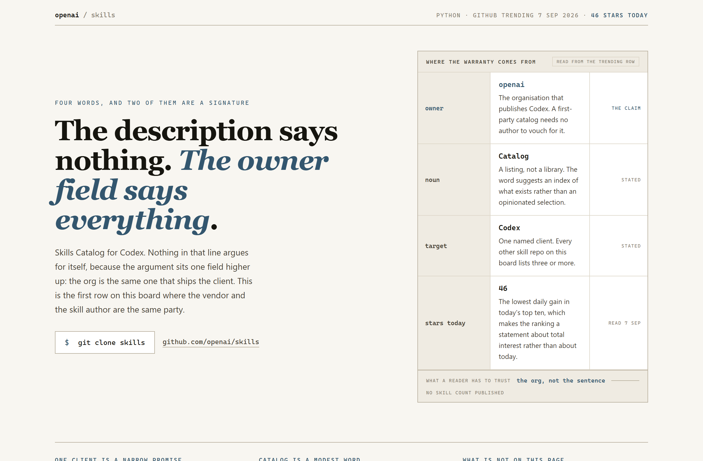
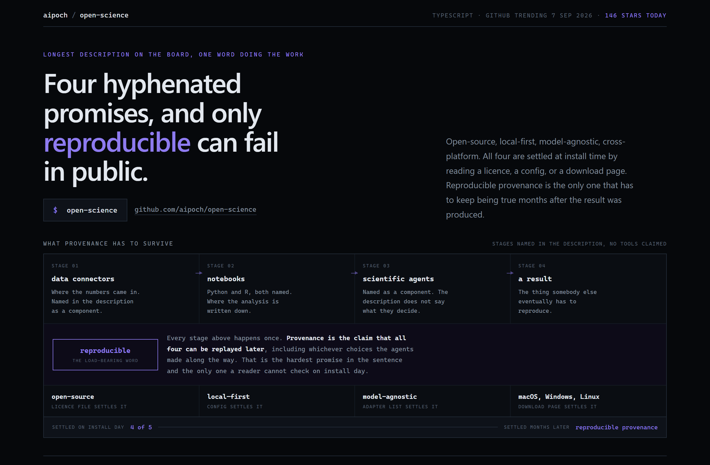
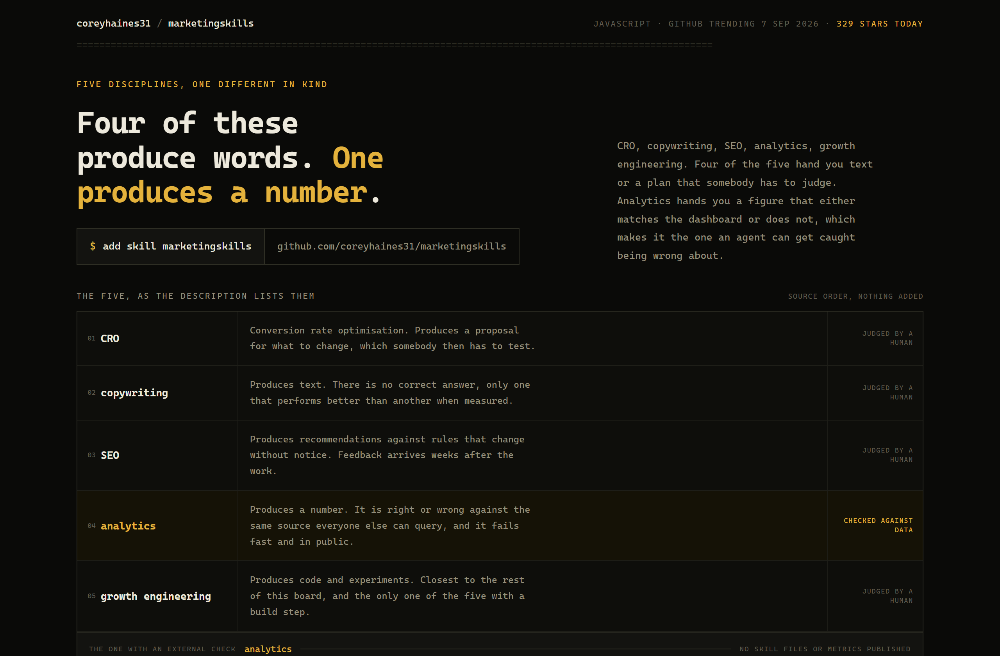

# Design Rep — Monday, September 7

> 3 mocks — editorial, constellation, mono-zine

[Catalog](../../CATALOG.md) · [Home](../../README.md)

## [openai/skills](https://github.com/openai/skills)

- **Style:** editorial / deep-slate
- **Idea tested:** when the description carries no argument, grade the trending row instead of the sentence
- **Verdict:** works, the owner field is the whole warranty
- [live .html](./01-openai-skills.html) · [repo on GitHub](https://github.com/openai/skills)

## [aipoch/open-science](https://github.com/aipoch/open-science)

- **Style:** constellation / violet
- **Idea tested:** sort the promises by when they can fail, install day versus months later
- **Verdict:** works, timing split is sharper than checkable versus unverifiable
- [live .html](./02-open-science.html) · [repo on GitHub](https://github.com/aipoch/open-science)

## [coreyhaines31/marketingskills](https://github.com/coreyhaines31/marketingskills)

- **Style:** mono-zine / amber
- **Idea tested:** mark the one discipline an agent can be caught being wrong about
- **Verdict:** strongest of the three, own inference labelled as mine in the header
- [live .html](./03-marketingskills.html) · [repo on GitHub](https://github.com/coreyhaines31/marketingskills)

