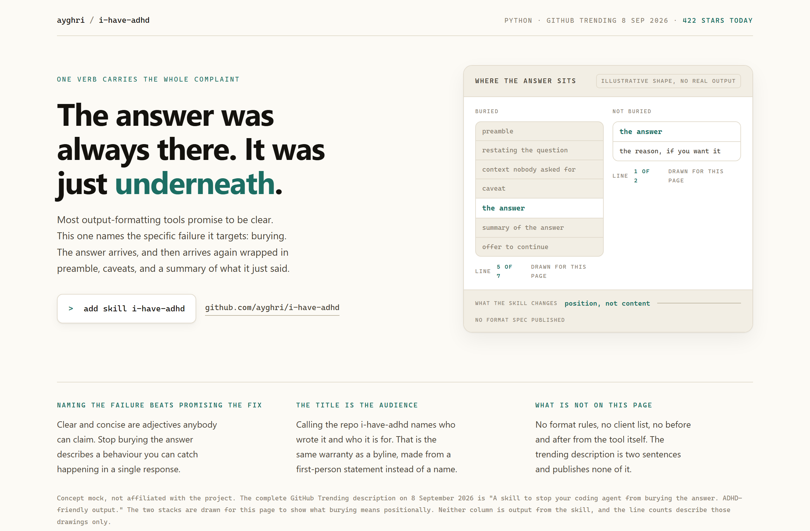
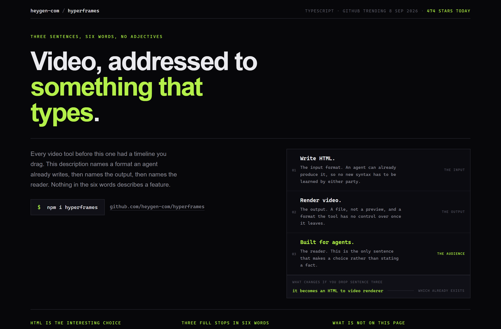
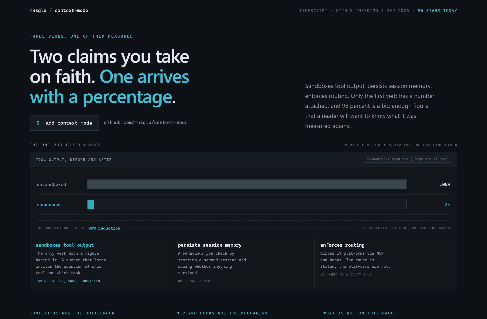

# Design Rep — Tuesday, September 8

> 3 mocks — warm-minimal, poster, data-viz

[Catalog](../../CATALOG.md) · [Home](../../README.md)

## [ayghri/i-have-adhd](https://github.com/ayghri/i-have-adhd)

- **Style:** warm-minimal / ink-teal
- **Idea tested:** burying is a spatial complaint, so draw the answer low in one stack and first in another
- **Verdict:** works, legible in a second
- [live .html](./01-i-have-adhd.html) · [repo on GitHub](https://github.com/ayghri/i-have-adhd)

## [heygen-com/hyperframes](https://github.com/heygen-com/hyperframes)

- **Style:** poster / signal-lime
- **Idea tested:** run the deletion test and name what the product becomes without sentence three
- **Verdict:** works after dropping the headline from 102px to 70px
- [live .html](./02-hyperframes.html) · [repo on GitHub](https://github.com/heygen-com/hyperframes)

## [mksglu/context-mode](https://github.com/mksglu/context-mode)

- **Style:** data-viz / reduction-cyan
- **Idea tested:** draw the one published number at face value and print what it lacks beside it
- **Verdict:** works, honest without a fake baseline
- [live .html](./03-context-mode.html) · [repo on GitHub](https://github.com/mksglu/context-mode)

