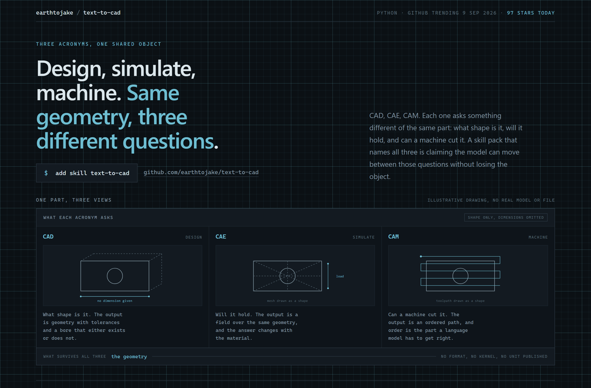
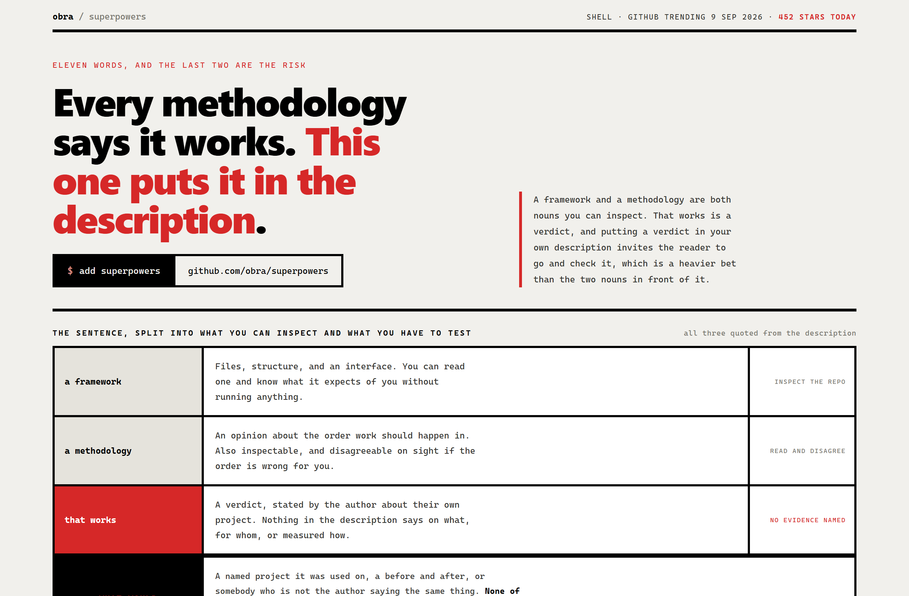
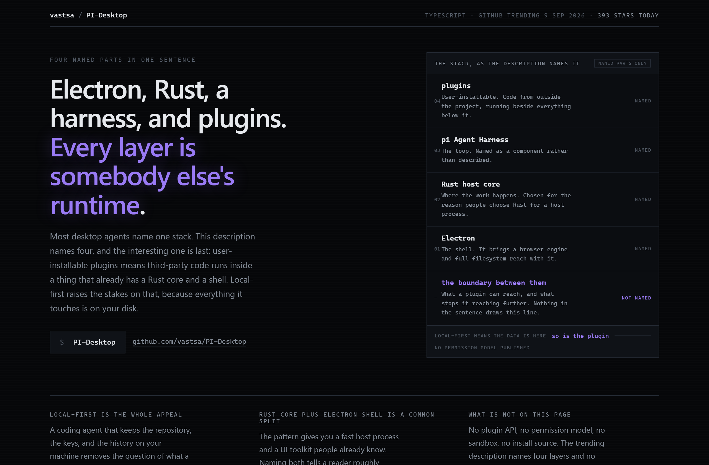

# Design Rep — Wednesday, September 9

> 3 mocks — blueprint, brutalist, neon-noir

[Catalog](../../CATALOG.md) · [Home](../../README.md)

## [earthtojake/text-to-cad](https://github.com/earthtojake/text-to-cad)

- **Style:** blueprint / drafting-cyan
- **Idea tested:** draw the same part three times, once per acronym, with every dimension marked absent
- **Verdict:** works, hand-drawn SVG reads native in blueprint
- [live .html](./01-text-to-cad.html) · [repo on GitHub](https://github.com/earthtojake/text-to-cad)

## [obra/superpowers](https://github.com/obra/superpowers)

- **Style:** brutalist / verdict-red
- **Idea tested:** split the sentence by what evidence each part needs, then list what would settle the verdict
- **Verdict:** strongest of the three
- [live .html](./02-superpowers.html) · [repo on GitHub](https://github.com/obra/superpowers)

## [vastsa/PI-Desktop](https://github.com/vastsa/PI-Desktop)

- **Style:** neon-noir / violet
- **Idea tested:** stack the four named layers and give the unnamed boundary its own row
- **Verdict:** works, position makes the absence obvious
- [live .html](./03-pi-desktop.html) · [repo on GitHub](https://github.com/vastsa/PI-Desktop)

