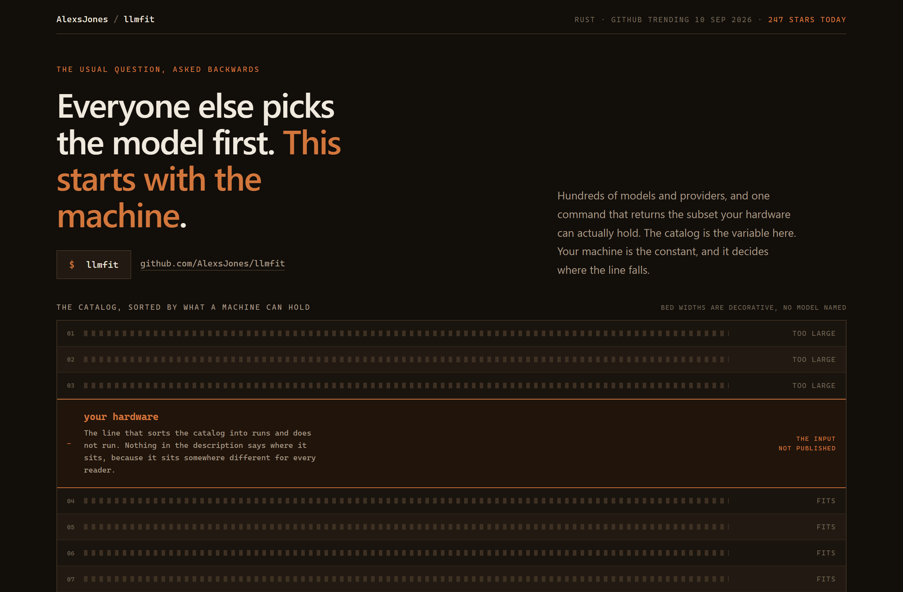
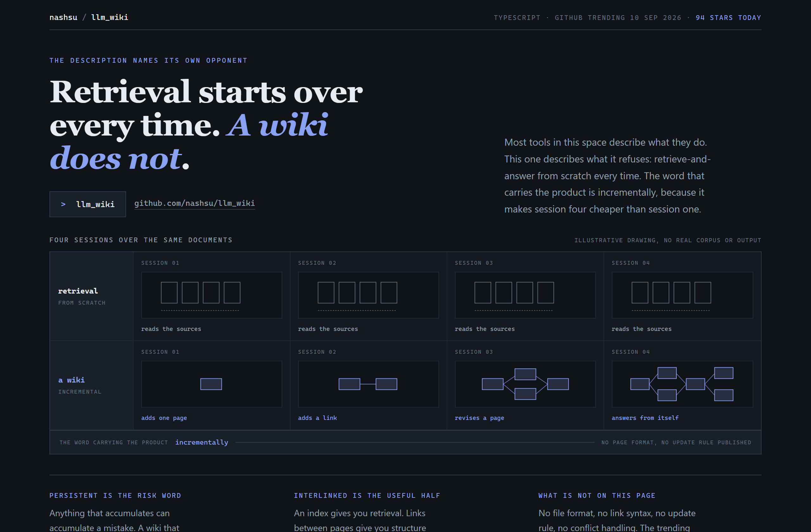
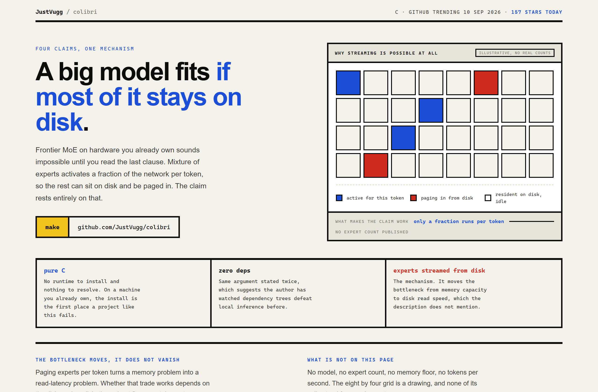

# Design Rep — Thursday, September 10

> 3 mocks — strata, storyboard, bauhaus

[Catalog](../../CATALOG.md) · [Home](../../README.md)

## [AlexsJones/llmfit](https://github.com/AlexsJones/llmfit)

- **Style:** strata / copper
- **Idea tested:** sort the model catalog into beds above and below a hardware waterline with no number printed on it
- **Verdict:** the empty axis reads stronger than a filled one
- [live .html](./01-llmfit.html) · [repo on GitHub](https://github.com/AlexsJones/llmfit)

## [nashsu/llm_wiki](https://github.com/nashsu/llm_wiki)

- **Style:** storyboard / ink-indigo
- **Idea tested:** two lanes of four frames over one corpus, retrieval repeating itself while the wiki accumulates
- **Verdict:** the repetition is the argument, no copy needed
- [live .html](./02-llm-wiki.html) · [repo on GitHub](https://github.com/nashsu/llm_wiki)

## [JustVugg/colibri](https://github.com/JustVugg/colibri)

- **Style:** bauhaus / primary-blue
- **Idea tested:** a 32 square sparse-activation grid showing why streaming experts from disk is possible
- **Verdict:** drawing the sparsity turns a claim into a trade
- [live .html](./03-colibri.html) · [repo on GitHub](https://github.com/JustVugg/colibri)

