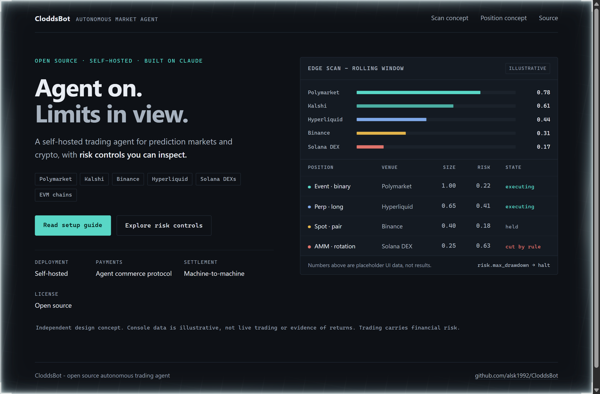
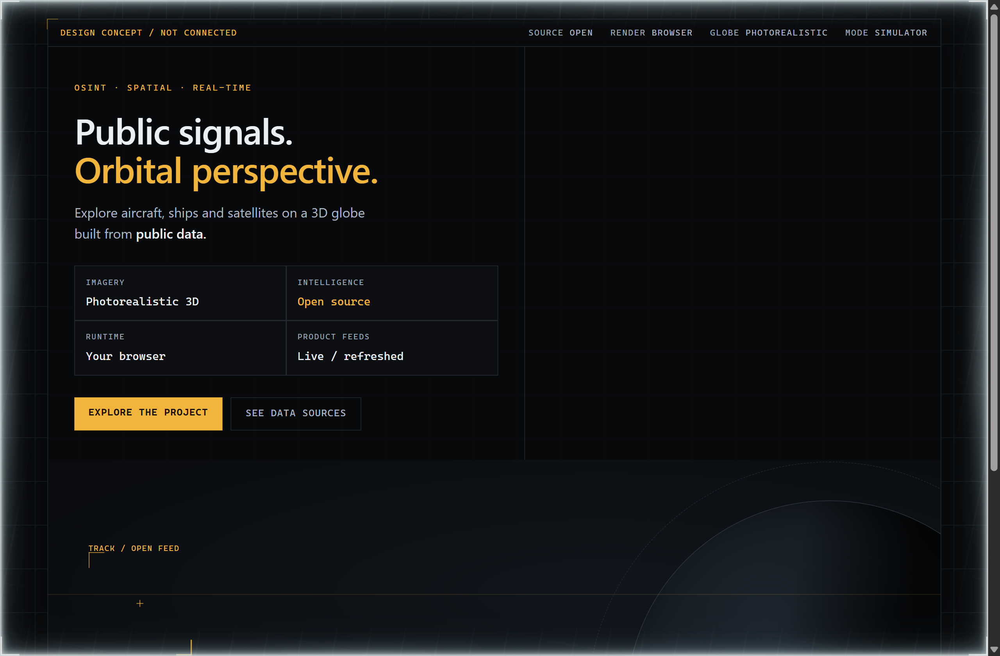
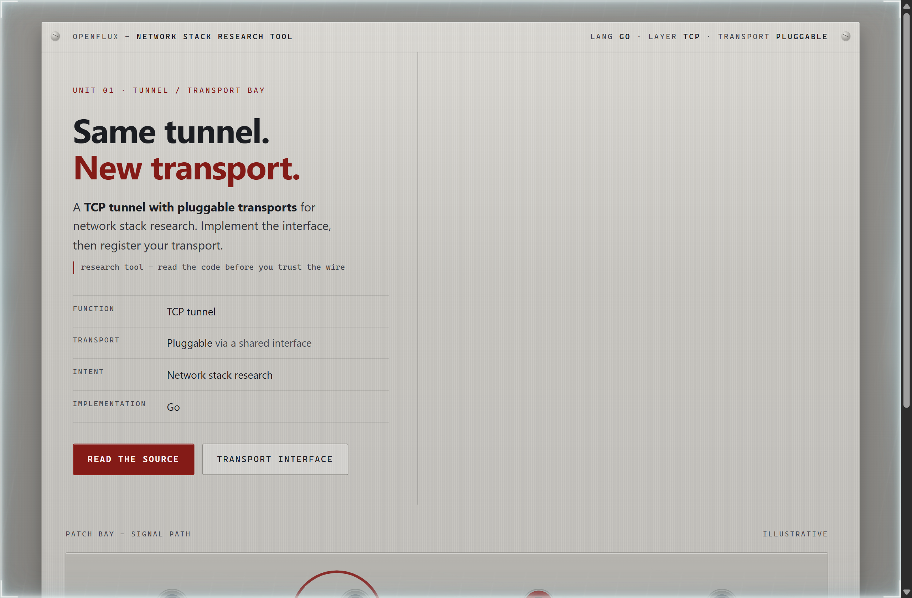

# Design Rep — Friday, September 11

> 3 mocks — data-viz, hud, patchbay

[Catalog](../../CATALOG.md) · [Home](../../README.md)

## [alsk1992/CloddsBot](https://github.com/alsk1992/CloddsBot)

- **Style:** data-viz / console-teal
- **Idea tested:** Put agent activity and its risk cutoff in the same field of view
- **Verdict:** The cutoff state explains control without implying investment returns
- [live .html](./01-cloddsbot.html) · [repo on GitHub](https://github.com/alsk1992/CloddsBot)

## [bilawalsidhu/gods-eye-view](https://github.com/bilawalsidhu/gods-eye-view)

- **Style:** hud / instrument-amber
- **Idea tested:** Use an orbital instrument frame to connect an impressive globe to its public data sources
- **Verdict:** The source link anchors the spectacle; the disconnected label keeps the concept honest
- [live .html](./02-gods-eye-view.html) · [repo on GitHub](https://github.com/bilawalsidhu/gods-eye-view)

## [p1neappleXpress/OpenFlux](https://github.com/p1neappleXpress/OpenFlux)

- **Style:** patchbay / signal-red
- **Idea tested:** Give the replaceable transport a physical jack while keeping the TCP tunnel visually fixed
- **Verdict:** The patch bay makes the extension seam readable without invented performance claims
- [live .html](./03-openflux.html) · [repo on GitHub](https://github.com/p1neappleXpress/OpenFlux)
