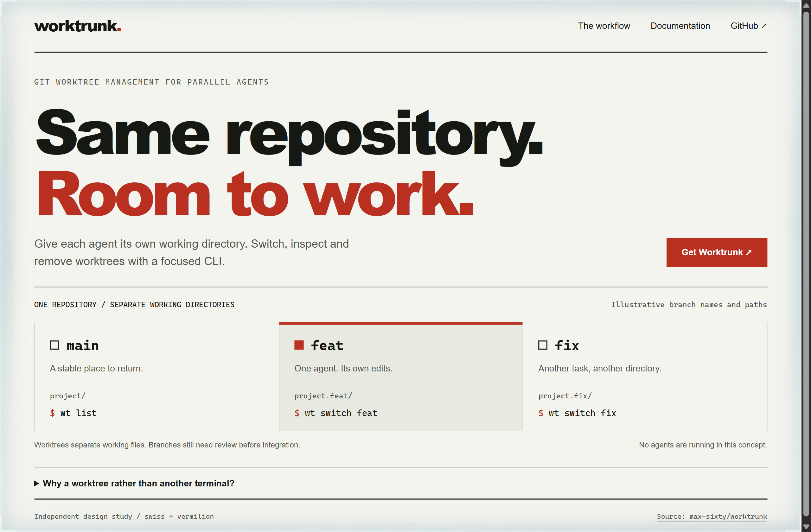
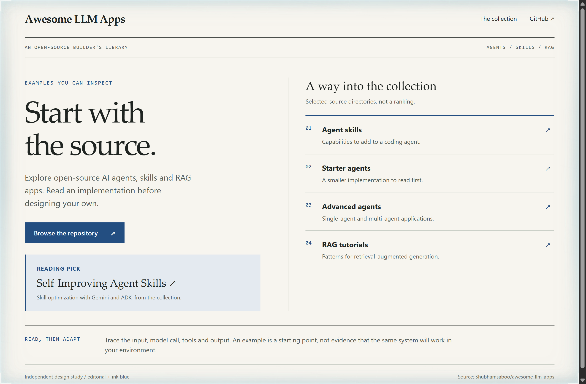
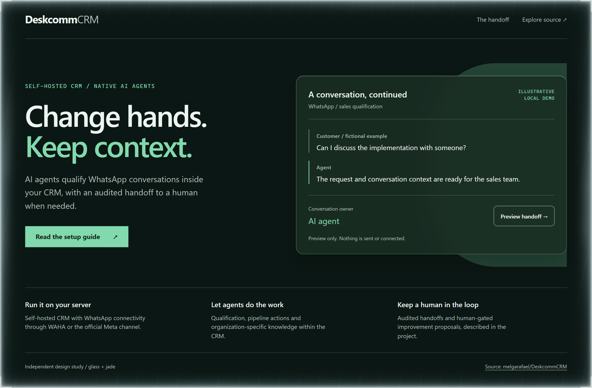

# Design Rep — Saturday, September 12

> 3 mocks — swiss, editorial, glass

[Catalog](../../CATALOG.md) · [Home](../../README.md)

## [max-sixty/worktrunk](https://github.com/max-sixty/worktrunk)

- **Style:** swiss / vermilion
- **Idea tested:** Turn worktree isolation into separate typographic lanes beneath one shared repository headline
- **Verdict:** The repeated directory structure explains parallel work without invented throughput claims
- [live .html](./01-worktrunk.html) · [repo on GitHub](https://github.com/max-sixty/worktrunk)

## [Shubhamsaboo/awesome-llm-apps](https://github.com/Shubhamsaboo/awesome-llm-apps)

- **Style:** editorial / ink-blue
- **Idea tested:** Treat the collection as a reading index whose entries lead directly to inspectable implementations
- **Verdict:** A source-linked index makes the next useful action clearer than a wall of capability badges
- [live .html](./02-awesome-llm-apps.html) · [repo on GitHub](https://github.com/Shubhamsaboo/awesome-llm-apps)

## [melgarafael/DeskcommCRM](https://github.com/melgarafael/DeskcommCRM)

- **Style:** glass / jade
- **Idea tested:** Keep a single conversation visible while its owner changes from agent to human
- **Verdict:** The local handoff makes continuity tangible; one frosted surface is enough
- [live .html](./03-deskcommcrm.html) · [repo on GitHub](https://github.com/melgarafael/DeskcommCRM)
