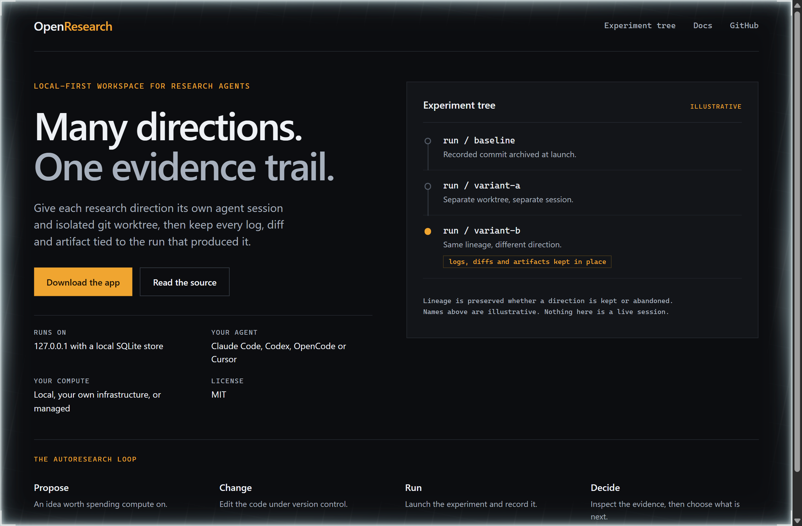
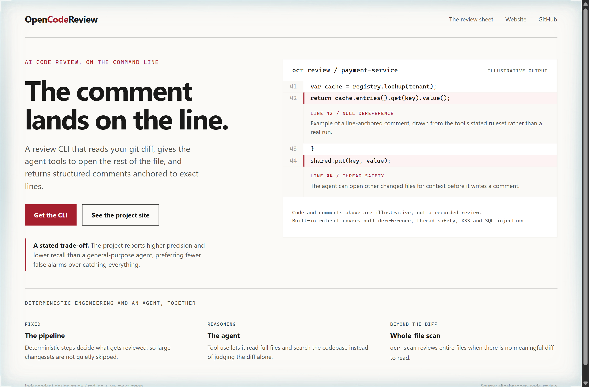
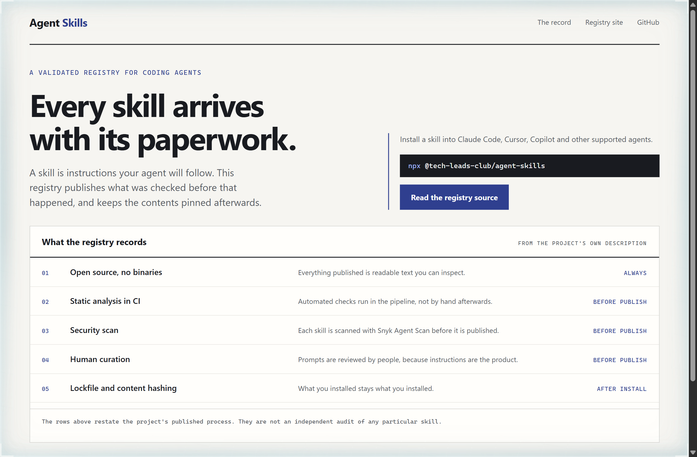

# Design Rep — Sunday, September 13

> 3 mocks — terminal-dark, redline, ledger

[Catalog](../../CATALOG.md) · [Home](../../README.md)

## [alphaXiv/OpenResearch](https://github.com/alphaXiv/OpenResearch)

- **Style:** terminal-dark / signal-amber
- **Idea tested:** Draw the experiment tree so parallel directions and their preserved lineage become the hero image
- **Verdict:** Lineage shown as structure explains the loop better than naming it
- [live .html](./01-openresearch.html) · [repo on GitHub](https://github.com/alphaXiv/OpenResearch)

## [alibaba/open-code-review](https://github.com/alibaba/open-code-review)

- **Style:** redline / review-crimson
- **Idea tested:** Make the page itself a review sheet, with each comment anchored to the numbered line it belongs to
- **Verdict:** Anchoring the note to a line proves the claim the headline makes
- [live .html](./02-open-code-review.html) · [repo on GitHub](https://github.com/alibaba/open-code-review)

## [tech-leads-club/agent-skills](https://github.com/tech-leads-club/agent-skills)

- **Style:** ledger / verification-indigo
- **Idea tested:** Publish the verification record as a ruled ledger instead of a trust badge
- **Verdict:** Rows with a timing column turn a trust claim into something a reader can interrogate
- [live .html](./03-agent-skills.html) · [repo on GitHub](https://github.com/tech-leads-club/agent-skills)
