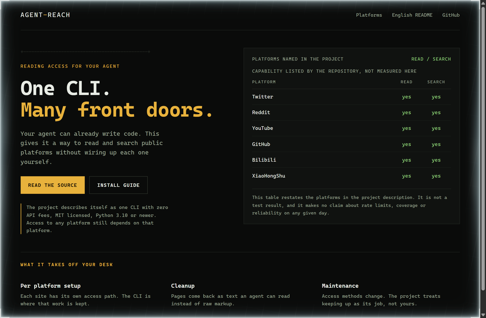
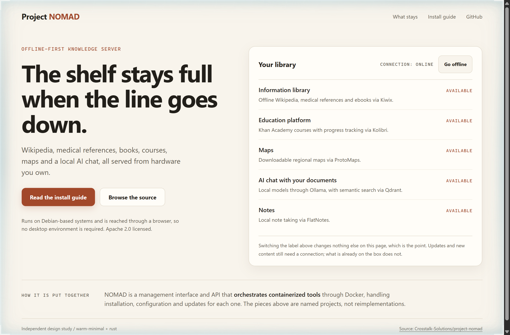
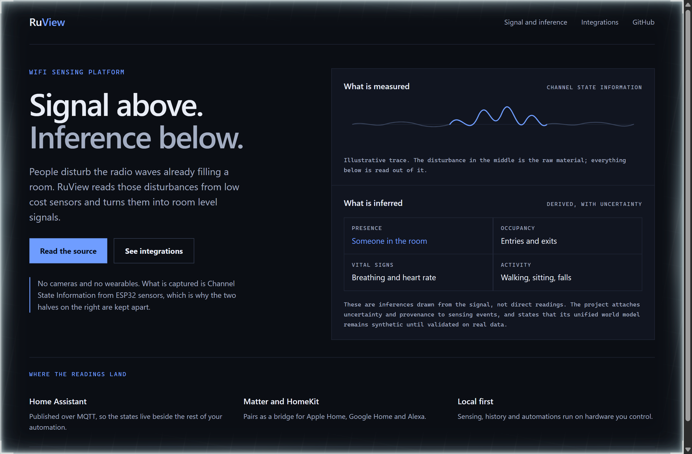

# Design Rep — Monday, September 14

> 3 mocks — mono-zine, warm-minimal, waveform

[Catalog](../../CATALOG.md) · [Home](../../README.md)

## [Panniantong/Agent-Reach](https://github.com/Panniantong/Agent-Reach)

- **Style:** mono-zine / amber
- **Idea tested:** Answer the only question that matters for an access tool by putting the platform matrix in the hero
- **Verdict:** A named list beats a promise of everything, and the caption keeps it a claim rather than a test result
- [live .html](./01-agent-reach.html) · [repo on GitHub](https://github.com/Panniantong/Agent-Reach)

## [Crosstalk-Solutions/project-nomad](https://github.com/Crosstalk-Solutions/project-nomad)

- **Style:** warm-minimal / rust
- **Idea tested:** Let the reader cut the connection and watch the library not change
- **Verdict:** An interaction that deliberately changes nothing proves offline-first faster than a paragraph
- [live .html](./02-project-nomad.html) · [repo on GitHub](https://github.com/Crosstalk-Solutions/project-nomad)

## [ruvnet/RuView](https://github.com/ruvnet/RuView)

- **Style:** waveform / ultramarine
- **Idea tested:** Split the page horizontally into what the sensor measures and what the system infers from it
- **Verdict:** The band boundary carries the honesty; the same claims read as engineering rather than magic
- [live .html](./03-ruview.html) · [repo on GitHub](https://github.com/ruvnet/RuView)
