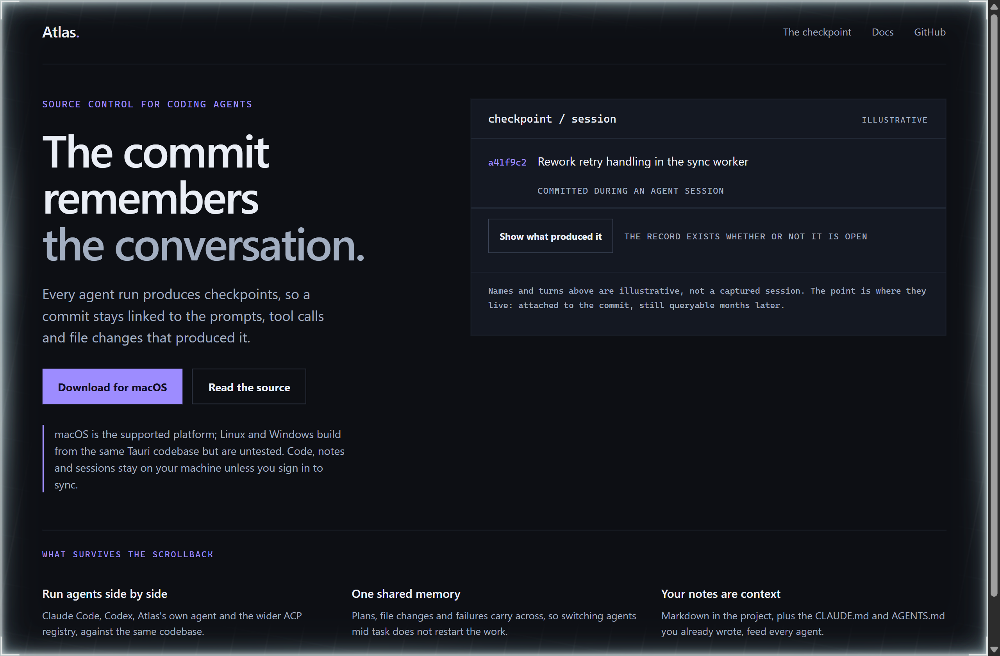
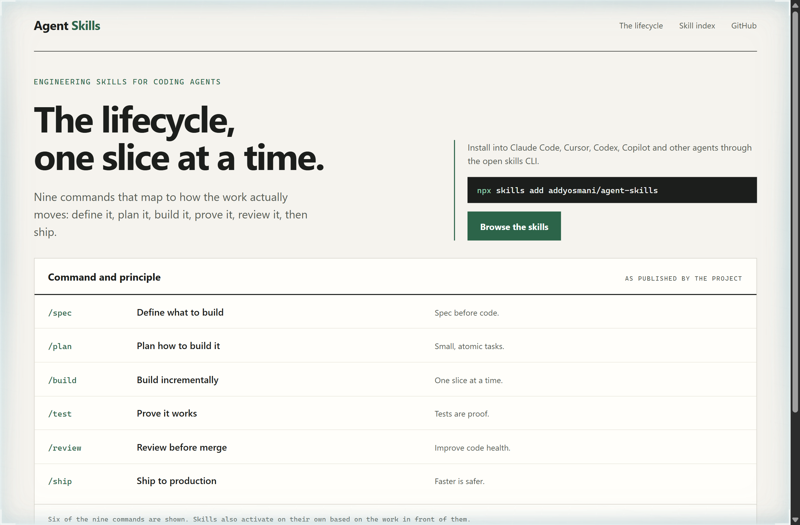
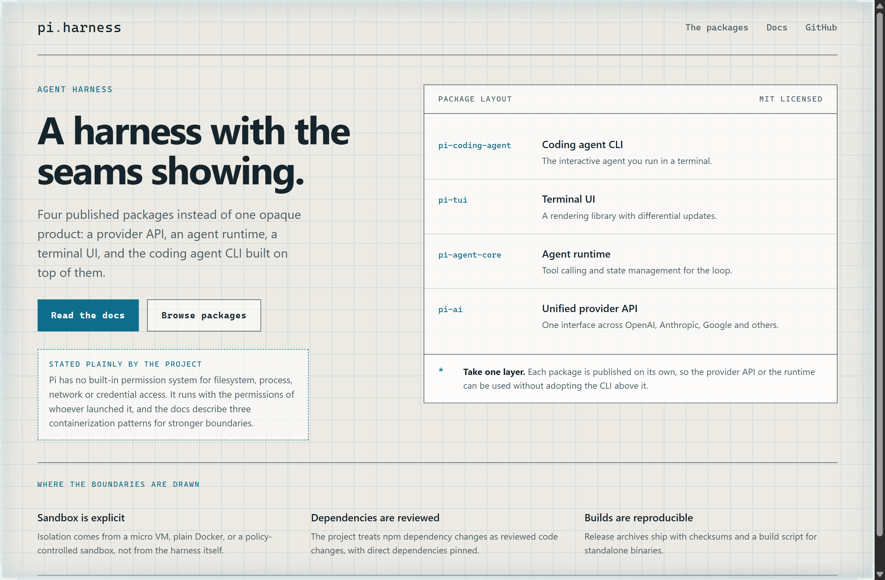

# Design Rep — Tuesday, September 15

> 3 mocks — neon-noir, specimen, blueprint

[Catalog](../../CATALOG.md) · [Home](../../README.md)

## [pacifio/atlas](https://github.com/pacifio/atlas)

- **Style:** neon-noir / violet
- **Idea tested:** Put the commit first, then let the reader open the session that produced it
- **Verdict:** A disclosure that starts closed matches the claim: the record is kept whether or not anyone looks
- [live .html](./01-atlas.html) · [repo on GitHub](https://github.com/pacifio/atlas)

## [addyosmani/agent-skills](https://github.com/addyosmani/agent-skills)

- **Style:** specimen / press-green
- **Idea tested:** Show the command beside the principle it enforces, as a specimen sheet rather than a feature list
- **Verdict:** Command and principle on one row reads as a working contract, not marketing
- [live .html](./02-agent-skills.html) · [repo on GitHub](https://github.com/addyosmani/agent-skills)

## [earendil-works/pi](https://github.com/earendil-works/pi)

- **Style:** blueprint / drafting-cyan
- **Idea tested:** Draw the harness as a stack of separately published packages so the seams are the selling point
- **Verdict:** Naming each layer makes the take-one-piece claim legible without a diagram of arrows
- [live .html](./03-pi-harness.html) · [repo on GitHub](https://github.com/earendil-works/pi)
