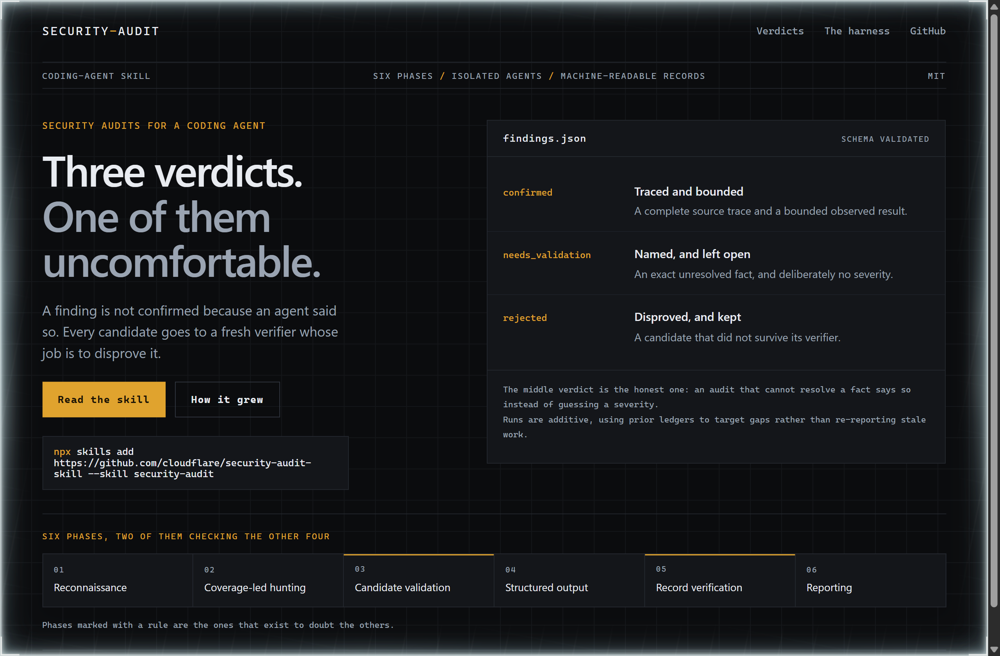
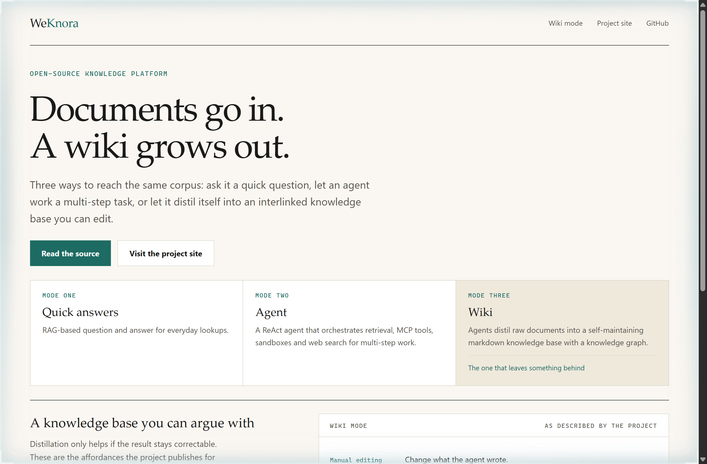
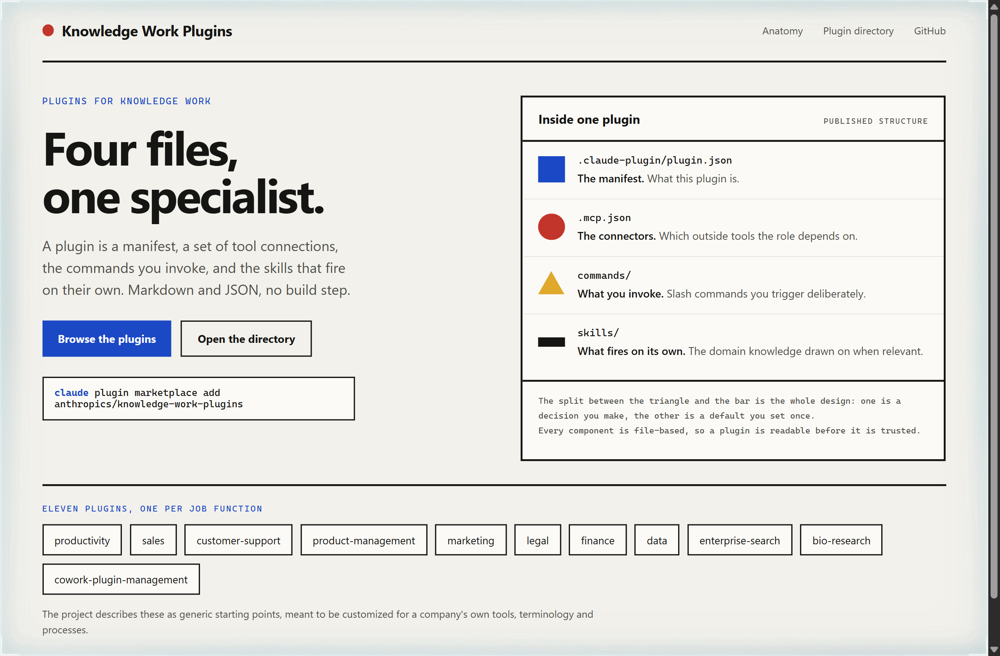

# Design Rep — Wednesday, September 16

> 3 mocks — hud, editorial, bauhaus

[Catalog](../../CATALOG.md) · [Home](../../README.md)

## [cloudflare/security-audit-skill](https://github.com/cloudflare/security-audit-skill)

- **Style:** hud / instrument-amber
- **Idea tested:** Lead with the three verdicts rather than the six phases, and give the unresolved one equal weight
- **Verdict:** The needs_validation row is the most persuasive thing on the page precisely because it admits a limit
- [live .html](./01-security-audit.html) · [repo on GitHub](https://github.com/cloudflare/security-audit-skill)

## [Tencent/WeKnora](https://github.com/Tencent/WeKnora)

- **Style:** editorial / archive-teal
- **Idea tested:** Sort a very long capability list into the three modes the project itself names, then spend the page on the one that leaves an artifact
- **Verdict:** Choosing which mode to enlarge is the edit; the editing affordances make distillation trustworthy
- [live .html](./02-weknora.html) · [repo on GitHub](https://github.com/Tencent/WeKnora)

## [anthropics/knowledge-work-plugins](https://github.com/anthropics/knowledge-work-plugins)

- **Style:** bauhaus / primary-blue
- **Idea tested:** Use four geometric marks to separate what a user invokes from what activates on its own
- **Verdict:** Giving commands and skills different shapes makes the consent boundary visible at a glance
- [live .html](./03-knowledge-work-plugins.html) · [repo on GitHub](https://github.com/anthropics/knowledge-work-plugins)
