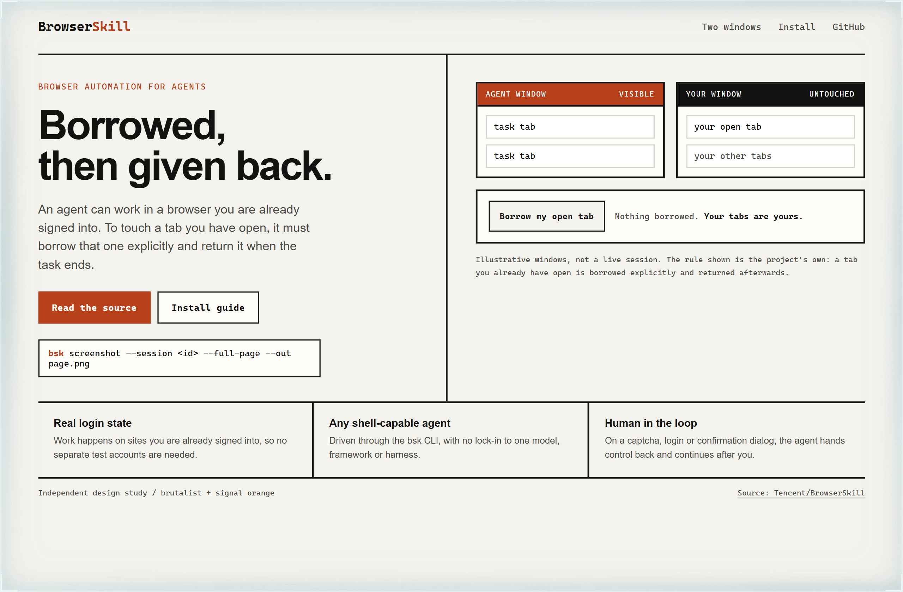
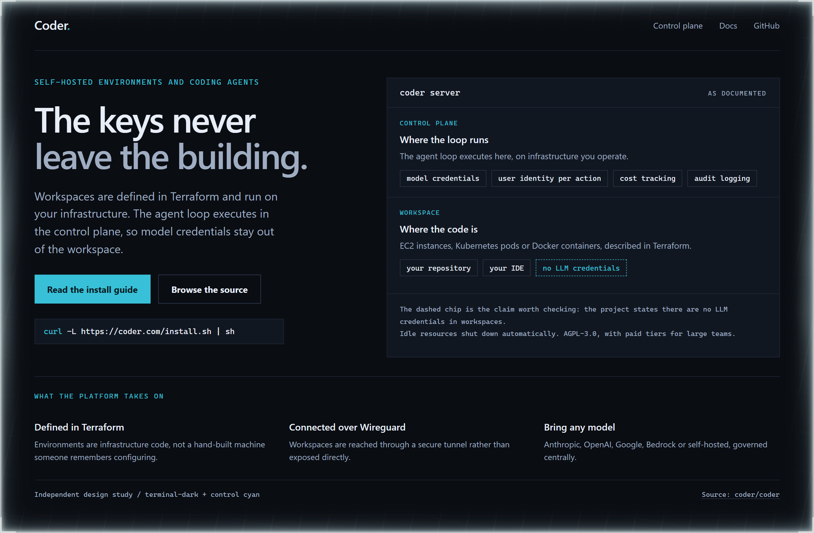
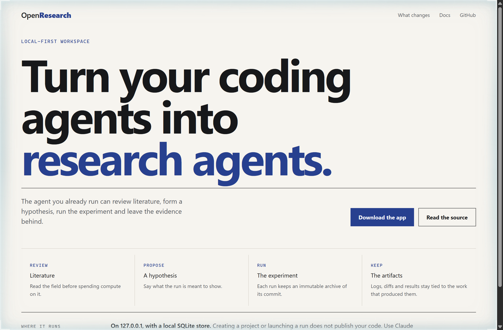

# Design Rep — Thursday, September 17

> 3 mocks — brutalist, terminal-dark, poster

[Catalog](../../CATALOG.md) · [Home](../../README.md)

## [Tencent/BrowserSkill](https://github.com/Tencent/BrowserSkill)

- **Style:** brutalist / signal-orange
- **Idea tested:** Show two windows side by side and let the reader borrow exactly one tab, then return it
- **Verdict:** Returning the tab is the whole product; an interaction that reverses itself says so without a paragraph
- [live .html](./01-browserskill.html) · [repo on GitHub](https://github.com/Tencent/BrowserSkill)

## [coder/coder](https://github.com/coder/coder)

- **Style:** terminal-dark / control-cyan
- **Idea tested:** Split the page into control plane and workspace, then mark the thing that is deliberately absent from one side
- **Verdict:** A dashed chip reading no LLM credentials carries more weight than any security adjective
- [live .html](./02-coder.html) · [repo on GitHub](https://github.com/coder/coder)

## [alphaXiv/OpenResearch](https://github.com/alphaXiv/OpenResearch)

- **Style:** poster / ink-blue
- **Idea tested:** The tagline shortened to seven words overnight, so set it at poster scale and let the page carry nothing else
- **Verdict:** When a project sharpens its own sentence, the most honest design move is to get out of its way
- [live .html](./03-openresearch.html) · [repo on GitHub](https://github.com/alphaXiv/OpenResearch)
