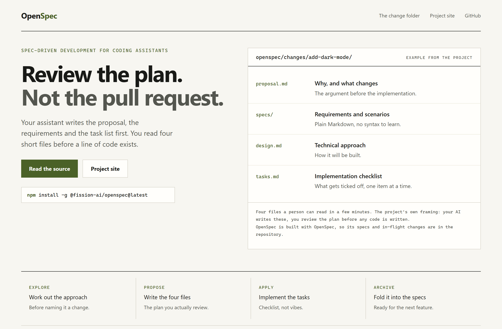
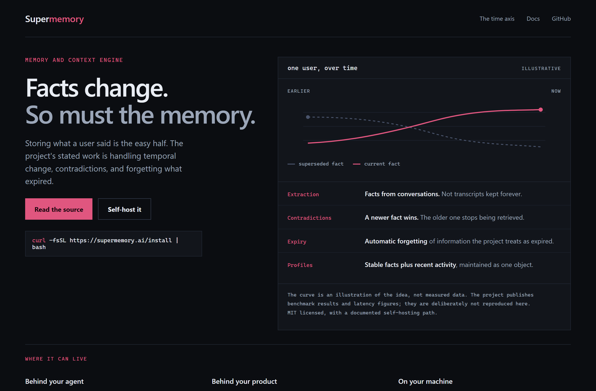
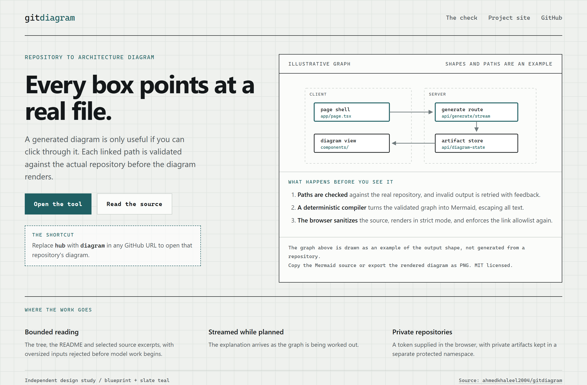

# Design Rep — Friday, September 18

> 3 mocks — warm-minimal, data-viz, blueprint

[Catalog](../../CATALOG.md) · [Home](../../README.md)

## [Fission-AI/OpenSpec](https://github.com/Fission-AI/OpenSpec)

- **Style:** warm-minimal / olive
- **Idea tested:** Show the four files a change produces, since those are what a person reviews before any code exists
- **Verdict:** Naming the four files is more concrete than describing spec-driven development in the abstract
- [live .html](./01-openspec.html) · [repo on GitHub](https://github.com/Fission-AI/OpenSpec)

## [supermemoryai/supermemory](https://github.com/supermemoryai/supermemory)

- **Style:** data-viz / magenta
- **Idea tested:** Draw memory on a time axis so the superseded fact and the current one are visibly different lines
- **Verdict:** The crossing point makes contradiction handling legible; the caption keeps the curve from posing as data
- [live .html](./02-supermemory.html) · [repo on GitHub](https://github.com/supermemoryai/supermemory)

## [ahmedkhaleel2004/gitdiagram](https://github.com/ahmedkhaleel2004/gitdiagram)

- **Style:** blueprint / slate-teal
- **Idea tested:** Show the generated graph with real repository paths under each box, then list the validation that makes those paths trustworthy
- **Verdict:** Printing the path inside the node is what separates a clickable diagram from a decorative one
- [live .html](./03-gitdiagram.html) · [repo on GitHub](https://github.com/ahmedkhaleel2004/gitdiagram)
