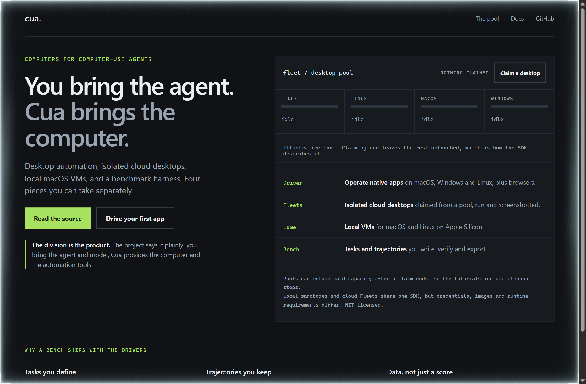
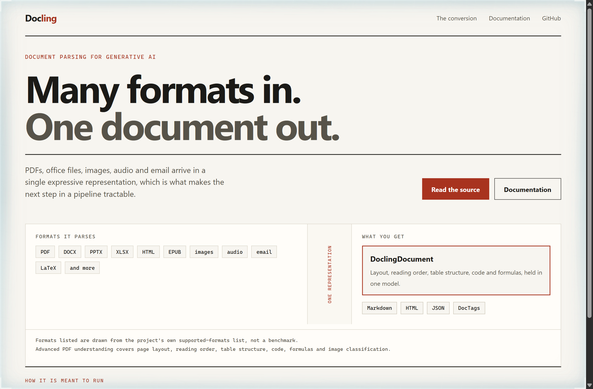
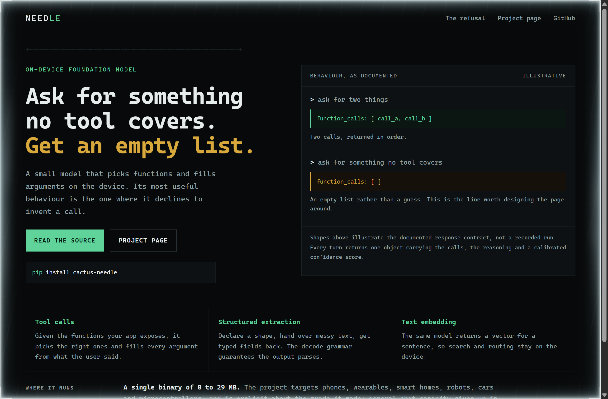

# Design Rep — Saturday, September 19

> 3 mocks — cell-grid, swiss, mono-zine

[Catalog](../../CATALOG.md) · [Home](../../README.md)

## [trycua/cua](https://github.com/trycua/cua)

- **Style:** cell-grid / lime
- **Idea tested:** Draw the desktop pool as a grid of cells and let the reader claim exactly one
- **Verdict:** Claiming one cell while three stay idle explains isolation faster than the word isolated
- [live .html](./01-cua.html) · [repo on GitHub](https://github.com/trycua/cua)

## [docling-project/docling](https://github.com/docling-project/docling)

- **Style:** swiss / brick-red
- **Idea tested:** Put the many input formats and the single output model on opposite sides of one narrow channel
- **Verdict:** The asymmetry does the arguing: a wide chip field collapsing into one named object
- [live .html](./02-docling.html) · [repo on GitHub](https://github.com/docling-project/docling)

## [cactus-compute/needle](https://github.com/cactus-compute/needle)

- **Style:** mono-zine / phosphor-green
- **Idea tested:** Make the refusal the hero: show the response shape when no tool covers the request
- **Verdict:** An empty list rendered in amber is a stronger claim than any size or speed number
- [live .html](./03-needle.html) · [repo on GitHub](https://github.com/cactus-compute/needle)
