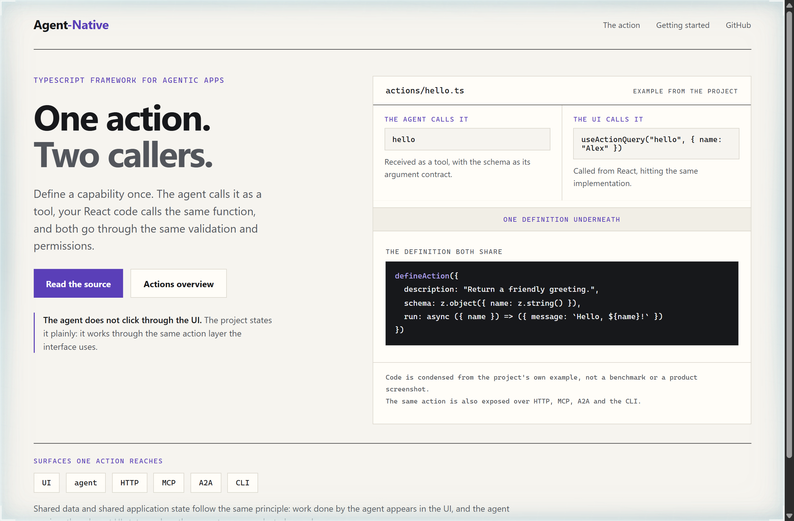
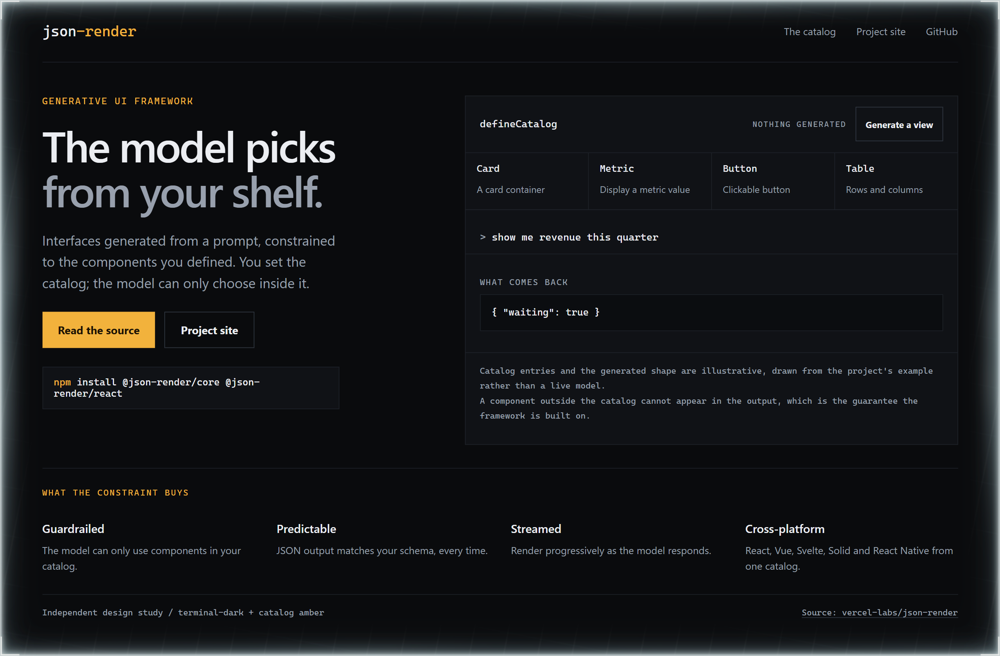
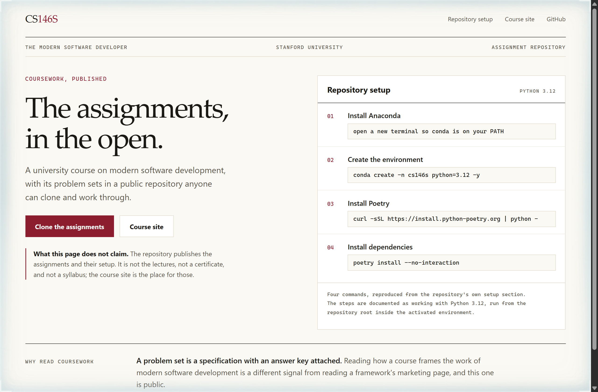

# Design Rep — Sunday, September 20

> 3 mocks — specimen, terminal-dark, editorial

[Catalog](../../CATALOG.md) · [Home](../../README.md)

## [BuilderIO/agent-native](https://github.com/BuilderIO/agent-native)

- **Style:** specimen / violet-ink
- **Idea tested:** Show the same action being called two ways above the single definition underneath
- **Verdict:** Two call sites over one definition is the architecture; a feature list would have buried it
- [live .html](./01-agent-native.html) · [repo on GitHub](https://github.com/BuilderIO/agent-native)

## [vercel-labs/json-render](https://github.com/vercel-labs/json-render)

- **Style:** terminal-dark / catalog-amber
- **Idea tested:** Let the reader generate a view and watch only the declared components light up
- **Verdict:** Two cells lighting while two stay dark proves the guardrail the copy claims
- [live .html](./02-json-render.html) · [repo on GitHub](https://github.com/vercel-labs/json-render)

## [mihail911/modern-software-dev-assignments](https://github.com/mihail911/modern-software-dev-assignments)

- **Style:** editorial / crimson
- **Idea tested:** Treat published coursework as a document, and print what the repository is not alongside what it is
- **Verdict:** Naming the absent lectures makes the four real setup commands more credible, not less
- [live .html](./03-cs146s.html) · [repo on GitHub](https://github.com/mihail911/modern-software-dev-assignments)
